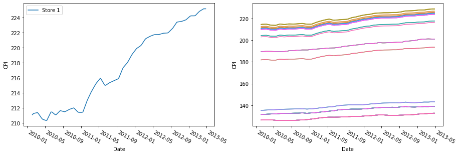
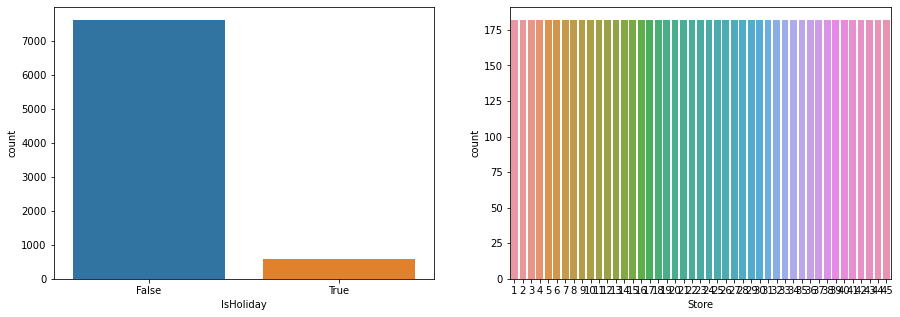
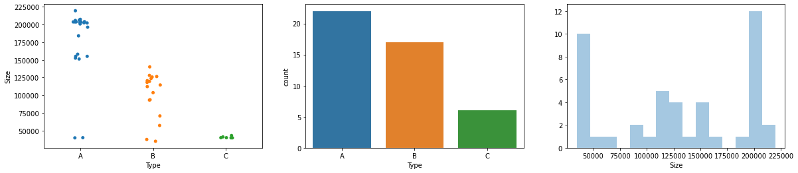
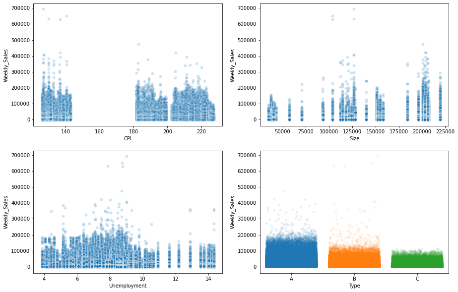
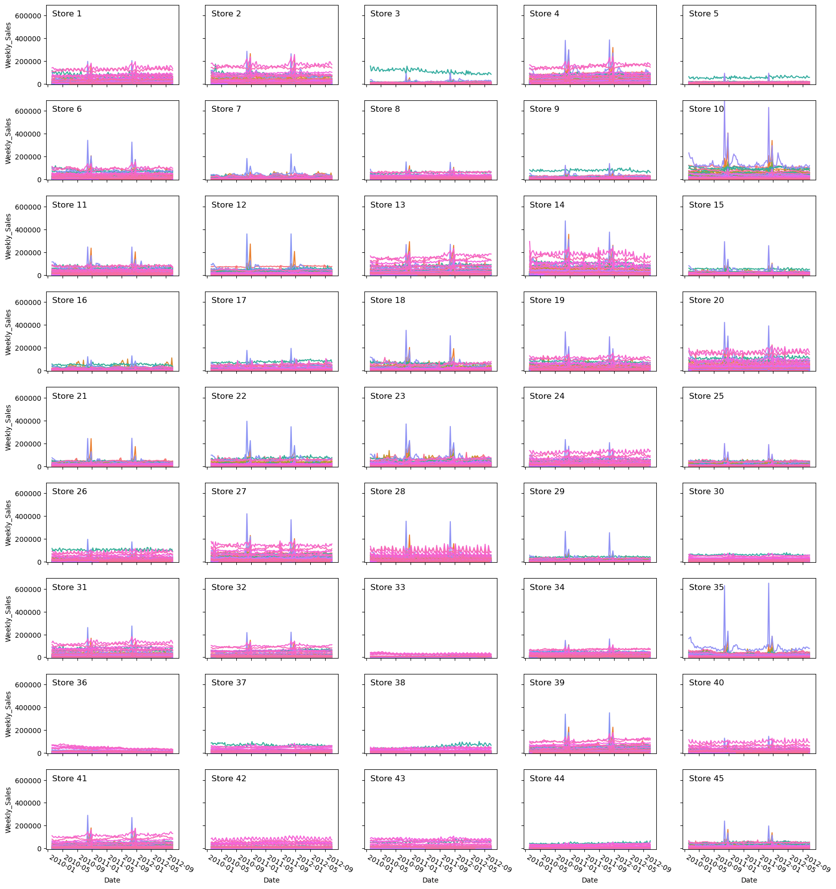
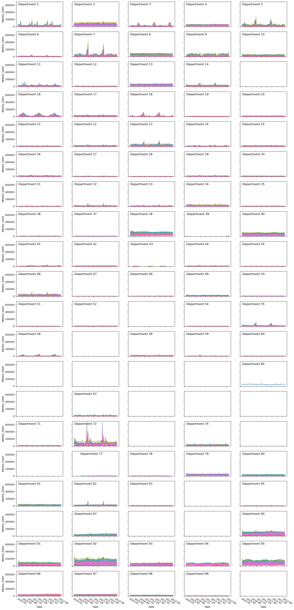

## Sales Forecast (Part 1)

#### Author: Charlie Cao

This is the first of a series of two notebooks on the topic of Sales Forecast. Through this series, we want to showcase one of the many ways that one can follow exloring and forecasting time series data. We encourage you to create your own Jupytor Notebook and follow along. You can also download this Notebook along with any accompanying data in the [Notebooks and Data](https://github.com/Master-of-Business-Analytics/Notebooks_and_Data) GitHub Repository. Alternatively, if you do not have Python or Jupyter Notebook installed yet, you may experiment with a virtual Notebook by launching Binder or Syzygy below (learn more about these two tools in the [Resource](https://analytics-at-sauder.github.io/resource.html) tab). 

<a href="https://ubc.syzygy.ca/jupyter/hub/user-redirect/git-pull?repo=https%3A%2F%2Fgithub.com%2FAnalytics-at-Sauder%2FNB0008_Sales_Forecast&urlpath=tree%2FNB0008_Sales_Forecast%2Fnb0008_sales_forecast_part_1.ipynb&branch=master" target="_blank" class="button">Launch Syzygy (UBC)</a>

<a href="https://pims.syzygy.ca/jupyter/hub/user-redirect/git-pull?repo=https%3A%2F%2Fgithub.com%2FAnalytics-at-Sauder%2FNB0008_Sales_Forecast&urlpath=tree%2FNB0008_Sales_Forecast%2Fnb0008_sales_forecast_part_1.ipynb&branch=master" target="_blank" class="button">Launch Syzygy (Google)</a>

<a href="https://mybinder.org/v2/gh/Analytics-at-Sauder/NB0008_Sales_Forecast/master?filepath=nb0008_sales_forecast_part_1.ipynb" target="_blank" class="button">Launch Binder</a>

## Background

---

In this first Notebook, we will focus on explorating and manipulating our data, while the second Notebook will focus on modeling the data. Understanding the data is important for analytics, and we recommend that you read this Notebook before diving into modeling (Part 2) in order to gain a better grasp of our large and messy datasets. The datasets that we are using consist of sales records for a retailer with 45 stores, each containing several departments. They are already included in the GitHub Repository where this Jupyter Notebook is located (please see the "Data" folder), but you can also find them on [this Kaggle page](https://www.kaggle.com/manjeetsingh/retaildataset?select=sales+data-set.csv). 

Let's first start by importing the libraries we need and loading our data:


```python
import pandas as pd
import numpy as np
from scipy import stats
import matplotlib.pyplot as plt
import seaborn as sns

# ipywidgets are used to make interactive contents in Jupyter notebooks
from ipywidgets import interact

df_sales = pd.read_csv('nb0008_data/sales.csv')
df_features = pd.read_csv('nb0008_data/features.csv')
df_stores = pd.read_csv('nb0008_data/stores.csv')

# converting the date column (initally stored as strings) to dates
df_sales['Date'] = pd.to_datetime(df_sales['Date'], format='%d/%m/%Y')
df_features['Date'] = pd.to_datetime(df_features['Date'], format='%d/%m/%Y')

df_sales['Store'] = df_sales['Store'].astype('category')
df_sales['Dept'] = df_sales['Dept'].astype('category')
df_features['Store'] = df_features['Store'].astype('category')
df_stores['Store'] = df_stores['Store'].astype('category')
df_stores['Type'] = df_stores['Type'].astype('category')

# Information on the SettingWithCopywarning that might occur: 
# https://www.dataquest.io/blog/settingwithcopywarning/
```

## Exploratory Data Analysis

---

Before we build a model, it is always a good idea to take a look at the dataset itself. Here are some questions that we might want to ask ourselves when exploring our data:

- What information is recorded? What do the different columns contain?
- Since we are working with time series data, how frequently are the data recorded?
- How many missing values are there in each column? 
- What are the distributions of the different columns? 
- Are there any columns that are highly correlated with another?

After a preliminary exploration of the data, if there are several missing values or if the distribution of a column is highly left/right skewed, both of which could potentially affect the accruacy of our models, then we would want to first think about replacing or transforming the data before building, comparing, and selecting our models. Since we have a big dataset containing data from multiple stores and multiple departments, we can create an interactive (and basic) widget using `ipywidgets` for a preliminary inspection of the sales record at each store and department (please read its [documentation](https://ipywidgets.readthedocs.io/en/latest/) for more information or for tutorials).


```python
def sales_viz(store_num, dept_num):
    fig, axes = plt.subplots(1,2, figsize=(10,3), dpi=100)
    # Subset the data based on store and department numbers
    sales_temp = df_sales[(df_sales.Store==store_num) & (df_sales.Dept==dept_num)][['Date', 'Weekly_Sales']]
    # Create time series dataframe by using date as index
    ts_sales_temp = sales_temp.set_index('Date')
    ts_sales_temp.plot(ax=axes[0], legend=False)
    ts_sales_temp.hist(ax=axes[1], bins=100)
    display(ts_sales_temp.describe().transpose().round(2))
    plt.show()
    return

display(interact(sales_viz, store_num={n:n for n in range(1,46)}, dept_num={n:n for n in range(1,100)}))
```


    interactive(children=(Dropdown(description='store_num', options={1: 1, 2: 2, 3: 3, 4: 4, 5: 5, 6: 6, 7: 7, 8: …


    <function __main__.sales_viz(store_num, dept_num)>


### Inspection

#### `Sales`

Now we can take a look at the `sales` dataframe, which has 5 fields (columns) and 421,570 observations (rows). Note that we had mannually changed the data types in the 'Store', 'Dept', and 'Date' columns when we imported the data.


```python
print(df_sales.info())
```

    <class 'pandas.core.frame.DataFrame'>
    RangeIndex: 421570 entries, 0 to 421569
    Data columns (total 5 columns):
     #   Column        Non-Null Count   Dtype         
    ---  ------        --------------   -----         
     0   Store         421570 non-null  category      
     1   Dept          421570 non-null  category      
     2   Date          421570 non-null  datetime64[ns]
     3   Weekly_Sales  421570 non-null  float64       
     4   IsHoliday     421570 non-null  bool          
    dtypes: bool(1), category(2), datetime64[ns](1), float64(1)
    memory usage: 7.6 MB
    None
    


```python
display(df_sales.describe().transpose().round(2))

print("CAUTION: {:.2%} of the `Weekly_Sales` column is negative."
      .format(len([n for n in df_sales['Weekly_Sales'] if n < 0])/
              len(df_sales['Weekly_Sales'])))

fig, axes = plt.subplots(1,3, figsize=(20,4))

df_sales['Weekly_Sales'].hist(bins=100, ax=axes[0])
sns.boxplot(x='Store', y='Weekly_Sales', whis=100, data=df_sales, ax=axes[1])
sns.boxplot(x='Dept', y='Weekly_Sales', whis=100, data=df_sales, ax=axes[2])

plt.show()
```


<div>
<style scoped>
    .dataframe tbody tr th:only-of-type {
        vertical-align: middle;
    }

    .dataframe tbody tr th {
        vertical-align: top;
    }

    .dataframe thead th {
        text-align: right;
    }
</style>
<table border="1" class="dataframe">
  <thead>
    <tr style="text-align: right;">
      <th></th>
      <th>count</th>
      <th>mean</th>
      <th>std</th>
      <th>min</th>
      <th>25%</th>
      <th>50%</th>
      <th>75%</th>
      <th>max</th>
    </tr>
  </thead>
  <tbody>
    <tr>
      <th>Weekly_Sales</th>
      <td>421570.0</td>
      <td>15981.26</td>
      <td>22711.18</td>
      <td>-4988.94</td>
      <td>2079.65</td>
      <td>7612.03</td>
      <td>20205.85</td>
      <td>693099.36</td>
    </tr>
  </tbody>
</table>
</div>


    CAUTION: 0.30% of the `Weekly_Sales` column is negative.
    


```python
display(df_sales.drop('Weekly_Sales', axis=1).describe().transpose())

fig, axes = plt.subplots(1,3, figsize=(20,4))
sns.countplot(x='IsHoliday', data=df_sales, ax=axes[0])
sns.countplot(x='Store', data=df_sales, ax=axes[1])
sns.countplot(x='Dept', data=df_sales, ax=axes[2])

plt.show()
```


<div>
<style scoped>
    .dataframe tbody tr th:only-of-type {
        vertical-align: middle;
    }

    .dataframe tbody tr th {
        vertical-align: top;
    }

    .dataframe thead th {
        text-align: right;
    }
</style>
<table border="1" class="dataframe">
  <thead>
    <tr style="text-align: right;">
      <th></th>
      <th>count</th>
      <th>unique</th>
      <th>top</th>
      <th>freq</th>
      <th>first</th>
      <th>last</th>
    </tr>
  </thead>
  <tbody>
    <tr>
      <th>Store</th>
      <td>421570</td>
      <td>45</td>
      <td>13</td>
      <td>10474</td>
      <td>NaT</td>
      <td>NaT</td>
    </tr>
    <tr>
      <th>Dept</th>
      <td>421570</td>
      <td>81</td>
      <td>1</td>
      <td>6435</td>
      <td>NaT</td>
      <td>NaT</td>
    </tr>
    <tr>
      <th>Date</th>
      <td>421570</td>
      <td>143</td>
      <td>2011-12-23 00:00:00</td>
      <td>3027</td>
      <td>2010-02-05</td>
      <td>2012-10-26</td>
    </tr>
    <tr>
      <th>IsHoliday</th>
      <td>421570</td>
      <td>2</td>
      <td>False</td>
      <td>391909</td>
      <td>NaT</td>
      <td>NaT</td>
    </tr>
  </tbody>
</table>
</div>


From the above charts, we can see that:

1. There are 143 unique dates (421,570 records in total) from 2010-02-05 to 2012-10-26 in the `sales` dataframe.
2. There are no missing values in any of the columns in this dataframe, which is good.
3. However, we should notice that the `weekly sales` column is extremely right skewed, with a mean of \\$15,981, but a 50th percentile (which is essentially the same as the median) of only \\$7,612. The range of the column is also fairly wide, from -\\$4,989 to \\$693,099
4. When grouped by stores and departments, respectively, it seems that a smaller proportion of departments are affecting the overall skew across stores.
5. 391,909 records out of the 421,570 are not holidays (or about 7% of the records *are* holidays), which could potentially explain why the `Weekly Sales` records are extremely right skewed (*maybe* most of the sales happen on holidays).
6. 99.68% of the `Weekly_Sales` are positive, which means that we could potentially drop the negative values without significantly affecting the integraty of our data. Having all positive numbers would allow us to take the logarithms of these positive values, which will help to make our records less skewed.
7. There seems to be fewer records for certain stores and departments.

#### `Features`

Now let's move on to the `features` dataframe, which has 12 fields (columns) and 8,190 observations (rows). Note that, again, we had mannually changed the data types for the 'Store' and 'Date' columns when we imported the data.


```python
print(df_features.info())
```

    <class 'pandas.core.frame.DataFrame'>
    RangeIndex: 8190 entries, 0 to 8189
    Data columns (total 12 columns):
     #   Column        Non-Null Count  Dtype         
    ---  ------        --------------  -----         
     0   Store         8190 non-null   category      
     1   Date          8190 non-null   datetime64[ns]
     2   Temperature   8190 non-null   float64       
     3   Fuel_Price    8190 non-null   float64       
     4   MarkDown1     4032 non-null   float64       
     5   MarkDown2     2921 non-null   float64       
     6   MarkDown3     3613 non-null   float64       
     7   MarkDown4     3464 non-null   float64       
     8   MarkDown5     4050 non-null   float64       
     9   CPI           7605 non-null   float64       
     10  Unemployment  7605 non-null   float64       
     11  IsHoliday     8190 non-null   bool          
    dtypes: bool(1), category(1), datetime64[ns](1), float64(9)
    memory usage: 657.6 KB
    None
    


```python
# inspecting rows containing NaN values
display(df_features[df_features['CPI'].isnull()])
display(df_features[df_features['Unemployment'].isnull()])
```


<div>
<style scoped>
    .dataframe tbody tr th:only-of-type {
        vertical-align: middle;
    }

    .dataframe tbody tr th {
        vertical-align: top;
    }

    .dataframe thead th {
        text-align: right;
    }
</style>
<table border="1" class="dataframe">
  <thead>
    <tr style="text-align: right;">
      <th></th>
      <th>Store</th>
      <th>Date</th>
      <th>Temperature</th>
      <th>Fuel_Price</th>
      <th>MarkDown1</th>
      <th>MarkDown2</th>
      <th>MarkDown3</th>
      <th>MarkDown4</th>
      <th>MarkDown5</th>
      <th>CPI</th>
      <th>Unemployment</th>
      <th>IsHoliday</th>
    </tr>
  </thead>
  <tbody>
    <tr>
      <th>169</th>
      <td>1</td>
      <td>2013-05-03</td>
      <td>66.66</td>
      <td>3.386</td>
      <td>2298.63</td>
      <td>2.00</td>
      <td>129.90</td>
      <td>55.46</td>
      <td>1301.04</td>
      <td>NaN</td>
      <td>NaN</td>
      <td>False</td>
    </tr>
    <tr>
      <th>170</th>
      <td>1</td>
      <td>2013-05-10</td>
      <td>63.90</td>
      <td>3.392</td>
      <td>4624.61</td>
      <td>83.88</td>
      <td>42.38</td>
      <td>1618.31</td>
      <td>8144.90</td>
      <td>NaN</td>
      <td>NaN</td>
      <td>False</td>
    </tr>
    <tr>
      <th>171</th>
      <td>1</td>
      <td>2013-05-17</td>
      <td>69.53</td>
      <td>3.454</td>
      <td>16170.50</td>
      <td>92.00</td>
      <td>8.32</td>
      <td>4127.24</td>
      <td>6206.97</td>
      <td>NaN</td>
      <td>NaN</td>
      <td>False</td>
    </tr>
    <tr>
      <th>172</th>
      <td>1</td>
      <td>2013-05-24</td>
      <td>77.19</td>
      <td>3.494</td>
      <td>7959.89</td>
      <td>178.00</td>
      <td>1621.47</td>
      <td>3152.57</td>
      <td>2938.70</td>
      <td>NaN</td>
      <td>NaN</td>
      <td>False</td>
    </tr>
    <tr>
      <th>173</th>
      <td>1</td>
      <td>2013-05-31</td>
      <td>78.02</td>
      <td>3.466</td>
      <td>2369.77</td>
      <td>142.45</td>
      <td>475.35</td>
      <td>45.55</td>
      <td>2056.84</td>
      <td>NaN</td>
      <td>NaN</td>
      <td>False</td>
    </tr>
    <tr>
      <th>...</th>
      <td>...</td>
      <td>...</td>
      <td>...</td>
      <td>...</td>
      <td>...</td>
      <td>...</td>
      <td>...</td>
      <td>...</td>
      <td>...</td>
      <td>...</td>
      <td>...</td>
      <td>...</td>
    </tr>
    <tr>
      <th>8185</th>
      <td>45</td>
      <td>2013-06-28</td>
      <td>76.05</td>
      <td>3.639</td>
      <td>4842.29</td>
      <td>975.03</td>
      <td>3.00</td>
      <td>2449.97</td>
      <td>3169.69</td>
      <td>NaN</td>
      <td>NaN</td>
      <td>False</td>
    </tr>
    <tr>
      <th>8186</th>
      <td>45</td>
      <td>2013-07-05</td>
      <td>77.50</td>
      <td>3.614</td>
      <td>9090.48</td>
      <td>2268.58</td>
      <td>582.74</td>
      <td>5797.47</td>
      <td>1514.93</td>
      <td>NaN</td>
      <td>NaN</td>
      <td>False</td>
    </tr>
    <tr>
      <th>8187</th>
      <td>45</td>
      <td>2013-07-12</td>
      <td>79.37</td>
      <td>3.614</td>
      <td>3789.94</td>
      <td>1827.31</td>
      <td>85.72</td>
      <td>744.84</td>
      <td>2150.36</td>
      <td>NaN</td>
      <td>NaN</td>
      <td>False</td>
    </tr>
    <tr>
      <th>8188</th>
      <td>45</td>
      <td>2013-07-19</td>
      <td>82.84</td>
      <td>3.737</td>
      <td>2961.49</td>
      <td>1047.07</td>
      <td>204.19</td>
      <td>363.00</td>
      <td>1059.46</td>
      <td>NaN</td>
      <td>NaN</td>
      <td>False</td>
    </tr>
    <tr>
      <th>8189</th>
      <td>45</td>
      <td>2013-07-26</td>
      <td>76.06</td>
      <td>3.804</td>
      <td>212.02</td>
      <td>851.73</td>
      <td>2.06</td>
      <td>10.88</td>
      <td>1864.57</td>
      <td>NaN</td>
      <td>NaN</td>
      <td>False</td>
    </tr>
  </tbody>
</table>
<p>585 rows × 12 columns</p>
</div>


<div>
<style scoped>
    .dataframe tbody tr th:only-of-type {
        vertical-align: middle;
    }

    .dataframe tbody tr th {
        vertical-align: top;
    }

    .dataframe thead th {
        text-align: right;
    }
</style>
<table border="1" class="dataframe">
  <thead>
    <tr style="text-align: right;">
      <th></th>
      <th>Store</th>
      <th>Date</th>
      <th>Temperature</th>
      <th>Fuel_Price</th>
      <th>MarkDown1</th>
      <th>MarkDown2</th>
      <th>MarkDown3</th>
      <th>MarkDown4</th>
      <th>MarkDown5</th>
      <th>CPI</th>
      <th>Unemployment</th>
      <th>IsHoliday</th>
    </tr>
  </thead>
  <tbody>
    <tr>
      <th>169</th>
      <td>1</td>
      <td>2013-05-03</td>
      <td>66.66</td>
      <td>3.386</td>
      <td>2298.63</td>
      <td>2.00</td>
      <td>129.90</td>
      <td>55.46</td>
      <td>1301.04</td>
      <td>NaN</td>
      <td>NaN</td>
      <td>False</td>
    </tr>
    <tr>
      <th>170</th>
      <td>1</td>
      <td>2013-05-10</td>
      <td>63.90</td>
      <td>3.392</td>
      <td>4624.61</td>
      <td>83.88</td>
      <td>42.38</td>
      <td>1618.31</td>
      <td>8144.90</td>
      <td>NaN</td>
      <td>NaN</td>
      <td>False</td>
    </tr>
    <tr>
      <th>171</th>
      <td>1</td>
      <td>2013-05-17</td>
      <td>69.53</td>
      <td>3.454</td>
      <td>16170.50</td>
      <td>92.00</td>
      <td>8.32</td>
      <td>4127.24</td>
      <td>6206.97</td>
      <td>NaN</td>
      <td>NaN</td>
      <td>False</td>
    </tr>
    <tr>
      <th>172</th>
      <td>1</td>
      <td>2013-05-24</td>
      <td>77.19</td>
      <td>3.494</td>
      <td>7959.89</td>
      <td>178.00</td>
      <td>1621.47</td>
      <td>3152.57</td>
      <td>2938.70</td>
      <td>NaN</td>
      <td>NaN</td>
      <td>False</td>
    </tr>
    <tr>
      <th>173</th>
      <td>1</td>
      <td>2013-05-31</td>
      <td>78.02</td>
      <td>3.466</td>
      <td>2369.77</td>
      <td>142.45</td>
      <td>475.35</td>
      <td>45.55</td>
      <td>2056.84</td>
      <td>NaN</td>
      <td>NaN</td>
      <td>False</td>
    </tr>
    <tr>
      <th>...</th>
      <td>...</td>
      <td>...</td>
      <td>...</td>
      <td>...</td>
      <td>...</td>
      <td>...</td>
      <td>...</td>
      <td>...</td>
      <td>...</td>
      <td>...</td>
      <td>...</td>
      <td>...</td>
    </tr>
    <tr>
      <th>8185</th>
      <td>45</td>
      <td>2013-06-28</td>
      <td>76.05</td>
      <td>3.639</td>
      <td>4842.29</td>
      <td>975.03</td>
      <td>3.00</td>
      <td>2449.97</td>
      <td>3169.69</td>
      <td>NaN</td>
      <td>NaN</td>
      <td>False</td>
    </tr>
    <tr>
      <th>8186</th>
      <td>45</td>
      <td>2013-07-05</td>
      <td>77.50</td>
      <td>3.614</td>
      <td>9090.48</td>
      <td>2268.58</td>
      <td>582.74</td>
      <td>5797.47</td>
      <td>1514.93</td>
      <td>NaN</td>
      <td>NaN</td>
      <td>False</td>
    </tr>
    <tr>
      <th>8187</th>
      <td>45</td>
      <td>2013-07-12</td>
      <td>79.37</td>
      <td>3.614</td>
      <td>3789.94</td>
      <td>1827.31</td>
      <td>85.72</td>
      <td>744.84</td>
      <td>2150.36</td>
      <td>NaN</td>
      <td>NaN</td>
      <td>False</td>
    </tr>
    <tr>
      <th>8188</th>
      <td>45</td>
      <td>2013-07-19</td>
      <td>82.84</td>
      <td>3.737</td>
      <td>2961.49</td>
      <td>1047.07</td>
      <td>204.19</td>
      <td>363.00</td>
      <td>1059.46</td>
      <td>NaN</td>
      <td>NaN</td>
      <td>False</td>
    </tr>
    <tr>
      <th>8189</th>
      <td>45</td>
      <td>2013-07-26</td>
      <td>76.06</td>
      <td>3.804</td>
      <td>212.02</td>
      <td>851.73</td>
      <td>2.06</td>
      <td>10.88</td>
      <td>1864.57</td>
      <td>NaN</td>
      <td>NaN</td>
      <td>False</td>
    </tr>
  </tbody>
</table>
<p>585 rows × 12 columns</p>
</div>


```python
display(df_features.describe().round(2))

for i in range(5):
    print('CAUTION: {:.2%} of MarkDown{} (non-null) is negative.'
          .format(len([n for n in df_features['MarkDown'+str(i+1)] if n < 0])/
                  len(df_features['MarkDown'+str(i+1)].dropna()), i+1))

df_features.drop(['Store', 'Date', 'IsHoliday'], axis=1).hist(figsize=(15,10), bins=100)

plt.show()
```


<div>
<style scoped>
    .dataframe tbody tr th:only-of-type {
        vertical-align: middle;
    }

    .dataframe tbody tr th {
        vertical-align: top;
    }

    .dataframe thead th {
        text-align: right;
    }
</style>
<table border="1" class="dataframe">
  <thead>
    <tr style="text-align: right;">
      <th></th>
      <th>Temperature</th>
      <th>Fuel_Price</th>
      <th>MarkDown1</th>
      <th>MarkDown2</th>
      <th>MarkDown3</th>
      <th>MarkDown4</th>
      <th>MarkDown5</th>
      <th>CPI</th>
      <th>Unemployment</th>
    </tr>
  </thead>
  <tbody>
    <tr>
      <th>count</th>
      <td>8190.00</td>
      <td>8190.00</td>
      <td>4032.00</td>
      <td>2921.00</td>
      <td>3613.00</td>
      <td>3464.00</td>
      <td>4050.00</td>
      <td>7605.00</td>
      <td>7605.00</td>
    </tr>
    <tr>
      <th>mean</th>
      <td>59.36</td>
      <td>3.41</td>
      <td>7032.37</td>
      <td>3384.18</td>
      <td>1760.10</td>
      <td>3292.94</td>
      <td>4132.22</td>
      <td>172.46</td>
      <td>7.83</td>
    </tr>
    <tr>
      <th>std</th>
      <td>18.68</td>
      <td>0.43</td>
      <td>9262.75</td>
      <td>8793.58</td>
      <td>11276.46</td>
      <td>6792.33</td>
      <td>13086.69</td>
      <td>39.74</td>
      <td>1.88</td>
    </tr>
    <tr>
      <th>min</th>
      <td>-7.29</td>
      <td>2.47</td>
      <td>-2781.45</td>
      <td>-265.76</td>
      <td>-179.26</td>
      <td>0.22</td>
      <td>-185.17</td>
      <td>126.06</td>
      <td>3.68</td>
    </tr>
    <tr>
      <th>25%</th>
      <td>45.90</td>
      <td>3.04</td>
      <td>1577.53</td>
      <td>68.88</td>
      <td>6.60</td>
      <td>304.69</td>
      <td>1440.83</td>
      <td>132.36</td>
      <td>6.63</td>
    </tr>
    <tr>
      <th>50%</th>
      <td>60.71</td>
      <td>3.51</td>
      <td>4743.58</td>
      <td>364.57</td>
      <td>36.26</td>
      <td>1176.42</td>
      <td>2727.14</td>
      <td>182.76</td>
      <td>7.81</td>
    </tr>
    <tr>
      <th>75%</th>
      <td>73.88</td>
      <td>3.74</td>
      <td>8923.31</td>
      <td>2153.35</td>
      <td>163.15</td>
      <td>3310.01</td>
      <td>4832.56</td>
      <td>213.93</td>
      <td>8.57</td>
    </tr>
    <tr>
      <th>max</th>
      <td>101.95</td>
      <td>4.47</td>
      <td>103184.98</td>
      <td>104519.54</td>
      <td>149483.31</td>
      <td>67474.85</td>
      <td>771448.10</td>
      <td>228.98</td>
      <td>14.31</td>
    </tr>
  </tbody>
</table>
</div>


    CAUTION: 0.10% of MarkDown1 (non-null) is negative.
    CAUTION: 0.86% of MarkDown2 (non-null) is negative.
    CAUTION: 0.36% of MarkDown3 (non-null) is negative.
    CAUTION: 0.00% of MarkDown4 (non-null) is negative.
    CAUTION: 0.05% of MarkDown5 (non-null) is negative.
    


```python
fig, axes = plt.subplots(1,2,figsize=(15,5))

sns.lineplot(x='Date', y='CPI', data=df_features[df_features.Store==1], ax=axes[0], label='Store 1')
sns.lineplot(x="Date", y="CPI", hue="Store", data=df_features, legend=False, ax=axes[1])
fig.autofmt_xdate(rotation=-30, ha='left')

plt.show()
```





```python
display(df_features[['Store', 'Date', 'IsHoliday']].describe().transpose())

fig, axes = plt.subplots(1,2, figsize=(15,5))
sns.countplot(x='IsHoliday', data=df_features, ax=axes[0])
sns.countplot(x='Store', data=df_features, ax=axes[1])

plt.show()
```


<div>
<style scoped>
    .dataframe tbody tr th:only-of-type {
        vertical-align: middle;
    }

    .dataframe tbody tr th {
        vertical-align: top;
    }

    .dataframe thead th {
        text-align: right;
    }
</style>
<table border="1" class="dataframe">
  <thead>
    <tr style="text-align: right;">
      <th></th>
      <th>count</th>
      <th>unique</th>
      <th>top</th>
      <th>freq</th>
      <th>first</th>
      <th>last</th>
    </tr>
  </thead>
  <tbody>
    <tr>
      <th>Store</th>
      <td>8190</td>
      <td>45</td>
      <td>45</td>
      <td>182</td>
      <td>NaT</td>
      <td>NaT</td>
    </tr>
    <tr>
      <th>Date</th>
      <td>8190</td>
      <td>182</td>
      <td>2011-07-15 00:00:00</td>
      <td>45</td>
      <td>2010-02-05</td>
      <td>2013-07-26</td>
    </tr>
    <tr>
      <th>IsHoliday</th>
      <td>8190</td>
      <td>2</td>
      <td>False</td>
      <td>7605</td>
      <td>NaT</td>
      <td>NaT</td>
    </tr>
  </tbody>
</table>
</div>





We can see from the above tables and plots that:

1. Compared to the `sales` dataframe, there are fewer records (8,190) in the `features` dataframe. This makes sense, because this dataframe is only detailed to the store-level and not to the department-level (different departments in the same store *probably* experience the same weather on the same day).
2. The are 182 unique dates from 2010-02-05 to 2013-07-26, which is a wider range of records than the `sales` dataframe.
3. The missing values in the 'CPI' and 'Unemployment' columns do not have corresponding observations in the `sales` dataframe (outside the date range), which means that removing these rows would not likely affect the integrity of our analysis.
4. From the first 10 rows, we can see that the dates do match up; however, it would not hurt to check the proportion of matching records (by date and store), especially if we are thinking about merging the two dataframes together.
5. The five markdown columns contain 'anonymous data related to promotional markdowns', as per Kaggle, and we might want to further inspect these columns (e.g. whether two or more markdowns occured at any point for the same store). At the same time, these five columns are also extremely right skewed.
6. Less than 1% of each of the markdowns contain negative values, and we could consider dropping these observations if we need to take the logarithms of this field to make it less right skewed.
7. The CPI (Consumer Price Index) is steadily increasing for all stores, but different stores have different levels of CPIs. There also seems to be a bimodal distribution among the CPI observations.
8. Approximately 7% of the 8,190 `features` records are holidays, which is consistent with the `sales` dataframe.

#### `Stores`

Last but not least, let's take a look at the `stores` dataframe, which only has three fields (columns) and 45 observations (rows). Again, note that we had mannually changed the data types for the 'Store' and 'Type' columns when we imported the data.


```python
display(df_stores.info())
```

    <class 'pandas.core.frame.DataFrame'>
    RangeIndex: 45 entries, 0 to 44
    Data columns (total 3 columns):
     #   Column  Non-Null Count  Dtype   
    ---  ------  --------------  -----   
     0   Store   45 non-null     category
     1   Type    45 non-null     category
     2   Size    45 non-null     int64   
    dtypes: category(2), int64(1)
    memory usage: 2.3 KB
    


    None


```python
display(pd.DataFrame(df_stores.drop('Store', axis=1).describe(include='all')).transpose().round(2))

fig, axes = plt.subplots(1,3, figsize=(20,4))
sns.stripplot(x='Type', y='Size', data=df_stores, ax=axes[0])
sns.countplot(x='Type', data=df_stores, ax=axes[1])
sns.distplot(df_stores['Size'], bins=15, kde=False, ax=axes[2])

plt.show()
```


<div>
<style scoped>
    .dataframe tbody tr th:only-of-type {
        vertical-align: middle;
    }

    .dataframe tbody tr th {
        vertical-align: top;
    }

    .dataframe thead th {
        text-align: right;
    }
</style>
<table border="1" class="dataframe">
  <thead>
    <tr style="text-align: right;">
      <th></th>
      <th>count</th>
      <th>unique</th>
      <th>top</th>
      <th>freq</th>
      <th>mean</th>
      <th>std</th>
      <th>min</th>
      <th>25%</th>
      <th>50%</th>
      <th>75%</th>
      <th>max</th>
    </tr>
  </thead>
  <tbody>
    <tr>
      <th>Type</th>
      <td>45</td>
      <td>3</td>
      <td>A</td>
      <td>22</td>
      <td>NaN</td>
      <td>NaN</td>
      <td>NaN</td>
      <td>NaN</td>
      <td>NaN</td>
      <td>NaN</td>
      <td>NaN</td>
    </tr>
    <tr>
      <th>Size</th>
      <td>45</td>
      <td>NaN</td>
      <td>NaN</td>
      <td>NaN</td>
      <td>130288</td>
      <td>63825.3</td>
      <td>34875</td>
      <td>70713</td>
      <td>126512</td>
      <td>202307</td>
      <td>219622</td>
    </tr>
  </tbody>
</table>
</div>





The `stores` dataframe appears to be smaller and simpler. We can see that:

1. Almost half of the stores are type A stores, and there is a correlation between store size and store type, with A being the largest and C being the smallest, on average.
2. `Sizes` of the stores are not extremely skewed, with the mean close to the 50th percentile. However, the sizes of the stores seem to follow a trimodel distribution, with the left and right peaks being higher (less spread out) than the middle one.

### Aggregation

After exploring each dataset by itself, it is also a good idea to merge the different datasets so that you could visualize any possible relationships that might exist between two or more variables. In our case, we are going to left join the `features` and `stores` dataframe to the `sales` dataframe, because we want to preserve all the sales data (since we are analyzing sales).


```python
df_merge = df_sales.merge(df_features, on=['Date', 'Store'], how='left').merge(df_stores, on='Store', how='left')

df_merge.head()
```


<div>
<style scoped>
    .dataframe tbody tr th:only-of-type {
        vertical-align: middle;
    }

    .dataframe tbody tr th {
        vertical-align: top;
    }

    .dataframe thead th {
        text-align: right;
    }
</style>
<table border="1" class="dataframe">
  <thead>
    <tr style="text-align: right;">
      <th></th>
      <th>Store</th>
      <th>Dept</th>
      <th>Date</th>
      <th>Weekly_Sales</th>
      <th>IsHoliday_x</th>
      <th>Temperature</th>
      <th>Fuel_Price</th>
      <th>MarkDown1</th>
      <th>MarkDown2</th>
      <th>MarkDown3</th>
      <th>MarkDown4</th>
      <th>MarkDown5</th>
      <th>CPI</th>
      <th>Unemployment</th>
      <th>IsHoliday_y</th>
      <th>Type</th>
      <th>Size</th>
    </tr>
  </thead>
  <tbody>
    <tr>
      <th>0</th>
      <td>1</td>
      <td>1</td>
      <td>2010-02-05</td>
      <td>24924.50</td>
      <td>False</td>
      <td>42.31</td>
      <td>2.572</td>
      <td>NaN</td>
      <td>NaN</td>
      <td>NaN</td>
      <td>NaN</td>
      <td>NaN</td>
      <td>211.096358</td>
      <td>8.106</td>
      <td>False</td>
      <td>A</td>
      <td>151315</td>
    </tr>
    <tr>
      <th>1</th>
      <td>1</td>
      <td>1</td>
      <td>2010-02-12</td>
      <td>46039.49</td>
      <td>True</td>
      <td>38.51</td>
      <td>2.548</td>
      <td>NaN</td>
      <td>NaN</td>
      <td>NaN</td>
      <td>NaN</td>
      <td>NaN</td>
      <td>211.242170</td>
      <td>8.106</td>
      <td>True</td>
      <td>A</td>
      <td>151315</td>
    </tr>
    <tr>
      <th>2</th>
      <td>1</td>
      <td>1</td>
      <td>2010-02-19</td>
      <td>41595.55</td>
      <td>False</td>
      <td>39.93</td>
      <td>2.514</td>
      <td>NaN</td>
      <td>NaN</td>
      <td>NaN</td>
      <td>NaN</td>
      <td>NaN</td>
      <td>211.289143</td>
      <td>8.106</td>
      <td>False</td>
      <td>A</td>
      <td>151315</td>
    </tr>
    <tr>
      <th>3</th>
      <td>1</td>
      <td>1</td>
      <td>2010-02-26</td>
      <td>19403.54</td>
      <td>False</td>
      <td>46.63</td>
      <td>2.561</td>
      <td>NaN</td>
      <td>NaN</td>
      <td>NaN</td>
      <td>NaN</td>
      <td>NaN</td>
      <td>211.319643</td>
      <td>8.106</td>
      <td>False</td>
      <td>A</td>
      <td>151315</td>
    </tr>
    <tr>
      <th>4</th>
      <td>1</td>
      <td>1</td>
      <td>2010-03-05</td>
      <td>21827.90</td>
      <td>False</td>
      <td>46.50</td>
      <td>2.625</td>
      <td>NaN</td>
      <td>NaN</td>
      <td>NaN</td>
      <td>NaN</td>
      <td>NaN</td>
      <td>211.350143</td>
      <td>8.106</td>
      <td>False</td>
      <td>A</td>
      <td>151315</td>
    </tr>
  </tbody>
</table>
</div>


Scatter plots are helpful for visualizing any linear or non-linear relationships between two variables. In our case, we suspect that, other than time, CPI, Store Size, Unemployment Rate, and Store Type could have potential impacts on Sales. After plotting each of them against Weekly Sales (see the four figures below), we can see that:

1. There seems to be a *slightly* negative relationship betweeen CPI and Sales.
2. There also seems to be a *slightly* positive relationship between Size and Sales.
3. Unemployment, on the other hand, does not seem to affect sales much.
4. Type A stores seem to have the highest sales, whereas Type C stores seem to have the lowest.

Some of this information might provide little to no help in the end. Sme of this information might be repetitive; for example, Store Type, Size, and Sales seem to be correlated to one another. However, it is important to keep these potential relationships in mind when we move on to build our models in Part 2.


```python
fig, axes = plt.subplots(2, 2, figsize=(15,10))

sns.scatterplot(x='CPI', y='Weekly_Sales', alpha=0.2, data=df_merge, ax=axes[0,0])
sns.scatterplot(x='Size', y='Weekly_Sales', alpha=0.2, data=df_merge, ax=axes[0,1])
sns.scatterplot(x='Unemployment', y='Weekly_Sales', alpha=0.2, data=df_merge, ax=axes[1,0])
sns.stripplot(x='Type', y='Weekly_Sales', jitter=0.4, alpha=0.1, data=df_merge, ax=axes[1,1])

plt.show()
```





At the beginning of this Notebook, we saw that (by randomly inspecting different combinations) seasonalities and trends vary across stores and departments. Some stores/deparments have consistant sales over time, while others see huge spikes either in the middle or at the end of each year. There are also increasing or decreasing trends in certain stores/departments. 

Even though it is nice to be able to see detailed sales performances for each individual department in every store, we also want to inspect whether or not there are shared patterns in our sales data. Therefore, let's aggregate the data so that we can visualize and compare sales across different stores for the same department, and then across different departments within the same store. From the two visualizations below, we can see that, when we aggregate by department, the data look a lot cleaner and more organized than when we aggregate by stores. This again reinforces our previous finding that certain departments are significantly skewing the sales of the entire store.


```python
fig, ax = plt.subplots(9, 5, sharex='col', sharey='row', figsize=(20, 25), dpi=100)
plt.setp(ax, ylim=(min(df_sales['Weekly_Sales']), max(df_sales['Weekly_Sales'])))
fig.autofmt_xdate(rotation=-30, ha='left')

store_num = pd.Series(range(1,46), dtype='category')
store_index = 0
for i in range(9):
    for j in range(5):
        sales_temp = df_sales[df_sales.Store==store_num[store_index]][['Date', 'Dept', 'Weekly_Sales']]
        sales_temp['Dept'] = sales_temp['Dept'].astype('category')
        sns.lineplot(x='Date', y='Weekly_Sales', hue='Dept', data=sales_temp, legend=False, ax=ax[i,j])
        ax[i,j].text(min(sales_temp['Date']), max(df_sales['Weekly_Sales'])-100000, 
                     'Store {}'.format(store_index+1), fontsize=12)
        store_index += 1
        
plt.show()
```





```python
fig, ax = plt.subplots(20, 5, sharex='col', sharey='row', figsize=(20, 50), dpi=100)
plt.setp(ax, ylim=(min(df_sales['Weekly_Sales']), max(df_sales['Weekly_Sales'])))
fig.autofmt_xdate(rotation=-30, ha='left')

dept_num = pd.Series(range(1,101), dtype='category')
dept_index = 0
for i in range(20):
    for j in range(5):
        try: 
            sales_temp = df_sales[df_sales.Dept==dept_num[dept_index]][['Date', 'Store', 'Weekly_Sales']]
            sales_temp['Store'] = sales_temp['Store'].astype('category')
            sns.lineplot(x='Date', y='Weekly_Sales', hue='Store', data=sales_temp, legend=False, ax=ax[i,j])
            ax[i,j].text(min(sales_temp['Date']), max(df_sales['Weekly_Sales'])-100000,
                         'Department {}'.format(dept_index+1), fontsize=12)
            dept_index += 1
        except:
            dept_index += 1
plt.show()
```




