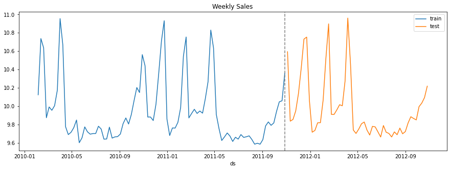
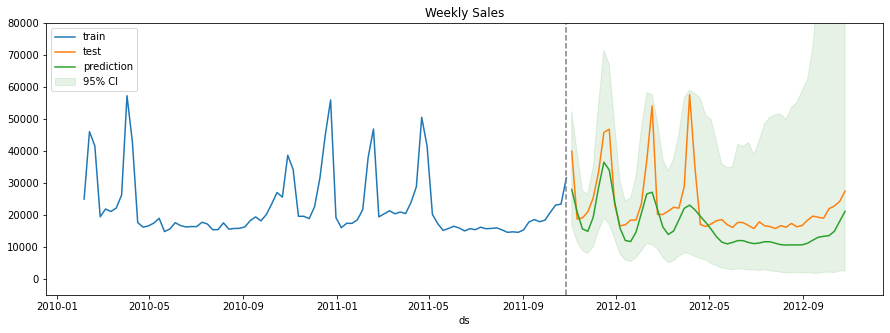
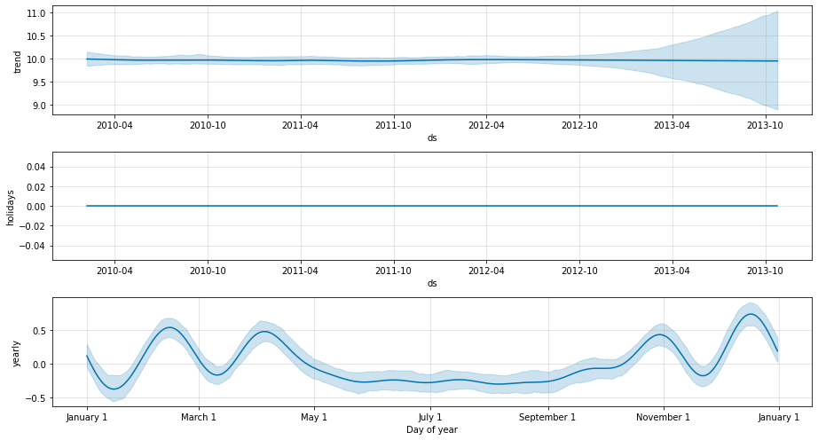
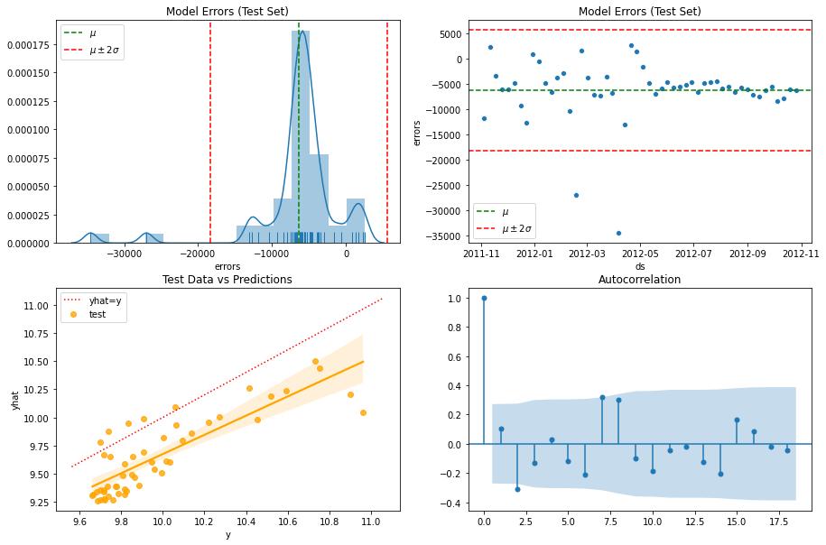

## Sales Forecaset (Part 2)

#### Author: Charlie Cao

This is the second of a series of two notebooks on the topic of Sales Forecast. Through this series, we want to showcase one of the many ways that one can follow exloring and forecasting time series data. We encourage you to create your own Jupyter Notebook and follow along. You can also download this notebook along with any accompanying data in the [Notebooks and Data](https://github.com/Master-of-Business-Analytics/Notebooks_and_Data) GitHub Repository. Alternatively, if you do not have Python or Jupyter Notebook installed yet, you may experiment with a virtual Notebook by launching Binder or Syzygy below (learn more about these two tools in the [Resource](https://analytics-at-sauder.github.io/resource.html) tab). 

<a href="https://ubc.syzygy.ca/jupyter/hub/user-redirect/git-pull?repo=https%3A%2F%2Fgithub.com%2FAnalytics-at-Sauder%2FNB0008_Sales_Forecast&urlpath=tree%2FNB0008_Sales_Forecast%2Fnb0008_sales_forecast_part_2.ipynb&branch=master" target="_blank" class="button">Launch Syzygy (UBC)</a>

<a href="https://pims.syzygy.ca/jupyter/hub/user-redirect/git-pull?repo=https%3A%2F%2Fgithub.com%2FAnalytics-at-Sauder%2FNB0008_Sales_Forecast&urlpath=tree%2FNB0008_Sales_Forecast%2Fnb0008_sales_forecast_part_2.ipynb&branch=master" target="_blank" class="button">Launch Syzygy (Google)</a>

<a href="https://mybinder.org/v2/gh/Analytics-at-Sauder/NB0008_Sales_Forecast/master?filepath=nb0008_sales_forecast_part_2.ipynb" target="_blank" class="button">Launch Binder</a>

## Background

---

The previous Notebook provides a detailed guide on the exploration and manipulation of data, while this Notebook will be centered around the modeling process itself. Understanding the data is important for analytics, and we recommend that you read the first Notebook (Part 1) prior to diving into modeling in order to gain a better grasp of our large and messy data. The datasets that we are using consist of sales records for a retailer with 45 stores, each containing several departments. They are already included in the GitHub Repository where this Jupyter Notebook is located (please see the "Data" folder), but you can also find them on [this Kaggle page](https://www.kaggle.com/manjeetsingh/retaildataset?select=sales+data-set.csv). 

Let's first start by importing the libraries we need and loading our data:


```python
import pandas as pd
import numpy as np
import datetime
import matplotlib.pyplot as plt
import seaborn as sns
from statsmodels.tsa.seasonal import STL
from statsmodels.graphics.tsaplots import plot_acf
# Prophet is a forecasting package developed by Facebook
from fbprophet import Prophet
# ipywidgets are used to make interactive contents in Jupyter notebooks
from ipywidgets import interact

# There are multiple SettingWithCopyWarnings in this notebook
# Read more here:
# https://www.dataquest.io/blog/settingwithcopywarning/
# https://pandas.pydata.org/pandas-docs/stable/user_guide/indexing.html#returning-a-view-versus-a-copy

# import data
df_sales = pd.read_csv('nb0008_data/sales.csv')
df_features = pd.read_csv('nb0008_data/features.csv')
df_stores = pd.read_csv('nb0008_data/stores.csv')

# converting the date column (initally stored as strings) to dates
df_sales['Date'] = pd.to_datetime(df_sales['Date'], format='%d/%m/%Y')
df_features['Date'] = pd.to_datetime(df_features['Date'], format='%d/%m/%Y')

# converting categorical-numeric columns to categories, which increases run speed
df_sales['Store'] = df_sales['Store'].astype('category')
df_sales['Dept'] = df_sales['Dept'].astype('category')
df_features['Store'] = df_features['Store'].astype('category')
df_stores['Store'] = df_stores['Store'].astype('category')
df_stores['Type'] = df_stores['Type'].astype('category')
```

## Modeling

---

In this Notebook, we will be using the `Prophet` forecasting package developed by Facebook. However, there are many other forecasting methods and packages, such as ARIMA models, ETS models, or a combination of explanatory models (linear regression) and time series models; some machine learning models can also be used to predict time series. After reading this Notebook, we encourage you to experiment with different forecasting packages in Python (or R) so that you can find the best fit for your data.

### STL Decomposition

Time series data can usually be described with Trend, Cycle, and Seasonality. The book, "Forecasting: Principles and Practice", does a great job defining these three components in [Chapter 2.3](https://otexts.com/fpp2/tspatterns.html). Oftentimes, identifying these components in our data (and understanding our data in general) can help us select the most appropriate model(s). There are many different ways to decompose time series data. STL decomposition (short for Seasonal and Trend decomposition using Loess) is helpful in our case because we have weekly data, while a lot of other decomposition methods are only applicable to monthly or quarterly data. Here, we utilize `ipywidgets` again (please read its [documentation](https://ipywidgets.readthedocs.io/en/latest/) for more information or for tutorials), together with the `STL` function from `statsmodels`, to inspect the different trends and seasonalities across stores and departments:


```python
def stl_viz(store_num, dept_num):
    try:
        # Subsetting data according to store and department number
        sales_temp = df_sales[(df_sales.Store==store_num)&(df_sales.Dept==dept_num)]
        # Transform dataframe into time series
        sales_temp_ts = sales_temp.set_index('Date')['Weekly_Sales']
        # Decompose the data
        stl_temp = STL(sales_temp_ts).fit()
        # Set up plot
        plt.rc('figure',figsize=(12,8))
        plot_temp = stl_temp.plot()
        plt.show()
        return 
    except:
        # Error message for when store-department combination doesn't exist
        print("ERROR: There is no Department {} in Store {}".format(store_num, dept_num))
        return

display(interact(stl_viz, store_num={n:n for n in range(1,46)}, dept_num={n:n for n in range(1,100)}))
```


    interactive(children=(Dropdown(description='store_num', options={1: 1, 2: 2, 3: 3, 4: 4, 5: 5, 6: 6, 7: 7, 8: …


    <function __main__.stl_viz(store_num, dept_num)>


### Prophet

Prophet is a package developed by Facebook. It is fast and fully automatic, which might not always be the best, but it surely is convenient. Prophet is also compatible with weekly data, which is one of the main reasons for why we are using it in this case; many other models, such as ARIMA and ETS models, only take in integer seasonalities (for example: 12), whereas the number of weeks in a year is usually not an integer (approximately 52.14). Prophet allows users to specify holidays in the model, as well, so that unusual observations caused by holidays can also be modeled. Let's start by building a model for Department 1 in Store 1. 

First, we will create a subset of the `sales` dataframe for rows where the `Store` and the `Dept` columns are both equal to 1:


```python
sales_s1d1_df = df_sales[(df_sales.Store==1)&(df_sales.Dept==1)]

# Taking the log of `Weekly_Sales` so that it is less right skewed
sales_s1d1_df.loc[:,'Log_Weekly_Sales'] = np.log(sales_s1d1_df.loc[:,'Weekly_Sales'])

sales_s1d1_df.head()
```


<div>
<style scoped>
    .dataframe tbody tr th:only-of-type {
        vertical-align: middle;
    }

    .dataframe tbody tr th {
        vertical-align: top;
    }

    .dataframe thead th {
        text-align: right;
    }
</style>
<table border="1" class="dataframe">
  <thead>
    <tr style="text-align: right;">
      <th></th>
      <th>Store</th>
      <th>Dept</th>
      <th>Date</th>
      <th>Weekly_Sales</th>
      <th>IsHoliday</th>
      <th>Log_Weekly_Sales</th>
    </tr>
  </thead>
  <tbody>
    <tr>
      <th>0</th>
      <td>1</td>
      <td>1</td>
      <td>2010-02-05</td>
      <td>24924.50</td>
      <td>False</td>
      <td>10.123607</td>
    </tr>
    <tr>
      <th>1</th>
      <td>1</td>
      <td>1</td>
      <td>2010-02-12</td>
      <td>46039.49</td>
      <td>True</td>
      <td>10.737255</td>
    </tr>
    <tr>
      <th>2</th>
      <td>1</td>
      <td>1</td>
      <td>2010-02-19</td>
      <td>41595.55</td>
      <td>False</td>
      <td>10.635748</td>
    </tr>
    <tr>
      <th>3</th>
      <td>1</td>
      <td>1</td>
      <td>2010-02-26</td>
      <td>19403.54</td>
      <td>False</td>
      <td>9.873211</td>
    </tr>
    <tr>
      <th>4</th>
      <td>1</td>
      <td>1</td>
      <td>2010-03-05</td>
      <td>21827.90</td>
      <td>False</td>
      <td>9.990944</td>
    </tr>
  </tbody>
</table>
</div>


#### Train/Test Split

Just like a lot of machine learning models, we want to split our data into training and testing sets (commonly 80% and 20%, respectively) before we build our models so that we can evaluate the performance of these models. In our case, even though we do not have a lot of data to work with (two years of data with yearly seasonality), we still want to have at least an entire year of data in our test set so that we can evaluate the performance of our model across seasons. From the first Notebook, we know that the last date in our dataset is '2012-10-26', so we will set the cutoff line exactly a year before that date. Note that you must use a date that exists in the data to keep the weekly intervals consistent. Prophet is very particular about the data that it uses: the date column has to be named `ds` while the dependent variable should be named `y`, and we will format our dataframe accordingly.


```python
# Define threshold date and creating a threashold filter
threshold_date = pd.to_datetime('2011-10-28')
threshold = sales_s1d1_df.Date <= threshold_date

# Splitting the original dataframe into training and testing sets for residual diagnosis later
sales_s1d1_df_train = sales_s1d1_df[threshold]
sales_s1d1_df_test = sales_s1d1_df[~threshold]


sales_s1d1_train = (sales_s1d1_df_train[['Date', 'Log_Weekly_Sales']]
                    .rename(columns={'Date':'ds', 'Log_Weekly_Sales': 'y'}))
sales_s1d1_test = (sales_s1d1_df_test[['Date', 'Log_Weekly_Sales']]
                   .rename(columns={'Date':'ds', 'Log_Weekly_Sales': 'y'}))

display(sales_s1d1_train.head())
print('ATTENTION: Training set has {} rows'.format(sales_s1d1_train.shape[0]))
display(sales_s1d1_test.head())
print('ATTENTION: Testing set has {} rows'.format(sales_s1d1_test.shape[0]))
```


<div>
<style scoped>
    .dataframe tbody tr th:only-of-type {
        vertical-align: middle;
    }

    .dataframe tbody tr th {
        vertical-align: top;
    }

    .dataframe thead th {
        text-align: right;
    }
</style>
<table border="1" class="dataframe">
  <thead>
    <tr style="text-align: right;">
      <th></th>
      <th>ds</th>
      <th>y</th>
    </tr>
  </thead>
  <tbody>
    <tr>
      <th>0</th>
      <td>2010-02-05</td>
      <td>10.123607</td>
    </tr>
    <tr>
      <th>1</th>
      <td>2010-02-12</td>
      <td>10.737255</td>
    </tr>
    <tr>
      <th>2</th>
      <td>2010-02-19</td>
      <td>10.635748</td>
    </tr>
    <tr>
      <th>3</th>
      <td>2010-02-26</td>
      <td>9.873211</td>
    </tr>
    <tr>
      <th>4</th>
      <td>2010-03-05</td>
      <td>9.990944</td>
    </tr>
  </tbody>
</table>
</div>


    ATTENTION: Training set has 91 rows
    


<div>
<style scoped>
    .dataframe tbody tr th:only-of-type {
        vertical-align: middle;
    }

    .dataframe tbody tr th {
        vertical-align: top;
    }

    .dataframe thead th {
        text-align: right;
    }
</style>
<table border="1" class="dataframe">
  <thead>
    <tr style="text-align: right;">
      <th></th>
      <th>ds</th>
      <th>y</th>
    </tr>
  </thead>
  <tbody>
    <tr>
      <th>91</th>
      <td>2011-11-04</td>
      <td>10.593782</td>
    </tr>
    <tr>
      <th>92</th>
      <td>2011-11-11</td>
      <td>9.835719</td>
    </tr>
    <tr>
      <th>93</th>
      <td>2011-11-18</td>
      <td>9.854857</td>
    </tr>
    <tr>
      <th>94</th>
      <td>2011-11-25</td>
      <td>9.948043</td>
    </tr>
    <tr>
      <th>95</th>
      <td>2011-12-02</td>
      <td>10.138302</td>
    </tr>
  </tbody>
</table>
</div>


    ATTENTION: Testing set has 52 rows
    


```python
# Visualize train/test split
plt.rc('figure',figsize=(15,5))
fig, ax = plt.subplots()

sns.lineplot(x='ds', y='y', label='train', data=sales_s1d1_train, ax=ax)
sns.lineplot(x='ds', y='y', label='test', data=sales_s1d1_test, ax=ax)

# A vertical gray dashed line seperating the training and testing sets
ax.axvline(threshold_date, color='grey', linestyle='--')

ax.legend(loc='upper right')
ax.set(title='Weekly Sales', ylabel='');
```





#### Holidays

To model holidays in Prophet, we have to create a similar time series dataframe, with the names of the holidays in the `holiday` column and the date, again, in the `ds` column. Here, we create this dataframe accordingly:


```python
# Subsetting data where the `IsHoliday` column indicates that the observation is a holiday
holidays_s1d1_df = sales_s1d1_df[sales_s1d1_df.IsHoliday==True]
# Create new dataframe with only `ds` and `holiday` columns
holidays_s1d1 = pd.DataFrame({'ds':holidays_s1d1_df['Date'], 'holiday':'holiday'})
display(holidays_s1d1.head())
```


<div>
<style scoped>
    .dataframe tbody tr th:only-of-type {
        vertical-align: middle;
    }

    .dataframe tbody tr th {
        vertical-align: top;
    }

    .dataframe thead th {
        text-align: right;
    }
</style>
<table border="1" class="dataframe">
  <thead>
    <tr style="text-align: right;">
      <th></th>
      <th>ds</th>
      <th>holiday</th>
    </tr>
  </thead>
  <tbody>
    <tr>
      <th>1</th>
      <td>2010-02-12</td>
      <td>holiday</td>
    </tr>
    <tr>
      <th>31</th>
      <td>2010-09-10</td>
      <td>holiday</td>
    </tr>
    <tr>
      <th>42</th>
      <td>2010-11-26</td>
      <td>holiday</td>
    </tr>
    <tr>
      <th>47</th>
      <td>2010-12-31</td>
      <td>holiday</td>
    </tr>
    <tr>
      <th>53</th>
      <td>2011-02-11</td>
      <td>holiday</td>
    </tr>
  </tbody>
</table>
</div>


#### Fitting

Now that we have our datasets ready, we can finally fit the model. One of the parameters of the model is called `mcmc_samples`, which sepcifies the number of samples to draw using the [Markov Chain Monte Carlo](https://en.wikipedia.org/wiki/Markov_chain_Monte_Carlo) method; this parameter has an impact on the confidence interval of our model, but for simplicity, we will not get into further details for the purposes of this Notebook.


```python
model = Prophet(yearly_seasonality=True, 
                weekly_seasonality=False, 
                daily_seasonality=False, 
                holidays=holidays_s1d1, 
                interval_width=0.95, 
                mcmc_samples=100)

model.fit(sales_s1d1_train)

# Warning messages might appear in our case because of limited data
```

    WARNING:pystan:n_eff / iter below 0.001 indicates that the effective sample size has likely been overestimated
    WARNING:pystan:Rhat above 1.1 or below 0.9 indicates that the chains very likely have not mixed
    WARNING:pystan:10 of 200 iterations saturated the maximum tree depth of 10 (5 %)
    WARNING:pystan:Run again with max_treedepth larger than 10 to avoid saturation
    


    <fbprophet.forecaster.Prophet at 0x1e5ad4e1d88>


## Testing the Model

---

Now with the model fitted using our training set, we can forecast our test set and compare it with the observed data. In this step, we will be able to analyze the errors of our forecasts and calculate some useful metrics for the model, which can be later used to compare with other models. Note that Prophet also generates retrospective predictions for past data, but we will only be using 'future' data, which is our test set.


```python
# Create a new dataframe containing current dates and future dates
# Make sure to use "7D" instead of "W" as the frequency so the intervals stay the same
future = model.make_future_dataframe(periods=sales_s1d1_test.shape[0], freq='7D')
# Generate predictions. 
forecast = model.predict(df=future)

# Back-transform the predictions and confidence intervals
forecast.loc[:,'exp_yhat'] = np.exp(forecast.loc[:,'yhat'])
forecast.loc[:,'exp_yhat_upper'] = np.exp(forecast.loc[:,'yhat_upper'])
forecast.loc[:,'exp_yhat_lower'] = np.exp(forecast.loc[:,'yhat_lower'])

# Creating a threshold filter and subset the 'future' forecasted data
threshold_forecast = forecast.ds <= threshold_date
forecast_test = forecast[~threshold_forecast]

display(forecast_test.head())
# Scroll to the right for back-transformed forecasts
```


<div>
<style scoped>
    .dataframe tbody tr th:only-of-type {
        vertical-align: middle;
    }

    .dataframe tbody tr th {
        vertical-align: top;
    }

    .dataframe thead th {
        text-align: right;
    }
</style>
<table border="1" class="dataframe">
  <thead>
    <tr style="text-align: right;">
      <th></th>
      <th>ds</th>
      <th>trend</th>
      <th>yhat_lower</th>
      <th>yhat_upper</th>
      <th>trend_lower</th>
      <th>trend_upper</th>
      <th>additive_terms</th>
      <th>additive_terms_lower</th>
      <th>additive_terms_upper</th>
      <th>holiday</th>
      <th>...</th>
      <th>yearly</th>
      <th>yearly_lower</th>
      <th>yearly_upper</th>
      <th>multiplicative_terms</th>
      <th>multiplicative_terms_lower</th>
      <th>multiplicative_terms_upper</th>
      <th>yhat</th>
      <th>exp_yhat</th>
      <th>exp_yhat_upper</th>
      <th>exp_yhat_lower</th>
    </tr>
  </thead>
  <tbody>
    <tr>
      <th>91</th>
      <td>2011-11-04</td>
      <td>9.827337</td>
      <td>9.721947</td>
      <td>10.865659</td>
      <td>9.528802</td>
      <td>10.089194</td>
      <td>0.411530</td>
      <td>0.149102</td>
      <td>0.654354</td>
      <td>0.0</td>
      <td>...</td>
      <td>0.411530</td>
      <td>0.149102</td>
      <td>0.654354</td>
      <td>0.0</td>
      <td>0.0</td>
      <td>0.0</td>
      <td>10.238867</td>
      <td>27969.413170</td>
      <td>52347.464653</td>
      <td>16679.687463</td>
    </tr>
    <tr>
      <th>92</th>
      <td>2011-11-11</td>
      <td>9.820663</td>
      <td>9.357288</td>
      <td>10.587088</td>
      <td>9.496571</td>
      <td>10.101078</td>
      <td>0.128629</td>
      <td>-0.157932</td>
      <td>0.415835</td>
      <td>0.0</td>
      <td>...</td>
      <td>0.128629</td>
      <td>-0.157932</td>
      <td>0.415835</td>
      <td>0.0</td>
      <td>0.0</td>
      <td>0.0</td>
      <td>9.949291</td>
      <td>20937.382581</td>
      <td>39619.965889</td>
      <td>11582.927667</td>
    </tr>
    <tr>
      <th>93</th>
      <td>2011-11-18</td>
      <td>9.813988</td>
      <td>9.087429</td>
      <td>10.221261</td>
      <td>9.472173</td>
      <td>10.106962</td>
      <td>-0.158051</td>
      <td>-0.420778</td>
      <td>0.129869</td>
      <td>0.0</td>
      <td>...</td>
      <td>-0.158051</td>
      <td>-0.420778</td>
      <td>0.129869</td>
      <td>0.0</td>
      <td>0.0</td>
      <td>0.0</td>
      <td>9.655937</td>
      <td>15614.214987</td>
      <td>27481.312068</td>
      <td>8843.420350</td>
    </tr>
    <tr>
      <th>94</th>
      <td>2011-11-25</td>
      <td>9.807314</td>
      <td>8.974859</td>
      <td>10.184661</td>
      <td>9.454328</td>
      <td>10.116060</td>
      <td>-0.202560</td>
      <td>-0.453042</td>
      <td>0.107089</td>
      <td>0.0</td>
      <td>...</td>
      <td>-0.202560</td>
      <td>-0.453042</td>
      <td>0.107089</td>
      <td>0.0</td>
      <td>0.0</td>
      <td>0.0</td>
      <td>9.604754</td>
      <td>14835.139555</td>
      <td>26493.660239</td>
      <td>7901.904417</td>
    </tr>
    <tr>
      <th>95</th>
      <td>2011-12-02</td>
      <td>9.800639</td>
      <td>9.207331</td>
      <td>10.462551</td>
      <td>9.427982</td>
      <td>10.127377</td>
      <td>0.063334</td>
      <td>-0.195558</td>
      <td>0.356669</td>
      <td>0.0</td>
      <td>...</td>
      <td>0.063334</td>
      <td>-0.195558</td>
      <td>0.356669</td>
      <td>0.0</td>
      <td>0.0</td>
      <td>0.0</td>
      <td>9.863973</td>
      <td>19225.119960</td>
      <td>34980.678991</td>
      <td>9969.955755</td>
    </tr>
  </tbody>
</table>
<p>5 rows × 25 columns</p>
</div>


```python
fig, ax = plt.subplots()
plt.rc('figure',figsize=(20,5))

sns.lineplot(x='Date', y='Weekly_Sales', label='train', data=sales_s1d1_df_train, ax=ax)
sns.lineplot(x='Date', y='Weekly_Sales', label='test', data=sales_s1d1_df_test, ax=ax)
sns.lineplot(x='ds', y='exp_yhat', label='prediction', data=forecast_test, ax=ax)

# visualizing the confidence interval
ax.fill_between(
    x=forecast_test['ds'],
    y1=forecast_test['exp_yhat_lower'],
    y2=forecast_test['exp_yhat_upper'],
    color='green', 
    alpha=0.1,
    label='95% CI'
)

plt.ylim(-5000,80000)

ax.axvline(threshold_date, color='grey', linestyle='--')
ax.legend(loc='upper left')
ax.set(title='Weekly Sales', ylabel='');
```





We can see right away that our forecast (green line) is consistently underestimating the observations (orange line), even though the observations are all within the 95% confidence interval of predictions. Combined with the component plots below (log scale), we can also see that the model includes a decreasing trend, and there is a large amount of uncertainty in the trend component as time goes on, as illustrated by the expanding confidence interval (shaded area). Holidays, on the other hand, do not seem to affect weekly sales for Department 1 in Store 1.


```python
model.plot_components(forecast, figsize=(13,7));
```





### Residual Diagnosis

For many models, but not all, residuals are the differences between the predicted values and the observed values, and they are useful in checking whether the model has captured a sufficient amount of information from the data. In a good model, the residuals should be uncorrelated and have a mean that is close to 0. Correlated residuals signal that there is information left in the errors that can be further modeled, and a mean far away from 0 suggests that the predictions are biased.


```python
forecast_test['errors'] = forecast_test['exp_yhat']-sales_s1d1_df_test['Weekly_Sales']

# Information on the SettingWithCopywarning that might occur: 
# https://www.dataquest.io/blog/settingwithcopywarning/

errors_mean = forecast_test['errors'].mean()
errors_std = forecast_test['errors'].std()

print('Residual mean: {:.2f}'.format(errors_mean))
print('Residual standard deviation: {:.2f}'.format(errors_std))
```

    Residual mean: -6369.44
    Residual standard deviation: 5974.84
    


```python
fig, axes = plt.subplots(2,2,figsize=(15,10))

# Plot residual distribution
sns.distplot(a=forecast_test['errors'], ax=axes[0,0], bins=15, rug=True)
axes[0,0].axvline(x=errors_mean, color='green', linestyle='--', label=r'$\mu$')
axes[0,0].axvline(x=errors_mean + 2*errors_std, color='red', linestyle='--', label=r'$\mu \pm 2\sigma$')
axes[0,0].axvline(x=errors_mean - 2*errors_std, color='red', linestyle='--')
axes[0,0].legend()
axes[0,0].set(title='Model Errors (Test Set)')

# Plot residuals against time
sns.scatterplot(x='ds', y='errors', data=forecast_test, ax=axes[0,1])
axes[0,1].axhline(y=errors_mean, color='green', linestyle='--', label=r'$\mu$ ')
axes[0,1].axhline(y=errors_mean + 2*errors_std, color='red', linestyle='--', label=r'$\mu \pm 2\sigma$')
axes[0,1].axhline(y=errors_mean - 2*errors_std, color='red', linestyle='--')
axes[0,1].legend()
axes[0,1].set(title='Model Errors (Test Set)')

# Plot prediction against observations
sns.regplot(x=sales_s1d1_test['y'], y=forecast_test['yhat'], color='orange', label='test', ax=axes[1,0])
# Generate diagonal line to plot.
d_x = np.linspace(start=sales_s1d1_test['y'].min()-0.1, stop=sales_s1d1_test['y'].max()+0.1, num=100)
axes[1,0].plot(d_x, d_x, color='red', label='yhat=y', ls=':')
axes[1,0].legend()
axes[1,0].set(title='Test Data vs Predictions')

# Plot autocorrelation of residuals
plot_acf(x=forecast_test['errors'], ax=axes[1,1])

plt.show()
```





```python
# Calculate key error metrics
mean_abs_err = np.mean(abs(forecast_test['errors']))
mean_sqrd_err = np.mean(np.square(forecast_test['errors']))
rt_mean_sqrd_err = np.sqrt(mean_sqrd_err)
mean_abs_pct_err = np.mean(abs(forecast_test['errors']/sales_s1d1_test['y']))

display(pd.DataFrame({'MAE': mean_abs_err,
                      'MSE': mean_sqrd_err,
                      'RMSE': rt_mean_sqrd_err,
                      'MAPE': mean_abs_pct_err}, index=['Measurements']))
```


<div>
<style scoped>
    .dataframe tbody tr th:only-of-type {
        vertical-align: middle;
    }

    .dataframe tbody tr th {
        vertical-align: top;
    }

    .dataframe thead th {
        text-align: right;
    }
</style>
<table border="1" class="dataframe">
  <thead>
    <tr style="text-align: right;">
      <th></th>
      <th>MAE</th>
      <th>MSE</th>
      <th>RMSE</th>
      <th>MAPE</th>
    </tr>
  </thead>
  <tbody>
    <tr>
      <th>Measurements</th>
      <td>6698.44868</td>
      <td>7.558195e+07</td>
      <td>8693.788244</td>
      <td>659.131386</td>
    </tr>
  </tbody>
</table>
</div>


We can see that the mean of our residuals is smaller than 0, and our predictions were frequently underestimating the observed data. The distribution of the residuals is also skewed by some extremely negative forecasting errors (underestimation). At the same time, the plots above show that the variance of our residuals is *not* constant over time; it decreases from the beginning to the end of the year. Luckily, there is not much significant autocorrelation in the residuals.

In short, our forecast is very biased, but our model is effectively capturing most of the information and patterns. However, this is not to say that we cannot find a better model (*or more importantly, collect more data*). In our case, we employ Prophet because it is compatible with weekly data. Perhaps there are other parameters that we can fine-tune, or even other models that should be fitted to our data, before we make the final decision on which model to use. Again, for the sake of simplicity, we will go ahead and forecast future sales with this current model.

## Forecasting

---

Now that we have an understanding of the prediction errors in our model, we can move on to build a full model using all the existing data. However, please be careful not to test the model with the data that are used to create the model itself.


```python
sales_s1d1 = (sales_s1d1_df[['Date', 'Log_Weekly_Sales']]
              .rename(columns={'Date':'ds', 'Log_Weekly_Sales': 'y'}))

display(sales_s1d1.tail())
```


<div>
<style scoped>
    .dataframe tbody tr th:only-of-type {
        vertical-align: middle;
    }

    .dataframe tbody tr th {
        vertical-align: top;
    }

    .dataframe thead th {
        text-align: right;
    }
</style>
<table border="1" class="dataframe">
  <thead>
    <tr style="text-align: right;">
      <th></th>
      <th>ds</th>
      <th>y</th>
    </tr>
  </thead>
  <tbody>
    <tr>
      <th>138</th>
      <td>2012-09-28</td>
      <td>9.849444</td>
    </tr>
    <tr>
      <th>139</th>
      <td>2012-10-05</td>
      <td>9.994446</td>
    </tr>
    <tr>
      <th>140</th>
      <td>2012-10-12</td>
      <td>10.032936</td>
    </tr>
    <tr>
      <th>141</th>
      <td>2012-10-19</td>
      <td>10.093499</td>
    </tr>
    <tr>
      <th>142</th>
      <td>2012-10-26</td>
      <td>10.217963</td>
    </tr>
  </tbody>
</table>
</div>


```python
model = Prophet(yearly_seasonality=True, 
                weekly_seasonality=False, 
                daily_seasonality=False, 
                holidays=holidays_s1d1, 
                interval_width=0.95, 
                mcmc_samples=100)

model.fit(sales_s1d1)

# Extend dates and features. 
future = model.make_future_dataframe(periods=sales_s1d1_test.shape[0], freq='7D')
# Generate predictions. 
forecast = model.predict(df=future)

# Back-transform the predictions and confidence intervals
forecast.loc[:,'exp_yhat'] = np.exp(forecast.loc[:,'yhat'])
forecast.loc[:,'exp_yhat_upper'] = np.exp(forecast.loc[:,'yhat_upper'])
forecast.loc[:,'exp_yhat_lower'] = np.exp(forecast.loc[:,'yhat_lower'])

display(forecast.tail())
# Scroll to the right for back-transformed forecasts
```

    WARNING:pystan:n_eff / iter below 0.001 indicates that the effective sample size has likely been overestimated
    WARNING:pystan:Rhat above 1.1 or below 0.9 indicates that the chains very likely have not mixed
    WARNING:pystan:8 of 200 iterations saturated the maximum tree depth of 10 (4 %)
    WARNING:pystan:Run again with max_treedepth larger than 10 to avoid saturation
    


<div>
<style scoped>
    .dataframe tbody tr th:only-of-type {
        vertical-align: middle;
    }

    .dataframe tbody tr th {
        vertical-align: top;
    }

    .dataframe thead th {
        text-align: right;
    }
</style>
<table border="1" class="dataframe">
  <thead>
    <tr style="text-align: right;">
      <th></th>
      <th>ds</th>
      <th>trend</th>
      <th>yhat_lower</th>
      <th>yhat_upper</th>
      <th>trend_lower</th>
      <th>trend_upper</th>
      <th>additive_terms</th>
      <th>additive_terms_lower</th>
      <th>additive_terms_upper</th>
      <th>holiday</th>
      <th>...</th>
      <th>yearly</th>
      <th>yearly_lower</th>
      <th>yearly_upper</th>
      <th>multiplicative_terms</th>
      <th>multiplicative_terms_lower</th>
      <th>multiplicative_terms_upper</th>
      <th>yhat</th>
      <th>exp_yhat</th>
      <th>exp_yhat_upper</th>
      <th>exp_yhat_lower</th>
    </tr>
  </thead>
  <tbody>
    <tr>
      <th>190</th>
      <td>2013-09-27</td>
      <td>9.949436</td>
      <td>8.878983</td>
      <td>10.863036</td>
      <td>9.005251</td>
      <td>10.931574</td>
      <td>-0.069406</td>
      <td>-0.220070</td>
      <td>0.083404</td>
      <td>0.0</td>
      <td>...</td>
      <td>-0.069406</td>
      <td>-0.220070</td>
      <td>0.083404</td>
      <td>0.0</td>
      <td>0.0</td>
      <td>0.0</td>
      <td>9.880030</td>
      <td>19536.299549</td>
      <td>52210.357567</td>
      <td>7179.482755</td>
    </tr>
    <tr>
      <th>191</th>
      <td>2013-10-04</td>
      <td>9.949049</td>
      <td>8.864927</td>
      <td>10.906662</td>
      <td>8.981442</td>
      <td>10.937505</td>
      <td>-0.066797</td>
      <td>-0.223274</td>
      <td>0.063376</td>
      <td>0.0</td>
      <td>...</td>
      <td>-0.066797</td>
      <td>-0.223274</td>
      <td>0.063376</td>
      <td>0.0</td>
      <td>0.0</td>
      <td>0.0</td>
      <td>9.882252</td>
      <td>19579.767680</td>
      <td>54538.503668</td>
      <td>7079.277725</td>
    </tr>
    <tr>
      <th>192</th>
      <td>2013-10-11</td>
      <td>9.948662</td>
      <td>8.951491</td>
      <td>11.034013</td>
      <td>8.958226</td>
      <td>10.964481</td>
      <td>0.002060</td>
      <td>-0.148902</td>
      <td>0.136651</td>
      <td>0.0</td>
      <td>...</td>
      <td>0.002060</td>
      <td>-0.148902</td>
      <td>0.136651</td>
      <td>0.0</td>
      <td>0.0</td>
      <td>0.0</td>
      <td>9.950722</td>
      <td>20967.349025</td>
      <td>61945.667035</td>
      <td>7719.392897</td>
    </tr>
    <tr>
      <th>193</th>
      <td>2013-10-18</td>
      <td>9.948275</td>
      <td>9.034649</td>
      <td>11.254050</td>
      <td>8.927615</td>
      <td>10.999212</td>
      <td>0.180019</td>
      <td>0.032323</td>
      <td>0.300479</td>
      <td>0.0</td>
      <td>...</td>
      <td>0.180019</td>
      <td>0.032323</td>
      <td>0.300479</td>
      <td>0.0</td>
      <td>0.0</td>
      <td>0.0</td>
      <td>10.128293</td>
      <td>25041.585266</td>
      <td>77191.909834</td>
      <td>8388.771142</td>
    </tr>
    <tr>
      <th>194</th>
      <td>2013-10-25</td>
      <td>9.947888</td>
      <td>9.218415</td>
      <td>11.475638</td>
      <td>8.902477</td>
      <td>11.033823</td>
      <td>0.376329</td>
      <td>0.228094</td>
      <td>0.506146</td>
      <td>0.0</td>
      <td>...</td>
      <td>0.376329</td>
      <td>0.228094</td>
      <td>0.506146</td>
      <td>0.0</td>
      <td>0.0</td>
      <td>0.0</td>
      <td>10.324217</td>
      <td>30461.435565</td>
      <td>96339.867815</td>
      <td>10081.072583</td>
    </tr>
  </tbody>
</table>
<p>5 rows × 25 columns</p>
</div>


```python
fig, ax = plt.subplots()
plt.rc('figure',figsize=(15,7))

sns.scatterplot(x='Date', y='Weekly_Sales', label='observations', color='orange', data=sales_s1d1_df, ax=ax)
sns.lineplot(x='ds', y='exp_yhat', label='predictions', color='green', data=forecast, ax=ax)

# visualizing the confidence interval
ax.fill_between(
    x=forecast['ds'],
    y1=forecast['exp_yhat_lower'],
    y2=forecast['exp_yhat_upper'],
    color='green', 
    alpha=0.1,
    label='95% CI'
)

# plt.ylim(-5000,80000)

ax.axvline(max(sales_s1d1_df['Date']), color='grey', linestyle='--')
ax.legend(loc='upper left')
ax.set(title='Weekly Sales', ylabel='');
```


## Next Steps

---

Now that you have a basic understanding of our data, as well as forecasting for a single time series in Python using `Prophet`, we encourage you to:

1. Read through the [documentation for Prophet](https://facebook.github.io/prophet/docs/quick_start.html) and fine-tune any additional parameters that you think could improve our model.
2. Create your own Prophet model with a different dataset. Try to find a time series that is much longer than what we used in this Notebook so that you have more data to work with.
3. Come up with a strategy to efficiently forecast for multiple stores and departments.
