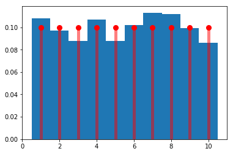
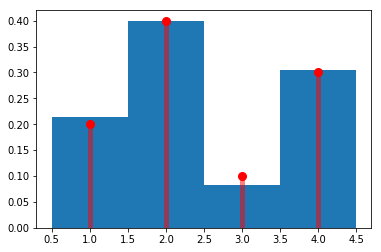
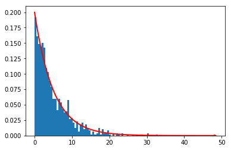

## Common Probability Distributions

#### Ahthors: Hossein Piri, Steven Shechter

This notebook describes probability distributions often used in simulation modeling, demonstrates how to generate random variables from these distributions, and visualizes the distributions through their density functions and histograms from sampled data. Other distributions to consider adding in the future, which also often arise in certain applications, include: Weibull, Beta, Gamma, Poisson

We encourage you to create your own Jupytor notebook and follow along. You can also download this notebook together with any affiliated data in the [Notebooks and Data](https://github.com/Master-of-Business-Analytics/Notebooks_and_Data) GitHub repository. Alternatively, if you do not have Python or Jupyter Notebook installed yet, you may experiment with a virtual notebook by launching Binder or Syzygy below (learn more about these two tools in the [Resource](https://analytics-at-sauder.github.io/resource.html) tab).

<a href="https://ubc.syzygy.ca/jupyter/hub/user-redirect/git-pull?repo=https%3A%2F%2Fgithub.com%2FAnalytics-at-Sauder%2FNB0014_Common_Probability_Distributions&urlpath=tree%2FNB0014_Common_Probability_Distributions%2Fnb0014_common_probability_distributions.ipynb&branch=master" target="_blank" class="button">Launch Syzygy (UBC)</a>

<a href="https://pims.syzygy.ca/jupyter/hub/user-redirect/git-pull?repo=https%3A%2F%2Fgithub.com%2FAnalytics-at-Sauder%2FNB0014_Common_Probability_Distributions&urlpath=tree%2FNB0014_Common_Probability_Distributions%2Fnb0014_common_probability_distributions.ipynb&branch=master" target="_blank" class="button">Launch Syzygy (Google)</a>

<a href="https://mybinder.org/v2/gh/Analytics-at-Sauder/NB0014_Common_Probability_Distributions/master?filepath=nb0014_common_probability_distributions.ipynb" target="_blank" class="button">Launch Binder</a>

## Probability distributions detailed in this notebook

---

### <u> <font color = blue > Discrete Random Variables: </font> </u>

### <font color = red> Discrete Uniform Distribution </font>
 Example cases: often used when all you know is the minimum and maximum values a variable can take, and you know it can take any whole number value in between with equal probability.  This is also used when you want to simulate drawing numbers out of a hat with equal chance, and with replacement each time.  e.g., we can simulate the Birthday Problem by using a discrete uniform between 1 and 365 for each person in the room.  

### <font color = red> Binomial Distribution </font>
 Example cases: you want to generate the random number of people who show up for a flight, when you sold 100 tickets and each person has a .90 probability of showing up.

### <font color = red> General Discrete Distribution </font>
 Example cases: you want to generate random whole numbers or categories, with a specific probability of getting each.  e.g., the group size of a party arriving to a restaurant will be 1, 2, 3, or 4 with probabilities .2, .4, .1, and .3, respectively.

### <u> <font color = blue > Continuous Random Variables: </font> </u>

### <font color = red> Continuous Uniform Distibution </font>
 Example cases: often used when all you know is the minimum and maximum values a variable can take, and you assume it can take any continuous value in between with equal probability.  e.g., a service time that takes anywhere between 5 and 10 minutes.

### <font color = red> Triangular Distribution </font>
 Example cases: often used when all you know is the minimum, maximum, and most likely values of a variable e.g., service time that is between 5 and 10 minutes, but  most often takes 7 minutes.

### <font color = red> Normal Distribution </font>
 Example cases: you want to generate random demand that has a normal distribution with mean 150 and standard deviation 25.

### <font color = red> Lognormal Distribution </font>
 Example cases: often used when you want to generate variables with a "long right tail." e.g., incomes in a population are often well-modeled by a log-normal distribution.  e.g., If the ln (natural log) of your data looks like a Normal distribution with mean 4 and standard deviation 1, then you can simulate values as a Lognormal with parameters mean = 4 and sd = 1. 

### <font color = red> Exponential Distribution </font>
 Example cases: often used when you want to generate random times between arrivals to a queue; e.g., inter-arrival times that are exponentially  distributed with an average of 5 minutes between arrivals.

## Examples of how to simulate these random variables

---


```python
import scipy.stats as ss
import numpy as np
import matplotlib.pyplot as plt
```

### <font color = red> Discrete Uniform Distribution </font>
Example cases: often used when all you know is the minimum and maximum values a variable can take, and you know it can take any whole number value in between with equal probability.  This is also used when you want to simulate drawing numbers out of a hat with equal chance, and with replacement each time.  e.g., we can simulate the Birthday Problem by using a discrete uniform between 1 and 365 for each person in the room.


```python
### Specify upper and lower bound
lower, upper= 1, 365

### FUNCTION TO GENERATE RANDOM VARIABLE FROM THIS DISTRIBUTION: 
np.random.randint(lower,upper+1)  #note: need the +1 to esnure that we will include the "upper" itself.

# printing 3 outputs from this distribution
print(np.random.randint(lower,upper+1))
print(np.random.randint(lower,upper+1))
print(np.random.randint(lower,upper+1))
```

    272
    182
    48
    

### <font color = red> Binomial Distribution </font>
Example cases: you want to generate the random number of people who show up for a flight, when you sold 100 tickets and each person has a .90 probability of showing up.   


```python
### Specify n and p
n, p = 100, 0.9

### FUNCTION TO GENERATE RANDOM VARIABLE FROM THIS DISTRIBUTION:
np.random.binomial(n, p)

# printing 3 outputs from this distribution
print(np.random.binomial(n, p))
print(np.random.binomial(n, p))
print(np.random.binomial(n, p))
```

    93
    94
    88
    

### <font color = red> General Discrete Distribution </font>
Example cases: you want to generate random whole numbers or categories, with a specific probability of getting each.  e.g., the group size of a party arriving to a restaurant will be 1, 2, 3, or 4 with probabilities .2, .4, .1, and .3, respectively.


```python
### Specify your array of possible outcomes and the probability of each outcome
your_array=[1,2,3,4]
probability=[.2,.4,.1,.3]

### check if probability array is valid (i.e., this checks that the sum of probabilities equals 1)
if ((np.sum(probability)>1+1e-6)|(np.sum(probability)<1-1e-6)):
    print("Error: Your array is not valid")
if len(your_array)!=len(probability):
    print("Error: the size of your array and the assigned probabilities do not match")
    
### FUNCTION TO GENERATE RANDOM VARIABLE FROM THIS DISTRIBUTION: 
np.random.choice(your_array, p=probability)

# printing 3 outputs from this distribution
print(np.random.choice(your_array, p=probability))
print(np.random.choice(your_array, p=probability))
print(np.random.choice(your_array, p=probability))
```

    2
    2
    1
    

### <font color = red> Continuous Uniform Distibution </font>
Example cases: often used when all you know is the minimum and maximum values a variable can take, and you assume it can take any continuous value in between with equal probability.  e.g., a service time that takes anywhere between 5 and 10 minutes.


```python
### Specify upper and lower bound
lower, upper= 5, 10

### FUNCTION TO GENERATE RANDOM VARIABLE FROM THIS DISTRIBUTION: 
np.random.uniform(lower, upper, 1)

# printing 3 outputs from this distribution
print(np.random.uniform(lower, upper, 1)) # 1 means that I need to generate 1 random number 
print(np.random.uniform(lower, upper, 1))
print(np.random.uniform(lower, upper, 1))
```

    [5.82251074]
    [5.84700153]
    [8.81755393]
    

### <font color = red> Triangular Distribution </font>
Example cases: often used when all you know is the minimum, maximum, and most likely values of a variable e.g., service time that is between 5 and 10 minutes, but  most often takes 7 minutes.


```python
### Specify min, mode, max
Min = 5
Mode= 7
Max= 10 

### FUNCTION TO GENERATE RANDOM VARIABLE FROM THIS DISTRIBUTION: 
np.random.triangular(Min,Mode,Max, 1)

# printing 3 outputs from this distribution
print(np.random.triangular(Min,Mode,Max, 1)) # 1 means that I need to generate 1 random number 
print(np.random.triangular(Min,Mode,Max, 1))
print(np.random.triangular(Min,Mode,Max, 1))
```

    [7.15691271]
    [6.67251991]
    [6.18580362]
    

### <font color = red> Normal Distribution </font>
Example cases: you want to generate random demand that has a normal distribution with mean 150 and standard deviation 25.


```python
### Specify mean and standard deviation
mu, sigma = 150, 25 

### FUNCTION TO GENERATE RANDOM VARIABLE FROM THIS DISTRIBUTION:
np.random.normal(mu,sigma,1) 

# printing 3 outputs from this distribution
print(np.random.normal(mu,sigma,1) ) # 1 means that I need to generate 1 random number 
print(np.random.normal(mu,sigma,1) ) 
print(np.random.normal(mu,sigma,1) ) 
```

    [171.96470781]
    [154.90223985]
    [136.76167883]
    

### <font color = red> Lognormal Distribution </font>
Example cases: often used when you want to generate variables with a "long right tail." e.g., incomes in a population are often well-modeled by a log-normal distribution.  e.g., If the ln (natural log) of your data looks like a Normal distribution with mean 4 and standard deviation 1, then you can simulate values as a Lognormal with parameters mean = 4 and sd = 1. 


```python
### Specify the mean and standard deviation of the natural log of the random variable
mu, sigma = 4, 1 

### FUNCTION TO GENERATE RANDOM VARIABLE FROM THIS DISTRIBUTION:
np.random.lognormal(mu, sigma, 1)

# printing 3 outputs from this distribution
print(np.random.lognormal(mu, sigma, 1))  # 1 means that I need to generate 1 random number 
print(np.random.lognormal(mu, sigma, 1)) 
print(np.random.lognormal(mu, sigma, 1)) 
```

    [24.79951668]
    [35.19124152]
    [45.98108506]
    

### <font color = red> Exponential Distribution </font>
Example cases: often used when you want to generate random times between arrivals to a queue; e.g., inter-arrival times that are exponentially  distributed with an average of 5 minutes between arrivals.


```python
### Specify the mean
mean = 5  

### FUNCTION TO GENERATE RANDOM VARIABLE FROM THIS DISTRIBUTION:
np.random.exponential(mean, 1)

# printing 3 outputs from this distribution
print(np.random.exponential(mean, 1)) # 1 means that I need to generate 1 random number 
print(np.random.exponential(mean, 1)) 
print(np.random.exponential(mean, 1)) 
```

    [0.50251511]
    [2.1734863]
    [35.19966146]
    

## Visualizations of these random variable distributions: Displaying the histogram of many samples (in blue), along with the probability density function (in red):

---

### <font color = red> Discrete Uniform Distribution </font>


```python
### Specify upper and lower bound
lower, upper= 1, 10

# Display the probability mass function (pmf):
fig, ax = plt.subplots(1, 1) # This sets the ground for plotting two things simultaneously

# Here I generate x and y for plotting PDF of uniform
x =range(lower,upper+1)
y=(1/len(x)) *np.ones(len(x))

ax.plot(x, y, 'bo', ms=8, label='discrete uniform pmf', color='r') # These two lines plot the pdf.
ax.vlines(x, 0, y, colors='b', lw=5, alpha=0.5, color='r')

#Generate random numbers:
#### How many random numbers you would like to generate
N=1000
result=[]
for trial in range(N):
    outcome=np.random.randint(lower,upper+1)
    result.append(outcome)
    
    
# And compare the histogram:
bins = np.arange(np.floor(min(x)), np.ceil(max(x))+2)-0.5 
count, bins, ignored=ax.hist(result, density=True,bins=bins , histtype='stepfilled')
plt.show()
```





### <font color = red> Binomial Distribution </font>


```python
### Specify n and p
n, p = 100, 0.9

fig, ax = plt.subplots(1, 1)

# Display the probability mass function (pmf):
x = np.arange(ss.binom.ppf(0.01, n, p),ss.binom.ppf(0.99, n, p))
ax.plot(x,ss. binom.pmf(x, n, p), 'bo', ms=8, label='binom pmf', color='r')
ax.vlines(x, 0, ss.binom.pmf(x, n, p), colors='b', lw=5, alpha=0.5, color='r')


#How many random numbers you would like to generate
N=1000 #
result=[]
for trial in range(N):
    outcome=np.random.binomial(n, p)
    result.append(outcome)
    
# And compare the histogram:   
bins = np.arange(np.floor(min(x)), np.ceil(max(x))+2)   -0.5
count, bins, ignored=ax.hist(result, density=True, bins=bins, histtype='stepfilled')
plt.show()
```


### <font color = red> General Discrete Distribution </font>


```python
### Specify your array of possible outcomes and the probability of each outcome
your_array=[1,2,3,4]
probability=[.2,.4,.1,.3]

# Display the probability mass function (pmf):
fig, ax = plt.subplots(1, 1)
x =your_array
y=probability
ax.plot(x, y, 'bo', ms=8, label='binom pmf', color='r')
ax.vlines(x, 0, y, colors='b', lw=5, alpha=0.5, color='r')


#### How many random numbers you would like to generate
N=1000

result=[]
for trial in range(N):
    outcome= np.random.choice(your_array, p=probability)
    result.append(outcome)
    
    
# And compare the histogram:
bins = np.arange(np.floor(min(x)), np.ceil(max(x))+2)-0.5  
count, bins, ignored=ax.hist(result,bins=bins, density=True, histtype='stepfilled')
plt.show()
```





### <font color = red> Continuous Uniform Distibution </font>


```python
### Specify upper and lower bound
lower, upper= 5, 10

#### How many random numbers you would like to generate
N=1000
result = np.random.uniform(lower, upper, N)

### Display the histogram of the samples, along with the probability density function:

#### Histogram
num_bins=100
count, bins, ignored = plt.hist(result,num_bins, density=True, align='mid')

#### PDF
x = np.linspace(min(bins), max(bins), 10000)
width=x[1]-x[0] ### Take the width of each bar
size=np.size(x)
pdf =( (1/size) *np.ones(size) )/width
plt.plot(x, pdf, linewidth=2, color='r')
plt.axis('tight')
plt.show()
```


### <font color = red> Triangular Distribution </font>


```python
### Specify min, mode, max
Min = 5
Mode= 7
Max= 10 

#### How many random numbers you would like to generate
N=10000
result  = np.random.triangular(Min,Mode,Max, N)

### Display the histogram of the samples, along with the probability density function:

num_bins=100
count, bins, ignored = plt.hist(result , num_bins, density=True, align='mid')
x = np.linspace(min(bins), max(bins), 1000)
line1=2*(x-Min)/((Max-Min)*(Mode-Min))
line2=2*(Max-x)/((Max-Min)*(Max-Mode))
pdf = [min(line1[i],line2[i]) for i in range(len(line1))] ### Choose the minimum of two lines
plt.plot(x, pdf, linewidth=2, color='r')
plt.axis('tight')
plt.show()

```


### <font color = red> Normal Distribution </font>


```python
# Specify the mean and standard deviation
mu, sigma = 150, 25 

#### How many random numbers you would like to generate
N=1000

result= np.random.normal(mu,sigma,N) ### generate N random numbers

### Display the histogram of the samples, along with the probability density function:
num_bins=30
count, bins, ignored = plt.hist(result, num_bins, density=True)
plt.plot(bins, 1/(sigma * np.sqrt(2 * np.pi)) *np.exp( - (bins - mu)**2 / (2 * sigma**2) ),linewidth=2, color='r')
plt.show()
```


### <font color = red> Lognormal Distribution </font>


```python
### Specify the mean and standard deviation of the natural log of the random variable
mu, sigma = 4, 1 

#### How many random numbers you would like to generate
N=1000
result = np.random.lognormal(mu, sigma, N)

### Display the histogram of the samples, along with the probability density function:

bins = np.linspace(.1,500) #cutting it off at 500
count, bins, ignored = plt.hist(result,bins = bins, density=True, align='mid')
x = np.linspace(min(bins), 500, 10000)

pdf = (np.exp(-(np.log(x) - mu)**2 / (2 * sigma**2))/ (x * sigma * np.sqrt(2 * np.pi)))
plt.plot(x, pdf, linewidth=2, color='r')
plt.axis('tight')
plt.show()
```


### <font color = red> Exponential Distribution </font>


```python
### Specify the mean
mean = 5

#### How many random numbers you would like to generate
N=1000
result = np.random.exponential(mean, N)

### Display the histogram of the samples, along with the probability density function:

num_bins=100
count, bins, ignored = plt.hist(result , num_bins, density=True, align='mid')
x = np.linspace(min(bins), 800, 10000)
pdf = 1/mean*np.exp(-1/mean*x)
plt.plot(x, pdf, linewidth=2, color='r')
plt.axis('tight')
plt.show()
```




