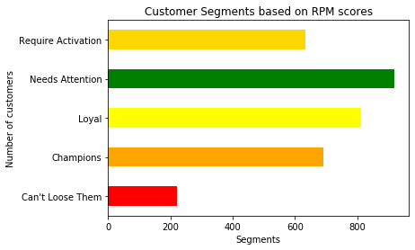

Customer Analytics is important to run a successful business. Sales and marketing resources are finite and expensive, therefore it is important to answer these questions when developing a marketing strategy.

* Who are our most/least valuable customers?
* How can we acquire new customers that resemble our most valuable?

In this project, we focus on RFM analysis. This type of analysis is used when historical data for existing customers is available. RFM Analysis identifies existing customers who are most likely to remain loyal to a company or respond to a new product. RFM analysis allows you to create customized and personalized messaging, and this can be used to streamline the various messages you send to a specific customer and continue sending messages of only a particular type, thereby reducing the chance of dissatisfaction or annoyance, and create higher customer satisfaction. RFM is a model based on historical data and helps forecast future behavior based on past interactions. 

All of the graphs and code can be found in the MBAN GitHub repository, feel free to download it and modify the numbers for your use case.
The Jupyter notebook can be opened in the executable environment Syzygy.

<a href="https://ubc.syzygy.ca/jupyter/hub/user-redirect/git-pull?repo=https%3A%2F%2Fgithub.com%2FMaster-of-Business-Analytics%2FProject_06_RFM_Analysis&urlpath=tree%2FProject_06_RFM_Analysis%2FRFM_Analysis.ipynb" target="_blank" class="button">Launch Syzygy</a>


# Business Problem 
How do we segment our customers to reach them effectively through target marketing?
By applying the paraeto principle to a customer database,  80% of a company's revenue comes from 20% of the customers. RFM helps determine who the top 20% of customers are and groups the remaining customers into other segments such as price-sensitive, potentially loyal, brand sensitive, etc. This ensures that each customer is better targeted and convert the other segments into the higher value segments and increase customer lifetime value. 
In this project, the customer sales data from January 2011 to May 2011 of an E-commerce store is analyzed to group customers from the United Kingdom into segments using the RFM model. The relevant libraries and the dataset is imported into the python environment. 


## Data Set
There are  eight variables in the data set:

1. InvoiceNo: Invoice number,  A 6-digit integral number uniquely assigned to each transaction.
2. StockCode: Product code, a 5-digit integral number uniquely assigned to each distinct product.
3. Description: Product name
4. Quantity: The quantities of each product (item) per transaction.
5. InvoiceDate: Invoice Date and time. Numeric, the day and time when each transaction was generated.
6. UnitPrice: Unit price. Numeric, Product price per unit in sterling.
7. CustomerID: Customer number, a 5-digit integral number uniquely assigned to each customer.
8. Country 

```python
import pandas as pd
import numpy as np
import seaborn as sns
from datetime import timedelta
import numpy as np
import matplotlib.pyplot as plt

pd.set_option("display.max_columns",None);
pd.set_option("display.max_rows",None);

#load data
url = 'https://raw.githubusercontent.com/Master-of-Business-Analytics/Project_06_RFM_Analysis/master/data.csv'
df = pd.read_csv(url, error_bad_lines=False,encoding= 'unicode_escape')

```


```python

df.head(5)
```


<div>
<style scoped>
    .dataframe tbody tr th:only-of-type {
        vertical-align: middle;
    }

    .dataframe tbody tr th {
        vertical-align: top;
    }

    .dataframe thead th {
        text-align: right;
    }
</style>
<table border="1" class="dataframe">
  <thead>
    <tr style="text-align: right;">
      <th></th>
      <th>InvoiceNo</th>
      <th>StockCode</th>
      <th>Description</th>
      <th>Quantity</th>
      <th>InvoiceDate</th>
      <th>UnitPrice</th>
      <th>CustomerID</th>
      <th>Country</th>
    </tr>
  </thead>
  <tbody>
    <tr>
      <th>0</th>
      <td>540558</td>
      <td>21258</td>
      <td>?</td>
      <td>-29</td>
      <td>1/10/2011 10:04</td>
      <td>0.00</td>
      <td>NaN</td>
      <td>United Kingdom</td>
    </tr>
    <tr>
      <th>1</th>
      <td>540560</td>
      <td>21589</td>
      <td>NaN</td>
      <td>-14</td>
      <td>1/10/2011 10:08</td>
      <td>0.00</td>
      <td>NaN</td>
      <td>United Kingdom</td>
    </tr>
    <tr>
      <th>2</th>
      <td>540561</td>
      <td>22343</td>
      <td>PARTY PIZZA DISH RED RETROSPOT</td>
      <td>24</td>
      <td>1/10/2011 10:32</td>
      <td>0.21</td>
      <td>13004.0</td>
      <td>United Kingdom</td>
    </tr>
    <tr>
      <th>3</th>
      <td>540561</td>
      <td>22344</td>
      <td>PARTY PIZZA DISH PINK POLKADOT</td>
      <td>24</td>
      <td>1/10/2011 10:32</td>
      <td>0.21</td>
      <td>13004.0</td>
      <td>United Kingdom</td>
    </tr>
    <tr>
      <th>4</th>
      <td>540561</td>
      <td>47504H</td>
      <td>ENGLISH ROSE SPIRIT LEVEL</td>
      <td>24</td>
      <td>1/10/2011 10:32</td>
      <td>0.85</td>
      <td>13004.0</td>
      <td>United Kingdom</td>
    </tr>
  </tbody>
</table>
</div>

#Data cleaning 
The dataset seemed relatively clean at first glance, but it was actually riddled with Null values. The code chunk below creates a new column that calculates the total purchase for each transaction. The NA values are also identified and the rows containing these NA values are removed. 
There are several methods of removing NA values from a dataset; replacing with another value or deleting the entire row. The choice of removal is dependent on the what data is been manipulated and how much data is available.

```python
df.describe()
```


<div>
<style scoped>
    .dataframe tbody tr th:only-of-type {
        vertical-align: middle;
    }

    .dataframe tbody tr th {
        vertical-align: top;
    }

    .dataframe thead th {
        text-align: right;
    }
</style>
<table border="1" class="dataframe">
  <thead>
    <tr style="text-align: right;">
      <th></th>
      <th>Quantity</th>
      <th>UnitPrice</th>
      <th>CustomerID</th>
    </tr>
  </thead>
  <tbody>
    <tr>
      <th>count</th>
      <td>290603.000000</td>
      <td>290603.000000</td>
      <td>214539.000000</td>
    </tr>
    <tr>
      <th>mean</th>
      <td>8.363265</td>
      <td>4.302626</td>
      <td>15528.122756</td>
    </tr>
    <tr>
      <th>std</th>
      <td>292.791363</td>
      <td>72.531652</td>
      <td>1592.760180</td>
    </tr>
    <tr>
      <th>min</th>
      <td>-80995.000000</td>
      <td>0.000000</td>
      <td>12346.000000</td>
    </tr>
    <tr>
      <th>25%</th>
      <td>1.000000</td>
      <td>1.250000</td>
      <td>14159.000000</td>
    </tr>
    <tr>
      <th>50%</th>
      <td>3.000000</td>
      <td>2.100000</td>
      <td>15493.000000</td>
    </tr>
    <tr>
      <th>75%</th>
      <td>10.000000</td>
      <td>4.130000</td>
      <td>16923.000000</td>
    </tr>
    <tr>
      <th>max</th>
      <td>80995.000000</td>
      <td>17836.460000</td>
      <td>18287.000000</td>
    </tr>
  </tbody>
</table>
</div>


In any event, it is good practice to sift out incorrect transactions, particularly when they result in extreme outliers. So in this section, the large transactions are scanned to clean the data. More information on data cleaning can be found on the [data cleaning project](https://master-of-business-analytics.github.io/Website/Data_Cleaning.html).


```python
# information about the data set
print('{:,} rows; {:,} columns'
      .format(df.shape[0], df.shape[1]))
print('{:,} transactions don\'t have a customer id'
      .format(df[df.CustomerID.isnull()].shape[0]))
print('Transactions timeframe from {} to {}'.format(df['InvoiceDate'].min(),
                                    df['InvoiceDate'].max()))

#Eliminating NA rows in Cstomer ID

df=df[df.notnull().all(axis=1)] #eliminating NA
```
```
    290,603 rows; 8 columns
    76,064 transactions don't have a customer id
    Transactions timeframe from 1/10/2011 10:04 to 5/20/2011 14:06
```


```python
print('{:,} rows; {:,} columns'
      .format(df.shape[0], df.shape[1]))
```
```
    214,539 rows; 8 columns

```

```python
#remove mi
df.drop(index=[df['Quantity'].idxmax(), df['Quantity'].idxmin()], inplace=True)
df.describe()
```


<div>
<style scoped>
    .dataframe tbody tr th:only-of-type {
        vertical-align: middle;
    }

    .dataframe tbody tr th {
        vertical-align: top;
    }

    .dataframe thead th {
        text-align: right;
    }
</style>
<table border="1" class="dataframe">
  <thead>
    <tr style="text-align: right;">
      <th></th>
      <th>Quantity</th>
      <th>UnitPrice</th>
      <th>CustomerID</th>
    </tr>
  </thead>
  <tbody>
    <tr>
      <th>count</th>
      <td>214537.000000</td>
      <td>214537.000000</td>
      <td>214537.000000</td>
    </tr>
    <tr>
      <th>mean</th>
      <td>10.561642</td>
      <td>3.048388</td>
      <td>15528.114199</td>
    </tr>
    <tr>
      <th>std</th>
      <td>232.168351</td>
      <td>14.165101</td>
      <td>1592.765139</td>
    </tr>
    <tr>
      <th>min</th>
      <td>-74215.000000</td>
      <td>0.000000</td>
      <td>12346.000000</td>
    </tr>
    <tr>
      <th>25%</th>
      <td>2.000000</td>
      <td>1.250000</td>
      <td>14159.000000</td>
    </tr>
    <tr>
      <th>50%</th>
      <td>4.000000</td>
      <td>1.950000</td>
      <td>15493.000000</td>
    </tr>
    <tr>
      <th>75%</th>
      <td>12.000000</td>
      <td>3.750000</td>
      <td>16923.000000</td>
    </tr>
    <tr>
      <th>max</th>
      <td>74215.000000</td>
      <td>3155.950000</td>
      <td>18287.000000</td>
    </tr>
  </tbody>
</table>
</div>


```python

df.drop(index=[df['Quantity'].idxmax(), df['Quantity'].idxmin()], inplace=True)
df.describe()
```


<div>
<style scoped>
    .dataframe tbody tr th:only-of-type {
        vertical-align: middle;
    }

    .dataframe tbody tr th {
        vertical-align: top;
    }

    .dataframe thead th {
        text-align: right;
    }
</style>
<table border="1" class="dataframe">
  <thead>
    <tr style="text-align: right;">
      <th></th>
      <th>Quantity</th>
      <th>UnitPrice</th>
      <th>CustomerID</th>
    </tr>
  </thead>
  <tbody>
    <tr>
      <th>count</th>
      <td>214535.000000</td>
      <td>214535.000000</td>
      <td>214535.000000</td>
    </tr>
    <tr>
      <th>mean</th>
      <td>10.561741</td>
      <td>3.048407</td>
      <td>15528.143865</td>
    </tr>
    <tr>
      <th>std</th>
      <td>50.550843</td>
      <td>14.165166</td>
      <td>1592.742929</td>
    </tr>
    <tr>
      <th>min</th>
      <td>-3114.000000</td>
      <td>0.000000</td>
      <td>12747.000000</td>
    </tr>
    <tr>
      <th>25%</th>
      <td>2.000000</td>
      <td>1.250000</td>
      <td>14159.000000</td>
    </tr>
    <tr>
      <th>50%</th>
      <td>4.000000</td>
      <td>1.950000</td>
      <td>15493.000000</td>
    </tr>
    <tr>
      <th>75%</th>
      <td>12.000000</td>
      <td>3.750000</td>
      <td>16923.000000</td>
    </tr>
    <tr>
      <th>max</th>
      <td>12540.000000</td>
      <td>3155.950000</td>
      <td>18287.000000</td>
    </tr>
  </tbody>
</table>
</div>


Note that the Minimum quantity and Maximum quantity have different absolute values.


```python
df.describe()
```

<div>
<style scoped>
    .dataframe tbody tr th:only-of-type {
        vertical-align: middle;
    }

    .dataframe tbody tr th {
        vertical-align: top;
    }

    .dataframe thead th {
        text-align: right;
    }
</style>
<table border="1" class="dataframe">
  <thead>
    <tr style="text-align: right;">
      <th></th>
      <th>Quantity</th>
      <th>UnitPrice</th>
      <th>CustomerID</th>
    </tr>
  </thead>
  <tbody>
    <tr>
      <th>count</th>
      <td>214516.000000</td>
      <td>214516.000000</td>
      <td>214516.000000</td>
    </tr>
    <tr>
      <th>mean</th>
      <td>10.503361</td>
      <td>3.048677</td>
      <td>15528.224948</td>
    </tr>
    <tr>
      <th>std</th>
      <td>42.705725</td>
      <td>14.165764</td>
      <td>1592.710040</td>
    </tr>
    <tr>
      <th>min</th>
      <td>-3114.000000</td>
      <td>0.001000</td>
      <td>12747.000000</td>
    </tr>
    <tr>
      <th>25%</th>
      <td>2.000000</td>
      <td>1.250000</td>
      <td>14159.000000</td>
    </tr>
    <tr>
      <th>50%</th>
      <td>4.000000</td>
      <td>1.950000</td>
      <td>15493.000000</td>
    </tr>
    <tr>
      <th>75%</th>
      <td>12.000000</td>
      <td>3.750000</td>
      <td>16923.000000</td>
    </tr>
    <tr>
      <th>max</th>
      <td>4800.000000</td>
      <td>3155.950000</td>
      <td>18287.000000</td>
    </tr>
  </tbody>
</table>
</div>


```python
# Convert InvoiceDate from object to datetime format
df['InvoiceDate'] = pd.to_datetime(df['InvoiceDate'])

#creating a total sales column
df["Totalsum"] = df['Quantity'] * df['UnitPrice']
```


```python
#Check the remaining large negative transactions
df[df.Totalsum<0].sort_values('Totalsum').head(10)
```


<div>
<style scoped>
    .dataframe tbody tr th:only-of-type {
        vertical-align: middle;
    }

    .dataframe tbody tr th {
        vertical-align: top;
    }

    .dataframe thead th {
        text-align: right;
    }
</style>
<table border="1" class="dataframe">
  <thead>
    <tr style="text-align: right;">
      <th></th>
      <th>InvoiceNo</th>
      <th>StockCode</th>
      <th>Description</th>
      <th>Quantity</th>
      <th>InvoiceDate</th>
      <th>UnitPrice</th>
      <th>CustomerID</th>
      <th>Country</th>
      <th>Totalsum</th>
    </tr>
  </thead>
  <tbody>
    <tr>
      <th>257377</th>
      <td>C550456</td>
      <td>21108</td>
      <td>FAIRY CAKE FLANNEL ASSORTED COLOUR</td>
      <td>-3114</td>
      <td>2011-04-18 13:08:00</td>
      <td>2.10</td>
      <td>15749.0</td>
      <td>United Kingdom</td>
      <td>-6539.40</td>
    </tr>
    <tr>
      <th>257375</th>
      <td>C550456</td>
      <td>85123A</td>
      <td>WHITE HANGING HEART T-LIGHT HOLDER</td>
      <td>-1930</td>
      <td>2011-04-18 13:08:00</td>
      <td>2.55</td>
      <td>15749.0</td>
      <td>United Kingdom</td>
      <td>-4921.50</td>
    </tr>
    <tr>
      <th>257373</th>
      <td>C550456</td>
      <td>48185</td>
      <td>DOORMAT FAIRY CAKE</td>
      <td>-670</td>
      <td>2011-04-18 13:08:00</td>
      <td>6.75</td>
      <td>15749.0</td>
      <td>United Kingdom</td>
      <td>-4522.50</td>
    </tr>
    <tr>
      <th>257376</th>
      <td>C550456</td>
      <td>21175</td>
      <td>GIN + TONIC DIET METAL SIGN</td>
      <td>-2000</td>
      <td>2011-04-18 13:08:00</td>
      <td>1.85</td>
      <td>15749.0</td>
      <td>United Kingdom</td>
      <td>-3700.00</td>
    </tr>
    <tr>
      <th>257374</th>
      <td>C550456</td>
      <td>47566B</td>
      <td>TEA TIME PARTY BUNTING</td>
      <td>-1300</td>
      <td>2011-04-18 13:08:00</td>
      <td>2.55</td>
      <td>15749.0</td>
      <td>United Kingdom</td>
      <td>-3315.00</td>
    </tr>
    <tr>
      <th>275098</th>
      <td>C549452</td>
      <td>D</td>
      <td>Discount</td>
      <td>-1</td>
      <td>2011-04-08 14:17:00</td>
      <td>1867.86</td>
      <td>17940.0</td>
      <td>United Kingdom</td>
      <td>-1867.86</td>
    </tr>
    <tr>
      <th>35080</th>
      <td>C570556</td>
      <td>22273</td>
      <td>FELTCRAFT DOLL MOLLY</td>
      <td>-720</td>
      <td>2011-10-11 11:10:00</td>
      <td>2.55</td>
      <td>16029.0</td>
      <td>United Kingdom</td>
      <td>-1836.00</td>
    </tr>
    <tr>
      <th>35074</th>
      <td>C570556</td>
      <td>22273</td>
      <td>FELTCRAFT DOLL MOLLY</td>
      <td>-720</td>
      <td>2011-10-11 11:10:00</td>
      <td>2.30</td>
      <td>16029.0</td>
      <td>United Kingdom</td>
      <td>-1656.00</td>
    </tr>
    <tr>
      <th>69265</th>
      <td>C569387</td>
      <td>23284</td>
      <td>DOORMAT KEEP CALM AND COME IN</td>
      <td>-200</td>
      <td>2011-10-03 16:49:00</td>
      <td>7.08</td>
      <td>14031.0</td>
      <td>United Kingdom</td>
      <td>-1416.00</td>
    </tr>
    <tr>
      <th>35081</th>
      <td>C570556</td>
      <td>20971</td>
      <td>PINK BLUE FELT CRAFT TRINKET BOX</td>
      <td>-1296</td>
      <td>2011-10-11 11:10:00</td>
      <td>1.06</td>
      <td>16029.0</td>
      <td>United Kingdom</td>
      <td>-1373.76</td>
    </tr>
  </tbody>
</table>
</div>


```python
# Customer 15749 is in the top 10 
df[df.CustomerID==15749].sort_values('Totalsum').head(10)
```


<div>
<style scoped>
    .dataframe tbody tr th:only-of-type {
        vertical-align: middle;
    }

    .dataframe tbody tr th {
        vertical-align: top;
    }

    .dataframe thead th {
        text-align: right;
    }
</style>
<table border="1" class="dataframe">
  <thead>
    <tr style="text-align: right;">
      <th></th>
      <th>InvoiceNo</th>
      <th>StockCode</th>
      <th>Description</th>
      <th>Quantity</th>
      <th>InvoiceDate</th>
      <th>UnitPrice</th>
      <th>CustomerID</th>
      <th>Country</th>
      <th>Totalsum</th>
    </tr>
  </thead>
  <tbody>
    <tr>
      <th>257377</th>
      <td>C550456</td>
      <td>21108</td>
      <td>FAIRY CAKE FLANNEL ASSORTED COLOUR</td>
      <td>-3114</td>
      <td>2011-04-18 13:08:00</td>
      <td>2.10</td>
      <td>15749.0</td>
      <td>United Kingdom</td>
      <td>-6539.4</td>
    </tr>
    <tr>
      <th>257375</th>
      <td>C550456</td>
      <td>85123A</td>
      <td>WHITE HANGING HEART T-LIGHT HOLDER</td>
      <td>-1930</td>
      <td>2011-04-18 13:08:00</td>
      <td>2.55</td>
      <td>15749.0</td>
      <td>United Kingdom</td>
      <td>-4921.5</td>
    </tr>
    <tr>
      <th>257373</th>
      <td>C550456</td>
      <td>48185</td>
      <td>DOORMAT FAIRY CAKE</td>
      <td>-670</td>
      <td>2011-04-18 13:08:00</td>
      <td>6.75</td>
      <td>15749.0</td>
      <td>United Kingdom</td>
      <td>-4522.5</td>
    </tr>
    <tr>
      <th>257376</th>
      <td>C550456</td>
      <td>21175</td>
      <td>GIN + TONIC DIET METAL SIGN</td>
      <td>-2000</td>
      <td>2011-04-18 13:08:00</td>
      <td>1.85</td>
      <td>15749.0</td>
      <td>United Kingdom</td>
      <td>-3700.0</td>
    </tr>
    <tr>
      <th>257374</th>
      <td>C550456</td>
      <td>47566B</td>
      <td>TEA TIME PARTY BUNTING</td>
      <td>-1300</td>
      <td>2011-04-18 13:08:00</td>
      <td>2.55</td>
      <td>15749.0</td>
      <td>United Kingdom</td>
      <td>-3315.0</td>
    </tr>
    <tr>
      <th>257775</th>
      <td>550461</td>
      <td>47556B</td>
      <td>TEA TIME TEA TOWELS</td>
      <td>1300</td>
      <td>2011-04-18 13:20:00</td>
      <td>2.10</td>
      <td>15749.0</td>
      <td>United Kingdom</td>
      <td>2730.0</td>
    </tr>
    <tr>
      <th>2204</th>
      <td>540818</td>
      <td>47556B</td>
      <td>TEA TIME TEA TOWELS</td>
      <td>1300</td>
      <td>2011-01-11 12:57:00</td>
      <td>2.55</td>
      <td>15749.0</td>
      <td>United Kingdom</td>
      <td>3315.0</td>
    </tr>
    <tr>
      <th>257777</th>
      <td>550461</td>
      <td>21175</td>
      <td>GIN + TONIC DIET METAL SIGN</td>
      <td>2000</td>
      <td>2011-04-18 13:20:00</td>
      <td>1.69</td>
      <td>15749.0</td>
      <td>United Kingdom</td>
      <td>3380.0</td>
    </tr>
    <tr>
      <th>2143</th>
      <td>540815</td>
      <td>21175</td>
      <td>GIN + TONIC DIET METAL SIGN</td>
      <td>2000</td>
      <td>2011-01-11 12:55:00</td>
      <td>1.85</td>
      <td>15749.0</td>
      <td>United Kingdom</td>
      <td>3700.0</td>
    </tr>
    <tr>
      <th>257776</th>
      <td>550461</td>
      <td>48185</td>
      <td>DOORMAT FAIRY CAKE</td>
      <td>670</td>
      <td>2011-04-18 13:20:00</td>
      <td>6.35</td>
      <td>15749.0</td>
      <td>United Kingdom</td>
      <td>4254.5</td>
    </tr>
  </tbody>
</table>
</div>


```python
# removing cancelled orders
df.drop(index=[257377,257778, 257375, 257373,2142,2205,2143,257374,257376,2204], inplace=True)
```


```python
# customer 16029
df[df.CustomerID==16029].sort_values('InvoiceDate').head(10)
```


<div>
<style scoped>
    .dataframe tbody tr th:only-of-type {
        vertical-align: middle;
    }

    .dataframe tbody tr th {
        vertical-align: top;
    }

    .dataframe thead th {
        text-align: right;
    }
</style>
<table border="1" class="dataframe">
  <thead>
    <tr style="text-align: right;">
      <th></th>
      <th>InvoiceNo</th>
      <th>StockCode</th>
      <th>Description</th>
      <th>Quantity</th>
      <th>InvoiceDate</th>
      <th>UnitPrice</th>
      <th>CustomerID</th>
      <th>Country</th>
      <th>Totalsum</th>
    </tr>
  </thead>
  <tbody>
    <tr>
      <th>25750</th>
      <td>C540030</td>
      <td>22070</td>
      <td>SMALL RED RETROSPOT MUG IN BOX</td>
      <td>-24</td>
      <td>2011-01-04 13:47:00</td>
      <td>3.75</td>
      <td>16029.0</td>
      <td>United Kingdom</td>
      <td>-90.00</td>
    </tr>
    <tr>
      <th>25749</th>
      <td>540029</td>
      <td>22207</td>
      <td>FRYING PAN UNION FLAG</td>
      <td>24</td>
      <td>2011-01-04 13:47:00</td>
      <td>3.75</td>
      <td>16029.0</td>
      <td>United Kingdom</td>
      <td>90.00</td>
    </tr>
    <tr>
      <th>5679</th>
      <td>541105</td>
      <td>85099F</td>
      <td>JUMBO BAG STRAWBERRY</td>
      <td>200</td>
      <td>2011-01-13 14:34:00</td>
      <td>1.65</td>
      <td>16029.0</td>
      <td>United Kingdom</td>
      <td>330.00</td>
    </tr>
    <tr>
      <th>5680</th>
      <td>541105</td>
      <td>22386</td>
      <td>JUMBO BAG PINK POLKADOT</td>
      <td>200</td>
      <td>2011-01-13 14:34:00</td>
      <td>1.65</td>
      <td>16029.0</td>
      <td>United Kingdom</td>
      <td>330.00</td>
    </tr>
    <tr>
      <th>13090</th>
      <td>541610</td>
      <td>84880</td>
      <td>WHITE WIRE EGG HOLDER</td>
      <td>17</td>
      <td>2011-01-20 10:18:00</td>
      <td>4.95</td>
      <td>16029.0</td>
      <td>United Kingdom</td>
      <td>84.15</td>
    </tr>
    <tr>
      <th>13091</th>
      <td>541610</td>
      <td>22207</td>
      <td>FRYING PAN UNION FLAG</td>
      <td>48</td>
      <td>2011-01-20 10:18:00</td>
      <td>3.75</td>
      <td>16029.0</td>
      <td>United Kingdom</td>
      <td>180.00</td>
    </tr>
    <tr>
      <th>13092</th>
      <td>541610</td>
      <td>21928</td>
      <td>JUMBO BAG SCANDINAVIAN PAISLEY</td>
      <td>100</td>
      <td>2011-01-20 10:18:00</td>
      <td>1.65</td>
      <td>16029.0</td>
      <td>United Kingdom</td>
      <td>165.00</td>
    </tr>
    <tr>
      <th>13093</th>
      <td>541611</td>
      <td>79321</td>
      <td>CHILLI LIGHTS</td>
      <td>96</td>
      <td>2011-01-20 10:18:00</td>
      <td>3.82</td>
      <td>16029.0</td>
      <td>United Kingdom</td>
      <td>366.72</td>
    </tr>
    <tr>
      <th>13094</th>
      <td>541611</td>
      <td>22779</td>
      <td>WOODEN OWLS LIGHT GARLAND</td>
      <td>48</td>
      <td>2011-01-20 10:18:00</td>
      <td>3.37</td>
      <td>16029.0</td>
      <td>United Kingdom</td>
      <td>161.76</td>
    </tr>
    <tr>
      <th>19493</th>
      <td>541992</td>
      <td>85099B</td>
      <td>JUMBO BAG RED RETROSPOT</td>
      <td>100</td>
      <td>2011-01-25 09:31:00</td>
      <td>1.65</td>
      <td>16029.0</td>
      <td>United Kingdom</td>
      <td>165.00</td>
    </tr>
  </tbody>
</table>
</div>


```python
# deleting more cancelled orders
df.drop(index=[35090,35080,35074,83508,35077,83505,35075,35084,35076,83502,35089,35071,35072,35032,35088,35026,83471,35082,35079,35073,83469,35087], inplace=True)

```

```python
df.describe()
```

<div>
<style scoped>
    .dataframe tbody tr th:only-of-type {
        vertical-align: middle;
    }

    .dataframe tbody tr th {
        vertical-align: top;
    }

    .dataframe thead th {
        text-align: right;
    }
</style>
<table border="1" class="dataframe">
  <thead>
    <tr style="text-align: right;">
      <th></th>
      <th>Quantity</th>
      <th>UnitPrice</th>
      <th>CustomerID</th>
      <th>Totalsum</th>
    </tr>
  </thead>
  <tbody>
    <tr>
      <th>count</th>
      <td>214484.000000</td>
      <td>214484.000000</td>
      <td>214484.000000</td>
      <td>214484.000000</td>
    </tr>
    <tr>
      <th>mean</th>
      <td>10.504928</td>
      <td>3.048726</td>
      <td>15528.163290</td>
      <td>17.793502</td>
    </tr>
    <tr>
      <th>std</th>
      <td>40.050825</td>
      <td>14.166812</td>
      <td>1592.820059</td>
      <td>62.596212</td>
    </tr>
    <tr>
      <th>min</th>
      <td>-1350.000000</td>
      <td>0.001000</td>
      <td>12747.000000</td>
      <td>-1867.860000</td>
    </tr>
    <tr>
      <th>25%</th>
      <td>2.000000</td>
      <td>1.250000</td>
      <td>14159.000000</td>
      <td>3.750000</td>
    </tr>
    <tr>
      <th>50%</th>
      <td>4.000000</td>
      <td>1.950000</td>
      <td>15493.000000</td>
      <td>9.950000</td>
    </tr>
    <tr>
      <th>75%</th>
      <td>12.000000</td>
      <td>3.750000</td>
      <td>16923.000000</td>
      <td>17.700000</td>
    </tr>
    <tr>
      <th>max</th>
      <td>4800.000000</td>
      <td>3155.950000</td>
      <td>18287.000000</td>
      <td>6539.400000</td>
    </tr>
  </tbody>
</table>
</div>

# RFM analysis 
The RFM Model of customer value uses proven marketing principles to help businesses differentiate between marketing to existing and helps them create relevantly and personalized messaging by understanding user behavior. The model allows the business to segment its users based on three criteria based on an existing customer’s transaction history, namely:

1. The recency of Customer's Last purchase 
2. Frequency of purchases 
3. Total amount spent, which is referred to as monetary

The RFM model, when used in conjunction with traditional models of segmentation, can help businesses visualize existing customers differently.

The customer records are grouped by recency of their purchase, the frequency by their quantity, and the monetary value of the purchases. 

## Recency Score
To calculate recency, a snapshot date is created. This date is one day after the most recent invoice date of the data set. The date difference is used to show the recency of the purchase.

```python
# Create snapshot date
snapshot_date = df['InvoiceDate'].max() + timedelta(days=1)  # set current date as most recent date plus one day
rec_df = snapshot_date-df.groupby("CustomerID").agg({"InvoiceDate":max}) 
#group customers by their most recent purchase

rec_df.rename(columns={"InvoiceDate": "Recency"}, inplace=True)#rename column
rec_df=rec_df["Recency"].apply(lambda x: x.days) #extracting number of days only
rec_df.head(5)
```
```

    CustomerID
    12747.0      2
    12748.0      1
    12749.0      4
    12820.0      3
    12823.0    255
    Name: Recency, dtype: int64

```

## Frequency Score
To calculate the frequency, the number of invoices per customer is calculated.

```python
freq_df = df.groupby("CustomerID").agg({'InvoiceNo': 'count'})
freq_df.rename(columns={"InvoiceNo": "Frequency"}, inplace=True)#rename column
freq_df.head()
```


<div>
<style scoped>
    .dataframe tbody tr th:only-of-type {
        vertical-align: middle;
    }

    .dataframe tbody tr th {
        vertical-align: top;
    }

    .dataframe thead th {
        text-align: right;
    }
</style>
<table border="1" class="dataframe">
  <thead>
    <tr style="text-align: right;">
      <th></th>
      <th>Frequency</th>
    </tr>
    <tr>
      <th>CustomerID</th>
      <th></th>
    </tr>
  </thead>
  <tbody>
    <tr>
      <th>12747.0</th>
      <td>50</td>
    </tr>
    <tr>
      <th>12748.0</th>
      <td>2729</td>
    </tr>
    <tr>
      <th>12749.0</th>
      <td>114</td>
    </tr>
    <tr>
      <th>12820.0</th>
      <td>45</td>
    </tr>
    <tr>
      <th>12823.0</th>
      <td>3</td>
    </tr>
  </tbody>
</table>
</div>


## Monetary Score

To calculated the monetary score, the total value of the purchases made by each customer is calculated.


```python
mon_df = df.groupby("CustomerID").agg({'Totalsum': 'sum'})
mon_df.rename(columns={"Totalsum": "Monetary"}, inplace=True)#rename column
mon_df.head(5)
```


<div>
<style scoped>
    .dataframe tbody tr th:only-of-type {
        vertical-align: middle;
    }

    .dataframe tbody tr th {
        vertical-align: top;
    }

    .dataframe thead th {
        text-align: right;
    }
</style>
<table border="1" class="dataframe">
  <thead>
    <tr style="text-align: right;">
      <th></th>
      <th>Monetary</th>
    </tr>
    <tr>
      <th>CustomerID</th>
      <th></th>
    </tr>
  </thead>
  <tbody>
    <tr>
      <th>12747.0</th>
      <td>2040.43</td>
    </tr>
    <tr>
      <th>12748.0</th>
      <td>15727.57</td>
    </tr>
    <tr>
      <th>12749.0</th>
      <td>2194.75</td>
    </tr>
    <tr>
      <th>12820.0</th>
      <td>724.57</td>
    </tr>
    <tr>
      <th>12823.0</th>
      <td>994.50</td>
    </tr>
  </tbody>
</table>
</div>


## RFM Score


```python
rfm=pd.concat([rec_df,freq_df, mon_df], axis=1) #combining all scores
rfm.head(7)
```


<div>
<style scoped>
    .dataframe tbody tr th:only-of-type {
        vertical-align: middle;
    }

    .dataframe tbody tr th {
        vertical-align: top;
    }

    .dataframe thead th {
        text-align: right;
    }
</style>
<table border="1" class="dataframe">
  <thead>
    <tr style="text-align: right;">
      <th></th>
      <th>Recency</th>
      <th>Frequency</th>
      <th>Monetary</th>
    </tr>
    <tr>
      <th>CustomerID</th>
      <th></th>
      <th></th>
      <th></th>
    </tr>
  </thead>
  <tbody>
    <tr>
      <th>12747.0</th>
      <td>2</td>
      <td>50</td>
      <td>2040.43</td>
    </tr>
    <tr>
      <th>12748.0</th>
      <td>1</td>
      <td>2729</td>
      <td>15727.57</td>
    </tr>
    <tr>
      <th>12749.0</th>
      <td>4</td>
      <td>114</td>
      <td>2194.75</td>
    </tr>
    <tr>
      <th>12820.0</th>
      <td>3</td>
      <td>45</td>
      <td>724.57</td>
    </tr>
    <tr>
      <th>12823.0</th>
      <td>255</td>
      <td>3</td>
      <td>994.50</td>
    </tr>
    <tr>
      <th>12824.0</th>
      <td>60</td>
      <td>25</td>
      <td>397.12</td>
    </tr>
    <tr>
      <th>12826.0</th>
      <td>3</td>
      <td>62</td>
      <td>964.20</td>
    </tr>
  </tbody>
</table>
</div>


<b>Creating Rank scores </b>
    
The customers are ranked in each criteria. Each criteria is broken into 5 buckets. Scores are assigned based on the relative percentile to the RFM features. This approach of scaling customers from 1-5 will result in, at the most, 125 different RFM scores (5x5x5), ranging from 111(lowest) to 555(highest) 


```python
# --Calculate R and F groups--

# Create labels for Recency and Frequency and MonetaryValue
r_labels = range(5, 0, -1) #[4,3,2,1] 
f_labels = range(1, 6)   #[1,2,3,4]
m_labels = range(1, 6)

# Assign these labels to 4 equal percentile groups 
r_groups = pd.qcut(rfm['Recency'], q=5, labels=r_labels)
# Assign these labels to 4 equal percentile groups 
f_groups = pd.qcut(rfm['Frequency'], q=5, labels=f_labels)

# Assign these labels to three equal percentile groups 
m_groups = pd.qcut(rfm['Monetary'], q=5, labels=m_labels)

# Create new columns R_score, M_score and F_score  
rfm = rfm.assign(R_score = r_groups.values, F_score = f_groups.values, M_score = m_groups.values)
rfm.head()
```


<div>
<style scoped>
    .dataframe tbody tr th:only-of-type {
        vertical-align: middle;
    }

    .dataframe tbody tr th {
        vertical-align: top;
    }

    .dataframe thead th {
        text-align: right;
    }
</style>
<table border="1" class="dataframe">
  <thead>
    <tr style="text-align: right;">
      <th></th>
      <th>Recency</th>
      <th>Frequency</th>
      <th>Monetary</th>
      <th>R_score</th>
      <th>F_score</th>
      <th>M_score</th>
    </tr>
    <tr>
      <th>CustomerID</th>
      <th></th>
      <th></th>
      <th></th>
      <th></th>
      <th></th>
      <th></th>
    </tr>
  </thead>
  <tbody>
    <tr>
      <th>12747.0</th>
      <td>2</td>
      <td>50</td>
      <td>2040.43</td>
      <td>5</td>
      <td>4</td>
      <td>5</td>
    </tr>
    <tr>
      <th>12748.0</th>
      <td>1</td>
      <td>2729</td>
      <td>15727.57</td>
      <td>5</td>
      <td>5</td>
      <td>5</td>
    </tr>
    <tr>
      <th>12749.0</th>
      <td>4</td>
      <td>114</td>
      <td>2194.75</td>
      <td>5</td>
      <td>5</td>
      <td>5</td>
    </tr>
    <tr>
      <th>12820.0</th>
      <td>3</td>
      <td>45</td>
      <td>724.57</td>
      <td>5</td>
      <td>3</td>
      <td>4</td>
    </tr>
    <tr>
      <th>12823.0</th>
      <td>255</td>
      <td>3</td>
      <td>994.50</td>
      <td>1</td>
      <td>1</td>
      <td>4</td>
    </tr>
  </tbody>
</table>
</div>


## RFM Score 

There are many ways to calculate the aggregate RFM score. Most companies allocate different weights to each criteria. For example, a customer of R_score =1, F_score =2 , M_score =3 could either have a RFM score of:

1. 123 if weights 100,10,1 were allocated to each criteria. 
2. 1+2+3 = 6 could be obtained
3. (1+2+3)/3=2 could also be calculated. 

Depending on the nature of the businesses, one might increase or decrease the relative importance of each RFM variable to arrive at the final score. In this project,the RFM score is simply the average of the individual R, F, and M scores.


```python
#create avegare rfm score column
rfm['Ave_Score'] = rfm[['R_score','F_score','M_score']].mean(axis=1)
#create rfm score by combining all scores
rfm['RFM score'] = rfm.R_score.astype(str) \
                            + rfm.F_score.astype(str) \
                            + rfm.M_score.astype(str)
rfm.head()

```


<div>
<style scoped>
    .dataframe tbody tr th:only-of-type {
        vertical-align: middle;
    }

    .dataframe tbody tr th {
        vertical-align: top;
    }

    .dataframe thead th {
        text-align: right;
    }
</style>
<table border="1" class="dataframe">
  <thead>
    <tr style="text-align: right;">
      <th></th>
      <th>Recency</th>
      <th>Frequency</th>
      <th>Monetary</th>
      <th>R_score</th>
      <th>F_score</th>
      <th>M_score</th>
      <th>Ave_RFM_Score</th>
      <th>RFM score</th>
      <th>Ave_Score</th>
    </tr>
    <tr>
      <th>CustomerID</th>
      <th></th>
      <th></th>
      <th></th>
      <th></th>
      <th></th>
      <th></th>
      <th></th>
      <th></th>
      <th></th>
    </tr>
  </thead>
  <tbody>
    <tr>
      <th>12747.0</th>
      <td>2</td>
      <td>50</td>
      <td>2040.43</td>
      <td>5</td>
      <td>4</td>
      <td>5</td>
      <td>4.666667</td>
      <td>545</td>
      <td>4.666667</td>
    </tr>
    <tr>
      <th>12748.0</th>
      <td>1</td>
      <td>2729</td>
      <td>15727.57</td>
      <td>5</td>
      <td>5</td>
      <td>5</td>
      <td>5.000000</td>
      <td>555</td>
      <td>5.000000</td>
    </tr>
    <tr>
      <th>12749.0</th>
      <td>4</td>
      <td>114</td>
      <td>2194.75</td>
      <td>5</td>
      <td>5</td>
      <td>5</td>
      <td>5.000000</td>
      <td>555</td>
      <td>5.000000</td>
    </tr>
    <tr>
      <th>12820.0</th>
      <td>3</td>
      <td>45</td>
      <td>724.57</td>
      <td>5</td>
      <td>3</td>
      <td>4</td>
      <td>4.000000</td>
      <td>534</td>
      <td>4.000000</td>
    </tr>
    <tr>
      <th>12823.0</th>
      <td>255</td>
      <td>3</td>
      <td>994.50</td>
      <td>1</td>
      <td>1</td>
      <td>4</td>
      <td>2.000000</td>
      <td>114</td>
      <td>2.000000</td>
    </tr>
  </tbody>
</table>
</div>


# Customer Classification
There are many ways we can use the RFM scores to create customer segments. The method used depends on the objective of the analysis. One way of using classifying customers is creating segments based on the average RFM score. Here, we take inspiration from some common segment names. 

Customer Segment | Average Score
-----------|----
Can't lose them | 5
Champions | 4-5
Loyal | 3-4
Needs Attention | 2-3
Require Activation | 0-2

```python
# Define rfm_level function
def rfm_level(df):
    if df['Ave_Score'] >= 5:
        return 'Can\'t Loose Them'
    elif ((df['Ave_Score'] >= 4) and (df['Ave_Score'] < 5)):
        return 'Champions'
    elif ((df['Ave_Score'] >= 3) and (df['Ave_Score'] < 4)):
        return 'Loyal'
    elif ((df['Ave_Score'] >= 2) and (df['Ave_Score'] < 3)):
        return 'Needs Attention'
    else:
        return 'Require Activation'
    
# Create a new variable RFM_Level by applying function to table

rfm['RFM_Level'] = rfm.apply(rfm_level, axis=1)
# Print the header with top 5 rows to the console
rfm.head()
```

<b> Calculating the size of each segment</b>

```python
# Calculate average values for each RFM_Level, and return a size of each segment 
rfm_level_agg = rfm.groupby('RFM_Level').agg({
    'Recency': 'mean',
    'Frequency': 'mean',
    'Monetary': ['mean', 'count']
}).round(1)


rfm_level_agg
```


```python
#visualizing customer segments based on average scores
rfm_level_agg['Count'].plot(kind="barh", use_index=True, color=['red', 'orange', 'yellow', 'green', 'gold'])

plt.title("Customer Segments based on average scores")
plt.xlabel("Segments")
plt.ylabel("Number of customers")
```





# Final Conclusion

RFM is relatively simple technique that could drastically improve your marketing performance. RFM analysis helps organizations find answers to the following questions:

* Who are your best customers?
* Which of your customers could contribute to your churn rate?
* Who has the potential to become valuable customers?
* Which of your customers can be retained?
* Which of your customers are most likely to respond to engagement campaigns?

# Reference 

1. Aditya,A. (2020, March 20). Predictive Segments using RFM Analysis: An In-Depth Guide. Retrieved July 03, 2020, from https://www.moengage.com/blog/rfm-analysis-using-predictive-segments/

2. Yuan, Y. (2019, August 19). Recency, Frequency, Monetary Model with Python - and how Sephora uses it to optimize their Google... Retrieved July 03, 2020, from https://towardsdatascience.com/recency-frequency-monetary-model-with-python-and-how-sephora-uses-it-to-optimize-their-google-d6a0707c5f17

