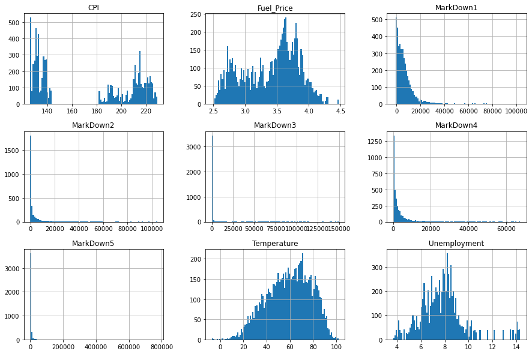
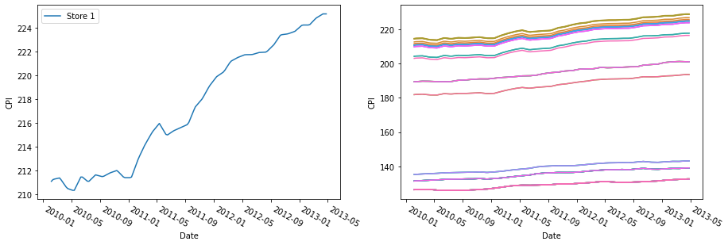
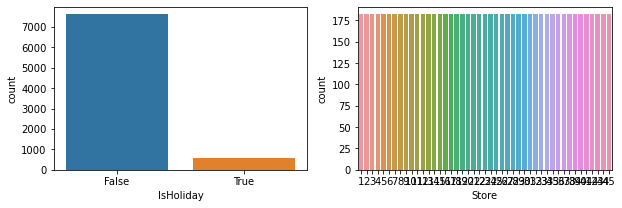
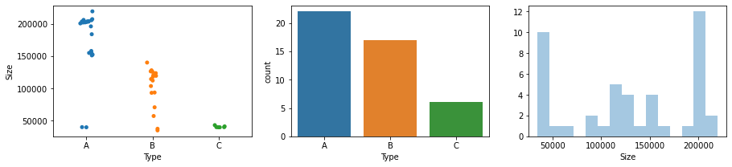
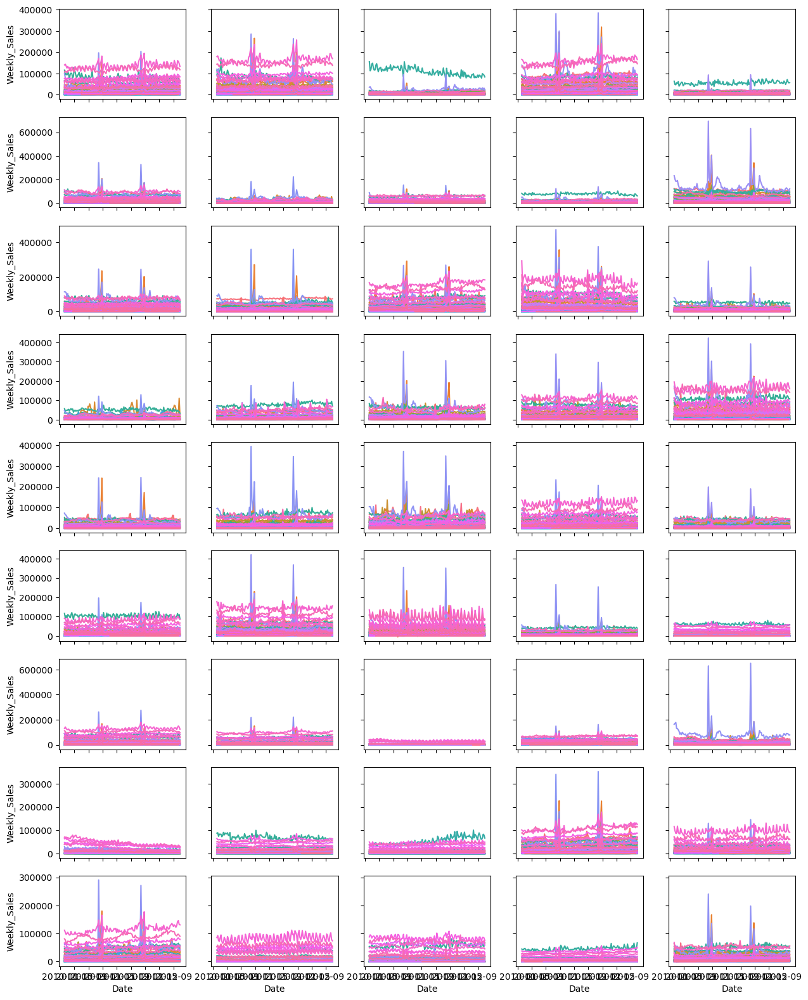
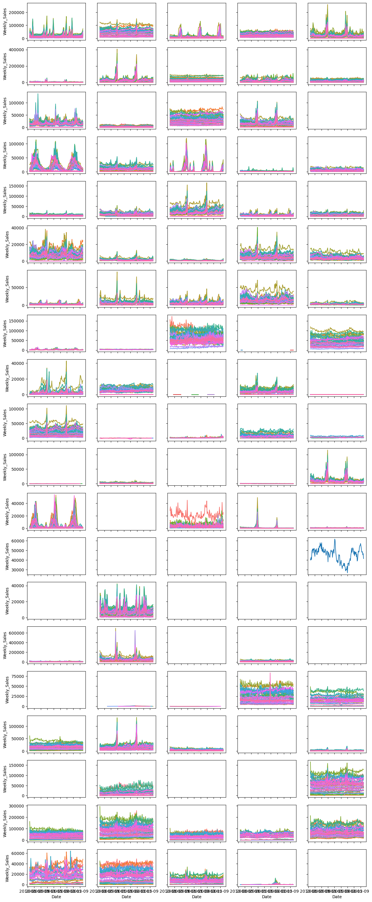

This is the first of a series of two notebooks, where we forecast sales for a retailers with 45 stores, each contains several departments, in multiple regions. We also want to understand the extent to which external factors, including holidays and promotions, affect sales in different departments, stores, and regions. We encourage you to create your own Jupytor notebook and follow along. **If you do not have Python or Jupyter Notebook installed yet, you could also experiment with the virtual notebook by clicking "Launch Syzygy" below.** On the other hand, the dowloadable Jupyter Notebook can be found [here](https://github.com/Master-of-Business-Analytics/Notebooks_and_Data).

<a href="
https://pims.syzygy.ca/jupyter/hub/user-redirect/git-pull?repo=https%3A%2F%2Fgithub.com%2FMaster-of-Business-Analytics%2FProject_08_Sales_Forecast&urlpath=tree%2FProject_08_Sales_Forecast%2F" target="_blank" class="button">Launch Syzygy</a>

## Background

---

In this notebook, we are going to focus on the exploration and manipulation of our data, whereas the next one would be centered around modeling itself. Understanding the data is important for analytics, and we recommend you to read both notebooks in order to gain a better grasp of analytics for big and messy data. The three datasets that we are using are already included (see the "Data" folder) in the repository where this Jupyter notebook is located, but you can also find them on [this Kaggle page](https://www.kaggle.com/manjeetsingh/retaildataset?select=sales+data-set.csv). 

One of the most commonly used time series forecasting model are ARIMA models, which is what we are going to use in this notebook. However, there are also other models that you could use, such as ETS Models. At the same time, since we want to understand the relationships between sales and several other variables, including mark downs, holidays, and potentially weather (temperature), it would be benefitial for us to build a Simple or Multiple Linear Regression Model first, with sales as the response variable. Then we can build time series models to forecast the explanatory variables, such as temperature, and plug in the time-series predicted explantory variables into the SLR/MLR models to generate further forecasts for the response variable,sales. Models generated in this manner might be less accurate as we are going through multiple steps, each adding more risks for errors; however, time series models combined with explanatory models are more interpretable and provide you with more managerial insights that could help you make recommendations and decisions. Let's go ahead and import the libraries we need and load our data:


```python
# basic tools for data analysis and visualization in Python
import pandas as pd
import numpy as np
from scipy import stats
import matplotlib.pyplot as plt
import seaborn as sns

# ipywidgets are used to make interactive contents in Jupyter notebooks
from ipywidgets import interact
```


```python
df_sales = pd.read_csv('Data/sales.csv')
df_features = pd.read_csv('Data/features.csv')
df_stores = pd.read_csv('Data/stores.csv')

# converting the date column (initally stored as strings) to dates
df_sales['Date'] = pd.to_datetime(df_sales['Date'], format='%d/%m/%Y')
df_features['Date'] = pd.to_datetime(df_features['Date'], format='%d/%m/%Y')

df_sales['Store'] = df_sales['Store'].astype('category')
df_sales['Dept'] = df_sales['Dept'].astype('category')
df_features['Store'] = df_features['Store'].astype('category')
df_stores['Store'] = df_stores['Store'].astype('category')
df_stores['Type'] = df_stores['Type'].astype('category')

# Information on the SettingWithCopywarning that might occur: 
# https://www.dataquest.io/blog/settingwithcopywarning/
```

## Exploratory Data Analysis

---

Before we build a model, it is always a good idea to take a look at the data itself. Some questions that you might ask when exploring your data are:

- What information is recorded (what do different columns contain)?
- How frequently (since we are working with time series data) is the data recorded?
- How many missing values are there in each column? 
- What are the distributions of the different columns? 
- Are any columns highly correlated to one another?

After exploration, if there are lots of missing values or if the distribution of a column is highly left/right skewed, which could potentially affect the accruacy of your models, you would want to think about replacing or transforming them before you build, compare, and select your models.


<iframe src="https://charlieqcao.github.io/sales_forecast_widget/sales_forecast_widget_01.html" style="height: 1000px"></iframe>


### Inspection

#### `Sales`

First, let's take a look at the `sales` dataframe:


```python
print(df_sales.info())
```
```
    <class 'pandas.core.frame.DataFrame'>
    RangeIndex: 421570 entries, 0 to 421569
    Data columns (total 5 columns):
     #   Column        Non-Null Count   Dtype         
    ---  ------        --------------   -----         
     0   Store         421570 non-null  category      
     1   Dept          421570 non-null  category      
     2   Date          421570 non-null  datetime64[ns]
     3   Weekly_Sales  421570 non-null  float64       
     4   IsHoliday     421570 non-null  bool          
    dtypes: bool(1), category(2), datetime64[ns](1), float64(1)
    memory usage: 7.6 MB
    None
```    


```python
display(df_sales.describe().transpose().round(2))

print("CAUTION: {:.2%} of the `Weekly_Sales` column is negative."
      .format(len([n for n in df_sales['Weekly_Sales'] if n < 0])/
              len(df_sales['Weekly_Sales'])))

fig, axes = plt.subplots(1,3, figsize=(20,4))
df_sales['Weekly_Sales'].hist(bins=100, ax=axes[0])
sns.boxplot(x='Store', y='Weekly_Sales', whis=100, data=df_sales, ax=axes[1])
sns.boxplot(x='Dept', y='Weekly_Sales', whis=100, data=df_sales, ax=axes[2])
plt.show()
```


<div>
<style scoped>
    .dataframe tbody tr th:only-of-type {
        vertical-align: middle;
    }

    .dataframe tbody tr th {
        vertical-align: top;
    }

    .dataframe thead th {
        text-align: right;
    }
</style>
<table border="1" class="dataframe">
  <thead>
    <tr style="text-align: right;">
      <th></th>
      <th>count</th>
      <th>mean</th>
      <th>std</th>
      <th>min</th>
      <th>25%</th>
      <th>50%</th>
      <th>75%</th>
      <th>max</th>
    </tr>
  </thead>
  <tbody>
    <tr>
      <th>Weekly_Sales</th>
      <td>421570.0</td>
      <td>15981.26</td>
      <td>22711.18</td>
      <td>-4988.94</td>
      <td>2079.65</td>
      <td>7612.03</td>
      <td>20205.85</td>
      <td>693099.36</td>
    </tr>
  </tbody>
</table>
</div>


    CAUTION: 0.30% of the `Weekly_Sales` column is negative.
    





```python
display(df_sales.drop('Weekly_Sales', axis=1).describe().transpose())
fig, axes = plt.subplots(1,3, figsize=(20,4))
sns.countplot(x='IsHoliday', data=df_sales, ax=axes[0])
sns.countplot(x='Store', data=df_sales, ax=axes[1])
sns.countplot(x='Dept', data=df_sales, ax=axes[2])
plt.show()
```


<div>
<style scoped>
    .dataframe tbody tr th:only-of-type {
        vertical-align: middle;
    }

    .dataframe tbody tr th {
        vertical-align: top;
    }

    .dataframe thead th {
        text-align: right;
    }
</style>
<table border="1" class="dataframe">
  <thead>
    <tr style="text-align: right;">
      <th></th>
      <th>count</th>
      <th>unique</th>
      <th>top</th>
      <th>freq</th>
      <th>first</th>
      <th>last</th>
    </tr>
  </thead>
  <tbody>
    <tr>
      <th>Store</th>
      <td>421570</td>
      <td>45</td>
      <td>13</td>
      <td>10474</td>
      <td>NaT</td>
      <td>NaT</td>
    </tr>
    <tr>
      <th>Dept</th>
      <td>421570</td>
      <td>81</td>
      <td>1</td>
      <td>6435</td>
      <td>NaT</td>
      <td>NaT</td>
    </tr>
    <tr>
      <th>Date</th>
      <td>421570</td>
      <td>143</td>
      <td>2011-12-23 00:00:00</td>
      <td>3027</td>
      <td>2010-02-05</td>
      <td>2012-10-26</td>
    </tr>
    <tr>
      <th>IsHoliday</th>
      <td>421570</td>
      <td>2</td>
      <td>False</td>
      <td>391909</td>
      <td>NaT</td>
      <td>NaT</td>
    </tr>
  </tbody>
</table>
</div>





99.68% of the `Weekly_Sales` column is positive. We could probably just drop the negative values so that we could take logarithms of the rest in order to make our data less skewed.

Now that we have taken a look at the aggregated data, we want to look at the sales of each store and department on an individual level. However, it is not the most efficient to print or plot the subsets one by one. Luckily, the `interact()` function from the [ipywidgets](https://ipywidgets.readthedocs.io/en/latest/) package allow us to create an interactive "dashboard" in Jupyter notebooks:

We can see that:

1. There are 143 unique dates (421,570 records in total) from 2010-02-05 to 2012-10-26 in the `sales` dataframe. We should keep in mind at this point that, on each day, sales across multiple stores with several departments are recorded, even though we do not know if all stores or departments are open on each of the 143 days. 
2. There is no missing values in any column of this dataframe, which is good.
3. However, we should notice that the `weekly sales` column is extremely right skewed, with a mean of \\$15,981, but a 50th percentile (mostly the same as the median) of only \\$7,612. The range of the column is also fairly large, from -\\$4,989 to \\$693,099.
4. 391,909 records out of 421,570 are not holidays (or about 7% of the records *are* holidays), which could potentially explain why the `weekly sales` records are extremely right skewed (*maybe* most of the sales happen on holidays).

#### `Features`

Now let's move onto the `features` dataframe:


```python
print(df_features.info())
```
```
    <class 'pandas.core.frame.DataFrame'>
    RangeIndex: 8190 entries, 0 to 8189
    Data columns (total 12 columns):
     #   Column        Non-Null Count  Dtype         
    ---  ------        --------------  -----         
     0   Store         8190 non-null   category      
     1   Date          8190 non-null   datetime64[ns]
     2   Temperature   8190 non-null   float64       
     3   Fuel_Price    8190 non-null   float64       
     4   MarkDown1     4032 non-null   float64       
     5   MarkDown2     2921 non-null   float64       
     6   MarkDown3     3613 non-null   float64       
     7   MarkDown4     3464 non-null   float64       
     8   MarkDown5     4050 non-null   float64       
     9   CPI           7605 non-null   float64       
     10  Unemployment  7605 non-null   float64       
     11  IsHoliday     8190 non-null   bool          
    dtypes: bool(1), category(1), datetime64[ns](1), float64(9)
    memory usage: 657.6 KB
    None
```    


```python
display(df_features[df_features['CPI'].isnull()])
display(df_features[df_features['Unemployment'].isnull()])
```


<div>
<style scoped>
    .dataframe tbody tr th:only-of-type {
        vertical-align: middle;
    }

    .dataframe tbody tr th {
        vertical-align: top;
    }

    .dataframe thead th {
        text-align: right;
    }
</style>
<table border="1" class="dataframe">
  <thead>
    <tr style="text-align: right;">
      <th></th>
      <th>Store</th>
      <th>Date</th>
      <th>Temperature</th>
      <th>Fuel_Price</th>
      <th>MarkDown1</th>
      <th>MarkDown2</th>
      <th>MarkDown3</th>
      <th>MarkDown4</th>
      <th>MarkDown5</th>
      <th>CPI</th>
      <th>Unemployment</th>
      <th>IsHoliday</th>
    </tr>
  </thead>
  <tbody>
    <tr>
      <th>169</th>
      <td>1</td>
      <td>2013-05-03</td>
      <td>66.66</td>
      <td>3.386</td>
      <td>2298.63</td>
      <td>2.00</td>
      <td>129.90</td>
      <td>55.46</td>
      <td>1301.04</td>
      <td>NaN</td>
      <td>NaN</td>
      <td>False</td>
    </tr>
    <tr>
      <th>170</th>
      <td>1</td>
      <td>2013-05-10</td>
      <td>63.90</td>
      <td>3.392</td>
      <td>4624.61</td>
      <td>83.88</td>
      <td>42.38</td>
      <td>1618.31</td>
      <td>8144.90</td>
      <td>NaN</td>
      <td>NaN</td>
      <td>False</td>
    </tr>
    <tr>
      <th>171</th>
      <td>1</td>
      <td>2013-05-17</td>
      <td>69.53</td>
      <td>3.454</td>
      <td>16170.50</td>
      <td>92.00</td>
      <td>8.32</td>
      <td>4127.24</td>
      <td>6206.97</td>
      <td>NaN</td>
      <td>NaN</td>
      <td>False</td>
    </tr>
    <tr>
      <th>172</th>
      <td>1</td>
      <td>2013-05-24</td>
      <td>77.19</td>
      <td>3.494</td>
      <td>7959.89</td>
      <td>178.00</td>
      <td>1621.47</td>
      <td>3152.57</td>
      <td>2938.70</td>
      <td>NaN</td>
      <td>NaN</td>
      <td>False</td>
    </tr>
    <tr>
      <th>173</th>
      <td>1</td>
      <td>2013-05-31</td>
      <td>78.02</td>
      <td>3.466</td>
      <td>2369.77</td>
      <td>142.45</td>
      <td>475.35</td>
      <td>45.55</td>
      <td>2056.84</td>
      <td>NaN</td>
      <td>NaN</td>
      <td>False</td>
    </tr>
    <tr>
      <th>...</th>
      <td>...</td>
      <td>...</td>
      <td>...</td>
      <td>...</td>
      <td>...</td>
      <td>...</td>
      <td>...</td>
      <td>...</td>
      <td>...</td>
      <td>...</td>
      <td>...</td>
      <td>...</td>
    </tr>
    <tr>
      <th>8185</th>
      <td>45</td>
      <td>2013-06-28</td>
      <td>76.05</td>
      <td>3.639</td>
      <td>4842.29</td>
      <td>975.03</td>
      <td>3.00</td>
      <td>2449.97</td>
      <td>3169.69</td>
      <td>NaN</td>
      <td>NaN</td>
      <td>False</td>
    </tr>
    <tr>
      <th>8186</th>
      <td>45</td>
      <td>2013-07-05</td>
      <td>77.50</td>
      <td>3.614</td>
      <td>9090.48</td>
      <td>2268.58</td>
      <td>582.74</td>
      <td>5797.47</td>
      <td>1514.93</td>
      <td>NaN</td>
      <td>NaN</td>
      <td>False</td>
    </tr>
    <tr>
      <th>8187</th>
      <td>45</td>
      <td>2013-07-12</td>
      <td>79.37</td>
      <td>3.614</td>
      <td>3789.94</td>
      <td>1827.31</td>
      <td>85.72</td>
      <td>744.84</td>
      <td>2150.36</td>
      <td>NaN</td>
      <td>NaN</td>
      <td>False</td>
    </tr>
    <tr>
      <th>8188</th>
      <td>45</td>
      <td>2013-07-19</td>
      <td>82.84</td>
      <td>3.737</td>
      <td>2961.49</td>
      <td>1047.07</td>
      <td>204.19</td>
      <td>363.00</td>
      <td>1059.46</td>
      <td>NaN</td>
      <td>NaN</td>
      <td>False</td>
    </tr>
    <tr>
      <th>8189</th>
      <td>45</td>
      <td>2013-07-26</td>
      <td>76.06</td>
      <td>3.804</td>
      <td>212.02</td>
      <td>851.73</td>
      <td>2.06</td>
      <td>10.88</td>
      <td>1864.57</td>
      <td>NaN</td>
      <td>NaN</td>
      <td>False</td>
    </tr>
  </tbody>
</table>
<p>585 rows × 12 columns</p>
</div>


<div>
<style scoped>
    .dataframe tbody tr th:only-of-type {
        vertical-align: middle;
    }

    .dataframe tbody tr th {
        vertical-align: top;
    }

    .dataframe thead th {
        text-align: right;
    }
</style>
<table border="1" class="dataframe">
  <thead>
    <tr style="text-align: right;">
      <th></th>
      <th>Store</th>
      <th>Date</th>
      <th>Temperature</th>
      <th>Fuel_Price</th>
      <th>MarkDown1</th>
      <th>MarkDown2</th>
      <th>MarkDown3</th>
      <th>MarkDown4</th>
      <th>MarkDown5</th>
      <th>CPI</th>
      <th>Unemployment</th>
      <th>IsHoliday</th>
    </tr>
  </thead>
  <tbody>
    <tr>
      <th>169</th>
      <td>1</td>
      <td>2013-05-03</td>
      <td>66.66</td>
      <td>3.386</td>
      <td>2298.63</td>
      <td>2.00</td>
      <td>129.90</td>
      <td>55.46</td>
      <td>1301.04</td>
      <td>NaN</td>
      <td>NaN</td>
      <td>False</td>
    </tr>
    <tr>
      <th>170</th>
      <td>1</td>
      <td>2013-05-10</td>
      <td>63.90</td>
      <td>3.392</td>
      <td>4624.61</td>
      <td>83.88</td>
      <td>42.38</td>
      <td>1618.31</td>
      <td>8144.90</td>
      <td>NaN</td>
      <td>NaN</td>
      <td>False</td>
    </tr>
    <tr>
      <th>171</th>
      <td>1</td>
      <td>2013-05-17</td>
      <td>69.53</td>
      <td>3.454</td>
      <td>16170.50</td>
      <td>92.00</td>
      <td>8.32</td>
      <td>4127.24</td>
      <td>6206.97</td>
      <td>NaN</td>
      <td>NaN</td>
      <td>False</td>
    </tr>
    <tr>
      <th>172</th>
      <td>1</td>
      <td>2013-05-24</td>
      <td>77.19</td>
      <td>3.494</td>
      <td>7959.89</td>
      <td>178.00</td>
      <td>1621.47</td>
      <td>3152.57</td>
      <td>2938.70</td>
      <td>NaN</td>
      <td>NaN</td>
      <td>False</td>
    </tr>
    <tr>
      <th>173</th>
      <td>1</td>
      <td>2013-05-31</td>
      <td>78.02</td>
      <td>3.466</td>
      <td>2369.77</td>
      <td>142.45</td>
      <td>475.35</td>
      <td>45.55</td>
      <td>2056.84</td>
      <td>NaN</td>
      <td>NaN</td>
      <td>False</td>
    </tr>
    <tr>
      <th>...</th>
      <td>...</td>
      <td>...</td>
      <td>...</td>
      <td>...</td>
      <td>...</td>
      <td>...</td>
      <td>...</td>
      <td>...</td>
      <td>...</td>
      <td>...</td>
      <td>...</td>
      <td>...</td>
    </tr>
    <tr>
      <th>8185</th>
      <td>45</td>
      <td>2013-06-28</td>
      <td>76.05</td>
      <td>3.639</td>
      <td>4842.29</td>
      <td>975.03</td>
      <td>3.00</td>
      <td>2449.97</td>
      <td>3169.69</td>
      <td>NaN</td>
      <td>NaN</td>
      <td>False</td>
    </tr>
    <tr>
      <th>8186</th>
      <td>45</td>
      <td>2013-07-05</td>
      <td>77.50</td>
      <td>3.614</td>
      <td>9090.48</td>
      <td>2268.58</td>
      <td>582.74</td>
      <td>5797.47</td>
      <td>1514.93</td>
      <td>NaN</td>
      <td>NaN</td>
      <td>False</td>
    </tr>
    <tr>
      <th>8187</th>
      <td>45</td>
      <td>2013-07-12</td>
      <td>79.37</td>
      <td>3.614</td>
      <td>3789.94</td>
      <td>1827.31</td>
      <td>85.72</td>
      <td>744.84</td>
      <td>2150.36</td>
      <td>NaN</td>
      <td>NaN</td>
      <td>False</td>
    </tr>
    <tr>
      <th>8188</th>
      <td>45</td>
      <td>2013-07-19</td>
      <td>82.84</td>
      <td>3.737</td>
      <td>2961.49</td>
      <td>1047.07</td>
      <td>204.19</td>
      <td>363.00</td>
      <td>1059.46</td>
      <td>NaN</td>
      <td>NaN</td>
      <td>False</td>
    </tr>
    <tr>
      <th>8189</th>
      <td>45</td>
      <td>2013-07-26</td>
      <td>76.06</td>
      <td>3.804</td>
      <td>212.02</td>
      <td>851.73</td>
      <td>2.06</td>
      <td>10.88</td>
      <td>1864.57</td>
      <td>NaN</td>
      <td>NaN</td>
      <td>False</td>
    </tr>
  </tbody>
</table>
<p>585 rows × 12 columns</p>
</div>


```python
display(df_features.describe().round(2))

for i in range(5):
    print('CAUTION: {:.2%} of MarkDown{} (non-null) is negative.'
          .format(len([n for n in df_features['MarkDown'+str(i+1)] if n < 0])/
                  len(df_features['MarkDown'+str(i+1)].dropna()), i+1))

df_features.drop(['Store', 'Date', 'IsHoliday'], axis=1).hist(figsize=(15,10), bins=100)
plt.show()
```


<div>
<style scoped>
    .dataframe tbody tr th:only-of-type {
        vertical-align: middle;
    }

    .dataframe tbody tr th {
        vertical-align: top;
    }

    .dataframe thead th {
        text-align: right;
    }
</style>
<table border="1" class="dataframe">
  <thead>
    <tr style="text-align: right;">
      <th></th>
      <th>Temperature</th>
      <th>Fuel_Price</th>
      <th>MarkDown1</th>
      <th>MarkDown2</th>
      <th>MarkDown3</th>
      <th>MarkDown4</th>
      <th>MarkDown5</th>
      <th>CPI</th>
      <th>Unemployment</th>
    </tr>
  </thead>
  <tbody>
    <tr>
      <th>count</th>
      <td>8190.00</td>
      <td>8190.00</td>
      <td>4032.00</td>
      <td>2921.00</td>
      <td>3613.00</td>
      <td>3464.00</td>
      <td>4050.00</td>
      <td>7605.00</td>
      <td>7605.00</td>
    </tr>
    <tr>
      <th>mean</th>
      <td>59.36</td>
      <td>3.41</td>
      <td>7032.37</td>
      <td>3384.18</td>
      <td>1760.10</td>
      <td>3292.94</td>
      <td>4132.22</td>
      <td>172.46</td>
      <td>7.83</td>
    </tr>
    <tr>
      <th>std</th>
      <td>18.68</td>
      <td>0.43</td>
      <td>9262.75</td>
      <td>8793.58</td>
      <td>11276.46</td>
      <td>6792.33</td>
      <td>13086.69</td>
      <td>39.74</td>
      <td>1.88</td>
    </tr>
    <tr>
      <th>min</th>
      <td>-7.29</td>
      <td>2.47</td>
      <td>-2781.45</td>
      <td>-265.76</td>
      <td>-179.26</td>
      <td>0.22</td>
      <td>-185.17</td>
      <td>126.06</td>
      <td>3.68</td>
    </tr>
    <tr>
      <th>25%</th>
      <td>45.90</td>
      <td>3.04</td>
      <td>1577.53</td>
      <td>68.88</td>
      <td>6.60</td>
      <td>304.69</td>
      <td>1440.83</td>
      <td>132.36</td>
      <td>6.63</td>
    </tr>
    <tr>
      <th>50%</th>
      <td>60.71</td>
      <td>3.51</td>
      <td>4743.58</td>
      <td>364.57</td>
      <td>36.26</td>
      <td>1176.42</td>
      <td>2727.14</td>
      <td>182.76</td>
      <td>7.81</td>
    </tr>
    <tr>
      <th>75%</th>
      <td>73.88</td>
      <td>3.74</td>
      <td>8923.31</td>
      <td>2153.35</td>
      <td>163.15</td>
      <td>3310.01</td>
      <td>4832.56</td>
      <td>213.93</td>
      <td>8.57</td>
    </tr>
    <tr>
      <th>max</th>
      <td>101.95</td>
      <td>4.47</td>
      <td>103184.98</td>
      <td>104519.54</td>
      <td>149483.31</td>
      <td>67474.85</td>
      <td>771448.10</td>
      <td>228.98</td>
      <td>14.31</td>
    </tr>
  </tbody>
</table>
</div>

```
    CAUTION: 0.10% of MarkDown1 (non-null) is negative.
    CAUTION: 0.86% of MarkDown2 (non-null) is negative.
    CAUTION: 0.36% of MarkDown3 (non-null) is negative.
    CAUTION: 0.00% of MarkDown4 (non-null) is negative.
    CAUTION: 0.05% of MarkDown5 (non-null) is negative.
```    


```python
display(df_features[['Store', 'Date', 'IsHoliday']].describe().transpose())

fig, axes = plt.subplots(1,2, figsize=(10,3))
sns.countplot(x='IsHoliday', data=df_features, ax=axes[0])
sns.countplot(x='Store', data=df_features, ax=axes[1])
plt.show()
```


<div>
<style scoped>
    .dataframe tbody tr th:only-of-type {
        vertical-align: middle;
    }

    .dataframe tbody tr th {
        vertical-align: top;
    }

    .dataframe thead th {
        text-align: right;
    }
</style>
<table border="1" class="dataframe">
  <thead>
    <tr style="text-align: right;">
      <th></th>
      <th>count</th>
      <th>unique</th>
      <th>top</th>
      <th>freq</th>
      <th>first</th>
      <th>last</th>
    </tr>
  </thead>
  <tbody>
    <tr>
      <th>Store</th>
      <td>8190</td>
      <td>45</td>
      <td>45</td>
      <td>182</td>
      <td>NaT</td>
      <td>NaT</td>
    </tr>
    <tr>
      <th>Date</th>
      <td>8190</td>
      <td>182</td>
      <td>2011-07-15 00:00:00</td>
      <td>45</td>
      <td>2010-02-05</td>
      <td>2013-07-26</td>
    </tr>
    <tr>
      <th>IsHoliday</th>
      <td>8190</td>
      <td>2</td>
      <td>False</td>
      <td>7605</td>
      <td>NaT</td>
      <td>NaT</td>
    </tr>
  </tbody>
</table>
</div>





Right away, we can see that:

1. Compared to the `sales` dataframe, there are less records (8190) in the `features` dataframe. It makes sense because this dataframe is only detailed to store level and not department; for example, different departments in the same store *probably* experience the same weather on the same day. 
2. However, with only store level data, we might find it harder to model the effect of markdowns across different departments within the same store. 
3. The are 182 unique dates from 2010-02-05 to 2013-07-26, which is a wider range of record than the `sales` dataframe.
4. From the first 10 rows, we can see that the dates do match up; however, it wouldn't hurt to check the proportion of matching records (by date and store) especially if we are thinking about merging together the two dataframes
5. The 5 mark down columns contain 'anonymous data related to promotional mark downs' as per Kaggle, and we might want to further inspect these columns (e.g. whether two mark downs occured at any point for the same store); at the same time, these 5 columns are also extremely right skewed
6. Again, approximately 7% of the 8190 `features` records are holidays, which is consistent with the `sales` dataframe

#### `Stores`

Last but not least, let's take a look at the `stores` dataframe:


```python
display(df_stores.info())
```
```
    <class 'pandas.core.frame.DataFrame'>
    RangeIndex: 45 entries, 0 to 44
    Data columns (total 3 columns):
     #   Column  Non-Null Count  Dtype 
    ---  ------  --------------  ----- 
     0   Store   45 non-null     int64 
     1   Type    45 non-null     object
     2   Size    45 non-null     int64 
    dtypes: int64(2), object(1)
    memory usage: 1.2+ KB
```


```python
display(pd.DataFrame(df_stores.drop('Store', axis=1).describe(include='all')).transpose().round(2))

fig, axes = plt.subplots(1,3, figsize=(15,3))
sns.stripplot(x='Type', y='Size', data=df_stores, ax=axes[0])
sns.countplot(x='Type', data=df_stores, ax=axes[1])
sns.distplot(df_stores['Size'], bins=15, kde=False, ax=axes[2])
plt.show()
```


<div>
<style scoped>
    .dataframe tbody tr th:only-of-type {
        vertical-align: middle;
    }

    .dataframe tbody tr th {
        vertical-align: top;
    }

    .dataframe thead th {
        text-align: right;
    }
</style>
<table border="1" class="dataframe">
  <thead>
    <tr style="text-align: right;">
      <th></th>
      <th>count</th>
      <th>unique</th>
      <th>top</th>
      <th>freq</th>
      <th>mean</th>
      <th>std</th>
      <th>min</th>
      <th>25%</th>
      <th>50%</th>
      <th>75%</th>
      <th>max</th>
    </tr>
  </thead>
  <tbody>
    <tr>
      <th>Type</th>
      <td>45</td>
      <td>3</td>
      <td>A</td>
      <td>22</td>
      <td>NaN</td>
      <td>NaN</td>
      <td>NaN</td>
      <td>NaN</td>
      <td>NaN</td>
      <td>NaN</td>
      <td>NaN</td>
    </tr>
    <tr>
      <th>Size</th>
      <td>45</td>
      <td>NaN</td>
      <td>NaN</td>
      <td>NaN</td>
      <td>130288</td>
      <td>63825.3</td>
      <td>34875</td>
      <td>70713</td>
      <td>126512</td>
      <td>202307</td>
      <td>219622</td>
    </tr>
  </tbody>
</table>
</div>





The `stores` dataframe appear to be smaller and simper. We can see that:

1. Almost half of the stores are type A stores; we might want to explore later whether there is any correlation between `store type` and other variables in the three dataframes
2. `Sizes` of the stores are not extremely skewed, with its mean close to its 50th percentile. However, we might want to check if they are light or heavy tailed.

### Aggregation

At a glance (by randomly inspecting different combinations), seasonalities and trends vary across stores and departments. Some stores/deparments have consistant sales throughout time, while some others see huge spikes either in the middle or at the end of each year. There are also increasing or decreasing trends in certain stores/departments. 

Even though is nice to be able to see detailed sales performance for each individual department in every store, we also want to inspect whether there are shared patterns in our sales data. Thus, let's aggregate the data a little bit so that we could visualize and compare sales across different stores for the same department and then across different departments in the same store.


```python
fig, ax = plt.subplots(9, 5, sharex='col', sharey='row', figsize=(15, 20), dpi=100)
store_num = pd.Series(range(1,46), dtype='category')
store_index = 0
for i in range(9):
    for j in range(5):
        sales_temp = df_sales[df_sales.Store==store_num[store_index]][['Date', 'Dept', 'Weekly_Sales']]
        sales_temp['Dept'] = sales_temp['Dept'].astype('category')
        sns.lineplot(x='Date', y='Weekly_Sales', hue='Dept', data=sales_temp, legend=False, ax=ax[i,j])
        store_index += 1
```





```python
fig, ax = plt.subplots(20, 5, sharex='col', sharey='row', figsize=(15, 40), dpi=100)
dept_num = pd.Series(range(1,101), dtype='category')
dept_index = 0
for i in range(20):
    for j in range(5):
        sales_temp = df_sales[df_sales.Dept==dept_num[dept_index]][['Date', 'Store', 'Weekly_Sales']]
        sales_temp['Store'] = sales_temp['Store'].astype('category')
        sns.lineplot(x='Date', y='Weekly_Sales', hue='Store', data=sales_temp, legend=False, ax=ax[i,j])
        dept_index += 1
```





#### Merging


```python
df_all = df_sales.merge(df_features, 
                        on=['Store', 'Date', 'IsHoliday'], 
                        how='left').merge(df_stores, 
                                          on='Store', 
                                          how='left')

print(df_all.info())
```
```
    <class 'pandas.core.frame.DataFrame'>
    Int64Index: 421570 entries, 0 to 421569
    Data columns (total 16 columns):
     #   Column        Non-Null Count   Dtype         
    ---  ------        --------------   -----         
     0   Store         421570 non-null  category      
     1   Dept          421570 non-null  category      
     2   Date          421570 non-null  datetime64[ns]
     3   Weekly_Sales  421570 non-null  float64       
     4   IsHoliday     421570 non-null  bool          
     5   Temperature   421570 non-null  float64       
     6   Fuel_Price    421570 non-null  float64       
     7   MarkDown1     150681 non-null  float64       
     8   MarkDown2     111248 non-null  float64       
     9   MarkDown3     137091 non-null  float64       
     10  MarkDown4     134967 non-null  float64       
     11  MarkDown5     151432 non-null  float64       
     12  CPI           421570 non-null  float64       
     13  Unemployment  421570 non-null  float64       
     14  Type          421570 non-null  category      
     15  Size          421570 non-null  int64         
    dtypes: bool(1), category(3), datetime64[ns](1), float64(10), int64(1)
    memory usage: 43.4 MB
    None
```    

### Manipulation

#### Adjustment


```python
mon_val = ['Weekly_Sales', 'Fuel_Price', 'MarkDown1', 'MarkDown2', 'MarkDown3', 'MarkDown4', 'MarkDown5']

df_adj = pd.concat([df_all.drop(mon_val, axis=1), 
                    (df_all[mon_val]*100).div(df_all.CPI, axis=0).add_prefix('AdjCPI_')], axis=1)
```


```python
adj_val = ['AdjCPI_' + s for s in mon_val if s != 'Fuel_Price']

display(df_adj[adj_val].describe().transpose())

df_adj[adj_val].hist(bins=100, figsize=(13,10))
plt.show()
```


<div>
<style scoped>
    .dataframe tbody tr th:only-of-type {
        vertical-align: middle;
    }

    .dataframe tbody tr th {
        vertical-align: top;
    }

    .dataframe thead th {
        text-align: right;
    }
</style>
<table border="1" class="dataframe">
  <thead>
    <tr style="text-align: right;">
      <th></th>
      <th>count</th>
      <th>mean</th>
      <th>std</th>
      <th>min</th>
      <th>25%</th>
      <th>50%</th>
      <th>75%</th>
      <th>max</th>
    </tr>
  </thead>
  <tbody>
    <tr>
      <th>AdjCPI_Weekly_Sales</th>
      <td>421570.0</td>
      <td>9908.548942</td>
      <td>14602.240095</td>
      <td>-3950.722934</td>
      <td>1195.198183</td>
      <td>4512.777475</td>
      <td>12421.081272</td>
      <td>547172.473684</td>
    </tr>
    <tr>
      <th>AdjCPI_MarkDown1</th>
      <td>150681.0</td>
      <td>4430.042457</td>
      <td>5348.301090</td>
      <td>0.206549</td>
      <td>1222.675566</td>
      <td>3045.650515</td>
      <td>5572.308352</td>
      <td>62862.823404</td>
    </tr>
    <tr>
      <th>AdjCPI_MarkDown2</th>
      <td>111248.0</td>
      <td>2059.609593</td>
      <td>6003.485424</td>
      <td>-192.610230</td>
      <td>24.452601</td>
      <td>110.381028</td>
      <td>1120.970072</td>
      <td>80355.739592</td>
    </tr>
    <tr>
      <th>AdjCPI_MarkDown3</th>
      <td>137091.0</td>
      <td>899.232310</td>
      <td>6284.294887</td>
      <td>-22.232464</td>
      <td>2.904313</td>
      <td>14.296407</td>
      <td>64.518748</td>
      <td>109083.900971</td>
    </tr>
    <tr>
      <th>AdjCPI_MarkDown4</th>
      <td>134967.0</td>
      <td>2083.455218</td>
      <td>4089.637783</td>
      <td>0.167800</td>
      <td>288.936331</td>
      <td>856.134875</td>
      <td>2034.683587</td>
      <td>47849.008580</td>
    </tr>
    <tr>
      <th>AdjCPI_MarkDown5</th>
      <td>151432.0</td>
      <td>2747.854633</td>
      <td>3245.911013</td>
      <td>60.910013</td>
      <td>1098.292765</td>
      <td>1949.324313</td>
      <td>3324.396470</td>
      <td>49200.118284</td>
    </tr>
  </tbody>
</table>
</div>


#### Remove Negative Values


```python
df_pos = df_adj[((df_adj[adj_val]>0)|(df_adj[adj_val].isnull())).all(1)]

print(df_adj.shape)
print(df_pos.shape)
```

    (421570, 16)
    (418380, 16)
    

#### Transformation


```python
df_trans = pd.concat([df_pos.drop(adj_val, axis=1), 
                     df_pos[adj_val].apply(lambda x: np.log(x)).add_prefix('TransLog_')], axis=1)
df_trans.info()
```
```
    <class 'pandas.core.frame.DataFrame'>
    Int64Index: 418380 entries, 0 to 421569
    Data columns (total 16 columns):
     #   Column                        Non-Null Count   Dtype         
    ---  ------                        --------------   -----         
     0   Store                         418380 non-null  category      
     1   Dept                          418380 non-null  category      
     2   Date                          418380 non-null  datetime64[ns]
     3   IsHoliday                     418380 non-null  bool          
     4   Temperature                   418380 non-null  float64       
     5   CPI                           418380 non-null  float64       
     6   Unemployment                  418380 non-null  float64       
     7   Type                          418380 non-null  category      
     8   Size                          418380 non-null  int64         
     9   AdjCPI_Fuel_Price             418380 non-null  float64       
     10  TransLog_AdjCPI_Weekly_Sales  418380 non-null  float64       
     11  TransLog_AdjCPI_MarkDown1     148395 non-null  float64       
     12  TransLog_AdjCPI_MarkDown2     109186 non-null  float64       
     13  TransLog_AdjCPI_MarkDown3     134955 non-null  float64       
     14  TransLog_AdjCPI_MarkDown4     132732 non-null  float64       
     15  TransLog_AdjCPI_MarkDown5     149097 non-null  float64       
    dtypes: bool(1), category(3), datetime64[ns](1), float64(10), int64(1)
    memory usage: 43.1 MB
```    


```python
trans_val = ['TransLog_' + s for s in adj_val]

display(df_trans[trans_val].describe().transpose())

df_trans[trans_val].hist(bins=100, figsize=(13,10))
plt.show()
```


<div>
<style scoped>
    .dataframe tbody tr th:only-of-type {
        vertical-align: middle;
    }

    .dataframe tbody tr th {
        vertical-align: top;
    }

    .dataframe thead th {
        text-align: right;
    }
</style>
<table border="1" class="dataframe">
  <thead>
    <tr style="text-align: right;">
      <th></th>
      <th>count</th>
      <th>mean</th>
      <th>std</th>
      <th>min</th>
      <th>25%</th>
      <th>50%</th>
      <th>75%</th>
      <th>max</th>
    </tr>
  </thead>
  <tbody>
    <tr>
      <th>TransLog_AdjCPI_Weekly_Sales</th>
      <td>418380.0</td>
      <td>8.009177</td>
      <td>2.065827</td>
      <td>-5.425113</td>
      <td>7.104933</td>
      <td>8.422070</td>
      <td>9.430193</td>
      <td>13.212519</td>
    </tr>
    <tr>
      <th>TransLog_AdjCPI_MarkDown1</th>
      <td>148395.0</td>
      <td>7.635139</td>
      <td>1.603340</td>
      <td>-1.577218</td>
      <td>7.099678</td>
      <td>8.020444</td>
      <td>8.626376</td>
      <td>11.048710</td>
    </tr>
    <tr>
      <th>TransLog_AdjCPI_MarkDown2</th>
      <td>109186.0</td>
      <td>4.965551</td>
      <td>2.688230</td>
      <td>-4.702690</td>
      <td>3.264481</td>
      <td>4.749675</td>
      <td>7.072172</td>
      <td>11.294219</td>
    </tr>
    <tr>
      <th>TransLog_AdjCPI_MarkDown3</th>
      <td>134955.0</td>
      <td>2.712321</td>
      <td>2.410671</td>
      <td>-5.410087</td>
      <td>1.078231</td>
      <td>2.672555</td>
      <td>4.168216</td>
      <td>11.599873</td>
    </tr>
    <tr>
      <th>TransLog_AdjCPI_MarkDown4</th>
      <td>132732.0</td>
      <td>6.496274</td>
      <td>1.815088</td>
      <td>-1.784981</td>
      <td>5.666128</td>
      <td>6.748512</td>
      <td>7.606688</td>
      <td>10.775806</td>
    </tr>
    <tr>
      <th>TransLog_AdjCPI_MarkDown5</th>
      <td>149097.0</td>
      <td>7.533416</td>
      <td>0.884697</td>
      <td>4.109398</td>
      <td>7.003998</td>
      <td>7.575858</td>
      <td>8.109043</td>
      <td>10.803651</td>
    </tr>
  </tbody>
</table>
</div>


#### Replace Missing Values


```python
df_full = pd.concat([df_trans.drop(trans_val, axis=1), df_trans[trans_val].fillna(0.0)], axis=1)
df_full.info()
```
```
    <class 'pandas.core.frame.DataFrame'>
    Int64Index: 418380 entries, 0 to 421569
    Data columns (total 16 columns):
     #   Column                        Non-Null Count   Dtype         
    ---  ------                        --------------   -----         
     0   Store                         418380 non-null  category      
     1   Dept                          418380 non-null  category      
     2   Date                          418380 non-null  datetime64[ns]
     3   IsHoliday                     418380 non-null  bool          
     4   Temperature                   418380 non-null  float64       
     5   CPI                           418380 non-null  float64       
     6   Unemployment                  418380 non-null  float64       
     7   Type                          418380 non-null  category      
     8   Size                          418380 non-null  int64         
     9   AdjCPI_Fuel_Price             418380 non-null  float64       
     10  TransLog_AdjCPI_Weekly_Sales  418380 non-null  float64       
     11  TransLog_AdjCPI_MarkDown1     418380 non-null  float64       
     12  TransLog_AdjCPI_MarkDown2     418380 non-null  float64       
     13  TransLog_AdjCPI_MarkDown3     418380 non-null  float64       
     14  TransLog_AdjCPI_MarkDown4     418380 non-null  float64       
     15  TransLog_AdjCPI_MarkDown5     418380 non-null  float64       
    dtypes: bool(1), category(3), datetime64[ns](1), float64(10), int64(1)
    memory usage: 43.1 MB
```    


```python
sns.pairplot(df_full.drop(['Store', 'Dept', 'Date', 'IsHoliday', 'Size', 
                           'CPI', 'AdjCPI_Fuel_Price', 'Unemployment'], axis=1), hue='Type')
```


