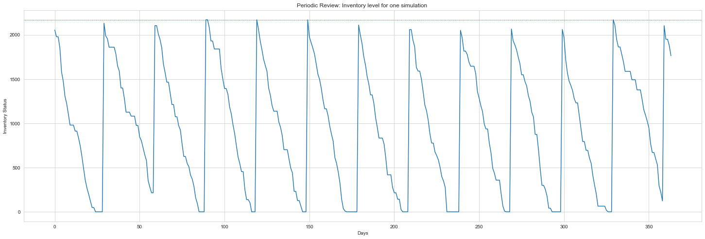
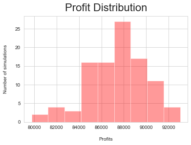
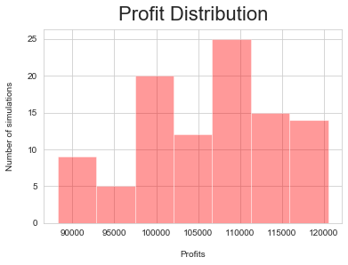

## Inventory Decision Analysis

#### Author: Kemjika Ananaba

In this project, we use Monte Carlo simulation and optimization tools to determine the optimal expected profits under different scenarios. In the **inventory management page**, we looked at two inventory management policies: continuous review policy and periodic review policy. This project compares the optimal expected profits across these two policies. We encourage you to create your own Jupytor notebook and follow along. You can also download this notebook together with any affiliated data in the [Notebooks and Data](https://github.com/Master-of-Business-Analytics/Notebooks_and_Data) GitHub repository. Alternatively, if you do not have Python or Jupyter Notebook installed yet, you may experiment with a virtual notebook by launching Binder or Syzygy below (learn more about these two tools in the [Resource](https://analytics-at-sauder.github.io/resource.html) tab).

<a href="https://ubc.syzygy.ca/jupyter/hub/user-redirect/git-pull?repo=https%3A%2F%2Fgithub.com%2FAnalytics-at-Sauder%2FProject_12_Inventory_Decision_Analysis&urlpath=tree%2FProject_12_Inventory_Decision_Analysis%2Fp12_inventory_decision_analysis.ipynb&branch=master" target="_blank" class="button">Launch Syzygy (UBC)</a>

<a href="https://pims.syzygy.ca/jupyter/hub/user-redirect/git-pull?repo=https%3A%2F%2Fgithub.com%2FAnalytics-at-Sauder%2FProject_12_Inventory_Decision_Analysis&urlpath=tree%2FProject_12_Inventory_Decision_Analysis%2Fp12_inventory_decision_analysis.ipynb&branch=master" target="_blank" class="button">Launch Syzygy (Google)</a>

<a href="https://mybinder.org/v2/gh/Analytics-at-Sauder/Project_12_Inventory_Decision_Analysis/master?filepath=p12_inventory_decision_analysis.ipynb" target="_blank" class="button">Launch Binder</a>

## Business Background
  ----

In the modern business environment, companies are requiring an increasing amount of effort to reduce operating costs and to improve customer satisfaction. Inventory can play a significant role in satisfying customer demand; therefore, inventory becomes an important asset for any organization. Thus, inventory should be managed effectively and efficiently in order to minimize total cost and to satisfy customer demand. In real life, inventory management faces several challenges, such as the tradeoff between minimizing total cost and maximizing service level; therefore, decisions involving inventory management can have a significant impact on the profitability of a business.
By analyzing the expected profits under different scenarios, some certainty can be introduced into the decision making process.


```python
#load packages 

import numpy as np
import pandas as pd

import seaborn as sns
import matplotlib.pyplot as plt

sns.set_style('whitegrid')
import operator
import warnings
warnings.simplefilter(action='ignore', category=FutureWarning)
from mpl_toolkits.mplot3d import Axes3D
```

## Data Entry and Manipulation 

### Operational and Demand data

For this Project, we start with one product. To mathematically model customer demand, the annual demand of the product is captured. In the demand dataset, Demand is the daily demand for 366 days. In the summary dataset, Summary provides information on the product operations and associated costs, such as:

* Purchase Cost
* Supplier lead time
* Selling price
* Cost of ordering (Co): administrative cost of ordering product from manufacturer
* Holding cost (Ch): warehouse cost for each product
* Starting stock
* Product Size


```python
#Read in the product demand information

df = pd.read_excel('XYZ-1.xlsx', 'Data')
demand = df[3:11]
print(demand.head())

```

       Product    1
    6        0   90
    7        1   94
    8        2    0
    9        3  110
    10       4  106
    


```python
#Visualize distribution of demand
demand[1].hist()
plt.title('Histogram of past product sales ')
plt.show()
```


```python
demand[1].std()
```


    55.07999993367887


```python
#Product information
summary = pd.read_csv('summary_stats.csv')
summary.head()
```


<div>
<style scoped>
    .dataframe tbody tr th:only-of-type {
        vertical-align: middle;
    }

    .dataframe tbody tr th {
        vertical-align: top;
    }

    .dataframe thead th {
        text-align: right;
    }
</style>
<table border="1" class="dataframe">
  <thead>
    <tr style="text-align: right;">
      <th></th>
      <th>Purchase Cost</th>
      <th>Lead Time</th>
      <th>Size</th>
      <th>Selling Price</th>
      <th>Starting Stock</th>
      <th>Co</th>
      <th>Ch</th>
    </tr>
  </thead>
  <tbody>
    <tr>
      <th>0</th>
      <td>12</td>
      <td>9</td>
      <td>0.57</td>
      <td>16.1</td>
      <td>2750</td>
      <td>1000</td>
      <td>20</td>
    </tr>
  </tbody>
</table>
</div>


Demand statistics such as mean, standard deviation, probability, and demand during lead time are added to the summary dataset. The demand mean and standard deviation are calculated applying the mean and std functions, respectively, to the demand dataset. The demand probability is calculated by taking the number of orders (non-zero) last year and dividing it by the number of working days. The demand during lead-time (Demand_lead) is calculated by multiplying the mean demand, probability of sales, and the supplier lead time.


```python
#use the mean_log log demand to avoid negative demand 
summary['Mean_log']= np.mean([np.log(j) for j in demand[demand[1] > 0][1]])
summary['Mean']=demand[1].mean()

#standard deviation of log demand
summary['Std_log']= np.std([np.log(j) for j in demand[demand[1] > 0][1]])

#Calculate probability of sales 
#count non-zero days
non_zero = demand[1].astype(bool).sum(axis=0)
#percentage of non-zero sales
prob = non_zero /len(demand[1])
summary['Probability']= prob

#Demand during lead time
summary['leadtime_demand'] = prob*summary['Mean']*summary['Lead Time']

summary
```


<div>
<style scoped>
    .dataframe tbody tr th:only-of-type {
        vertical-align: middle;
    }

    .dataframe tbody tr th {
        vertical-align: top;
    }

    .dataframe thead th {
        text-align: right;
    }
</style>
<table border="1" class="dataframe">
  <thead>
    <tr style="text-align: right;">
      <th></th>
      <th>Purchase Cost</th>
      <th>Lead Time</th>
      <th>Size</th>
      <th>Selling Price</th>
      <th>Starting Stock</th>
      <th>Co</th>
      <th>Ch</th>
      <th>Mean_log</th>
      <th>Std_log</th>
      <th>Probability</th>
      <th>Mean</th>
      <th>leadtime_demand</th>
    </tr>
  </thead>
  <tbody>
    <tr>
      <th>0</th>
      <td>12</td>
      <td>9</td>
      <td>0.57</td>
      <td>16.1</td>
      <td>2750</td>
      <td>1000</td>
      <td>20</td>
      <td>4.559988</td>
      <td>0.434902</td>
      <td>0.756831</td>
      <td>78.333333</td>
      <td>533.565574</td>
    </tr>
  </tbody>
</table>
</div>


```python
# Assigning Variables 
unit_cost = summary['Purchase Cost'].item()
lead_time = summary['Lead Time'].item()
size = summary['Size'].item()
selling_price = summary['Selling Price'].item()
holding_cost = summary['Ch'].item()
order_cost = summary['Co'].item()
probability = summary['Probability'].item()
starting_stock = summary['Starting Stock'].item()
demand_lead = summary['leadtime_demand'].item()
mean = summary['Mean'].item()
mean_log = summary['Mean_log'].item()
sd_log = summary['Std_log'].item()
```

## Monte Carlo Simulation
Monte Carlo simulations are used to model the probability of different outcomes in a process that cannot easily be predicted due to the intervention of random variables. We use this technique to simulate the inventory management policies and resulting costs.
## Daily Demand Simulation
The daily demand is simulated, taking into account a sale probability of 0.76, which means that the product is sold 76% of the time. The function below simulates the possibility that there is a sale using the product's probability of sale, and if there is a sale, then the demand follows a normal distribution. 


```python
# Creating a function that allocates the demand  if there is a purchase
# This function is included in the montecarlo simulation

def daily_demand(mean_log, sd_log, probability):
    #chose a random number between 1 and 0
    random_num = np.random.uniform(0, 1) 
    #if number is more than probability then there is no sale
    if random_num > probability:                      
        return 0
    else:
        #demand follows a log-normal distribution using mean and sd of the previous year's demand.
        return np.exp(np.random.normal(mean_log, sd_log))
    
```

## Simulating the Inventory status
In the simulation, the algorithm iterates through each day trying to capture the inventory level which changes based on the daily demand for the product. 

### Periodic Review
We assume that the review period is 30 days and the maximum stock that can be held in the warehouse is M = 2170.
The logic of the algorithm is as follows:

* If the sales can be completely serviced by the current inventory level — the inventory level is reduced by the sales amount and number of units sold on that day increments.

* If the demand cannot be serviced completely by the inventory level — the inventory on hand would be the number of units sold on that day

IIn order to model the periodic review policy, the algorithm keeps track of the current day in the year. If the day of the year is equal to the review period, then the order is placed to replenish the stock up to quantity M. This value is the decision variable and is passed as an input to the algorithm. After the lead time has passed for that particular product, the inventory is updated by the order quantity that was placed. This process repeats for a total duration of 365 days.


```python
# Define Monte Carlo Simulation function to imitate a periodic review model 
def pr_monte_carlo(M,summary,review_period=30):
    probability = summary['Probability'].item()
    mean=summary['Mean_log'].item()
    sd = summary['Std_log'].item()
    inventory = M
    q = 0
    stock_out = 0
    order_placed = False
    # dictionary to store all the information
    data = {'inv_level': [], 'daily_demand': [], 'units_sold': [], 'units_lost': [], 'orders': []}

    for day in range(1, 365):
        day_demand = daily_demand(mean, sd, probability)
        day_demand = round(day_demand,0)
        
        #used to determine if there is a sale and what the demand would be
        data['daily_demand'].append(day_demand)
        if day % review_period == 0: 
            #check if the day to place order
            q = M - inventory # quantity to be ordered
            data['orders'].append(round(q,0))
            # update inventory when product has been received from manufacturer
            inventory += q
            
        inv_gap = inventory - day_demand
        
        if inv_gap >= 0: #check if inventory is enough to satisfy demand
            data['units_sold'].append(day_demand)
            inventory -= day_demand #reduce inventory by daily demand
        else:
            data['units_sold'].append(round(inventory,0))
            lost_sales = day_demand - inventory
            data['units_lost'].append(round(lost_sales,0))
            inventory = 0
            stock_out += 1

        data['inv_level'].append(round(inventory,0))

    return data
```

<b> To simplify the problem, we look at only one simulation</b>


```python
#Assuming order up-to quantity M and review period is 30 days
df1 = pr_monte_carlo(2170,summary,review_period=30)
#plot inventory level
plt.figure(figsize=(25,8))
plt.plot(df1['inv_level'])
plt.xlabel("Days")
plt.ylabel("Inventory Status")
plt.axhline(2170, linewidth=1, color="red", linestyle=":")
plt.title('Periodic Review: Inventory level for one simulation ')
plt.show()
```





### Operational Cost 

To determine the profit the store would have made for that year, we must determine the store's annual revenue and annual costs. All the units that were sold are multiplied by the products selling price to calculate revenue. The costs come from three components

1. Product costs, 
Product costs are calculated by multiplying the unit costs of each product to the aggregation of the units ordered.
2. Ordering costs
The ordering costs are calculated by multiplying the number of times in that year an order was placed to the individual cost of ordering for that product. The inventory levels for each day of the year were aggregated to indicate how much stock was held throughout the duration of the year.
3. Holding costs.
The holdings costs were then calculated by multiplying the amount of stock held with the unit size of the product and the daily cost of holding a unit.


```python
#function to calculate profit
def calculate_profit(data,days,summary):
    unit_cost =summary['Purchase Cost'].item()
    holding_cost = summary['Ch'].item()
    order_cost = summary['Co'].item()
    selling_price= summary['Selling Price'].item()
    revenue = sum(data['units_sold']) * selling_price
    Co = len(data['orders']) * order_cost
    Ch = sum(data['inv_level']) * holding_cost * size * (1 / days)
    cost = sum(data['orders']) * unit_cost
    #profit calculation
    profit = revenue - cost - Co - Ch

    return profit
```

### Expected Profit Calculation

This simulation was carried out 100 times to give multiple realizations of profits and proportions of lost orders for each simulated scenario. These results were used to plot a histogram in order to calculate the mean and standard deviation of the simulated profits and the proportion of lost orders for that particular order up-to point (M).     


```python
#function to provide expected profits and number of orders lost for each simulation 

def mc_simulation( M, num_simulations,summary,days=365):
    
    profit_list = []
    orders_lost_list = []
    for sim in range(num_simulations):
        review_period = 30
        data = pr_monte_carlo(M,summary)
        # Calculating the profit
        profit = calculate_profit(data,days,summary)
        profit_list.append(round(profit,0))
        # Calculating the orders lost
        total_demand = sum(data['daily_demand'])
        unsold_orders = sum(data['units_lost'])
        orders_lost_list.append(unsold_orders/total_demand)

    return profit_list, orders_lost_list

    
```

<b> Expected profit and Average percentage of orders lost</b>


```python
#Using a 100 simulations to obtain the expected profit 
p_list, o_list = mc_simulation(2170,100,summary)        
#mean profit and percentage of orders lost
print([np.mean(p_list),np.mean(o_list)])
```

    [87361.3, 0.10891022806232062]
    


```python
sns.distplot(
    p_list,
    kde=False,
    color='red'
)
plt.xlabel("Profits", labelpad=15)
plt.ylabel("Number of simulations", labelpad=15)
plt.title("Profit Distribution", y=1.02, fontsize=22)
plt.show()
```





```python
sns.distplot(
    o_list,
    kde=False
)

plt.xlabel("Proportion of lost orders", labelpad=15)
plt.ylabel("Number of simulations", labelpad=15)
plt.title("Mean percentage of orders lost ", y=1.02, fontsize=18)
plt.show()
```


## Profit Optimization in Periodic Review Model

The model provides answers to the following question,
1. What is the expected profits and whats expected percentage of lost sales? 
2. What should the Warehouse Capacity (M) be to ensure the highest expected profit?

The second question can be answered by repeating this exercise for a range of values of M to determine the value that gives us the highest expected profit. In the the model below, we simulated the expected profits for a warehouse capacity within the range of 1,800 to 4,000.


```python
#Function to vary M to calculate mean profit and percentage of orders lost
def periodic_review(low, high,summary,step=100):
    m_range = [i for i in range(low, high, step)]
    review_dict = {}

    for M in m_range:
        num_simulations=100
        p_list, o_list = mc_simulation(M, num_simulations,summary,days=365)
        review_dict[M] = (np.mean(p_list), np.std(p_list), np.mean(o_list))

    return review_dict
```


```python
review = periodic_review(2000, 4000,summary,step=150)
xx = [i for i in review.keys()]
yy = []

for val in review.values():
    yy.append(val[0])
plt.xlabel("Ware house capacity")
plt.ylabel("Expected Profit")
plt.plot(xx, yy)
plt.show()
```


This gave an optimum expected profit of $93,883 for the order up-to point of 2600.


```python
# creating a dataframe with all the results
idx = ['Order-point M', 'Expected Profit', 'Profit Standard Deviation', 'Proportion of Lost Orders']

prod_review_1 = max(review.items(), key=operator.itemgetter(1))

df_product_review = pd.DataFrame(
    {'Product': [prod_review_1[0], prod_review_1[1][0], prod_review_1[1][1], prod_review_1[1][2]]})

df_product_review = df_product_review.set_index(pd.Index(idx))
df_product_review
```


<div>
<style scoped>
    .dataframe tbody tr th:only-of-type {
        vertical-align: middle;
    }

    .dataframe tbody tr th {
        vertical-align: top;
    }

    .dataframe thead th {
        text-align: right;
    }
</style>
<table border="1" class="dataframe">
  <thead>
    <tr style="text-align: right;">
      <th></th>
      <th>Product</th>
    </tr>
  </thead>
  <tbody>
    <tr>
      <th>Order-point M</th>
      <td>2600.000000</td>
    </tr>
    <tr>
      <th>Expected Profit</th>
      <td>93883.490000</td>
    </tr>
    <tr>
      <th>Profit Standard Deviation</th>
      <td>4781.068773</td>
    </tr>
    <tr>
      <th>Proportion of Lost Orders</th>
      <td>0.024064</td>
    </tr>
  </tbody>
</table>
</div>


### Continuous Review Model
In the continuous review model, the same quantity of items are ordered in each order; however, the order frequency varies in continuous systems because the inventory is monitored and orders are placed when items reach a particular level.
In this model, the inventory levels are checked regularly and help determine the reorder point (r). The distributor can also specify how much they want to order each time (i.e. order quantity (q)).
The logic in the Monte Carlo simulation is updated for the continuous review policy.


```python

def cc_monte_carlo(q, r,summary):

    mean = summary['Mean_log'].item() # log mean of past sales
    sd = summary['Std_log'].item()
    inventory = summary['Starting Stock'].item()
    lead_time = summary['Lead Time'].item()
    probability = summary['Probability'].item()


    order_placed = False
    order_time = 0
    stock_out = 0
    # dictionary to store all the information
    data = {'inv_level': [], 'daily_demand': [], 'units_sold': [], 'units_lost': [], 'orders': []}

    
    for day in range(1, 365):
        day_demand = daily_demand(mean, sd, probability)
        day_demand = round(day_demand,0)
        
        #used to determine if there is a sale and what the demand would be
        data['daily_demand'].append(day_demand)
        if inventory <= r and not order_placed:
            # Time to place an order
            order_placed = True
            order_time = day

        if order_placed and (day-order_time) == lead_time:
            #if order has been placed and product has arrived
            data['orders'].append(round(q,0))
            inventory += q
            #increase inventory with order quantity
            order_placed = False
            order_time = 0

        
        inv_gap = inventory - day_demand
        
        if inv_gap >= 0: #check if inventory is enough to satisfy demand
            data['units_sold'].append(day_demand)
            inventory -= day_demand #reduce inventory by daily demand
        else:
            data['units_sold'].append(round(inventory,0))
            lost_sales = day_demand - inventory
            data['units_lost'].append(round(lost_sales,0))
            inventory = 0
            stock_out += 1

        data['inv_level'].append(round(inventory,0))

    return data
```

At each day, the algorithm checks the inventory level and compares it with the reorder point.
If the inventory level is less than or equal to the reorder point, it then places an order. However, this stock only arrives on hand after the lead time for that product has passed. For example, Product 1 has a lead time of 9 days, so if the order is placed on day 52, the inventory will only be replenished on day 61.
The algorithm then follows a similar decision logic to the periodic review algorithm in updating the inventory level. The profit and expected lost orders calculations are similar to that in the periodic review policy.


```python
demand_lead = summary['leadtime_demand'].item()
#set the reorder point as demand during leadtime and reorder quantity as 2000
data = cc_monte_carlo(2000, demand_lead,summary)

plt.figure(figsize=(25,8))
plt.plot(data['inv_level'])
plt.xlabel("Days")
plt.ylabel("Inventory Status")
plt.axhline(3000, linewidth=1, color="grey", linestyle=":")
plt.show()
```


```python
#Number of orders
len(data['orders'])
```


    12


```python
def cc_mc_simulation(q, r, num_simulations,summary,days=365):
    profit_list = []
    orders_lost_list = []
    for sim in range(num_simulations):
        data = cc_monte_carlo(q, r,summary)
        # Calculating the profit
        profit = calculate_profit(data,days,summary)
        profit_list.append(profit)
        # Calculating the orders lost
        total_demand = sum(data['daily_demand'])
        unsold_orders = sum(data['units_lost'])
        orders_lost_list.append(unsold_orders/total_demand)

    return profit_list, orders_lost_list
```

<b>Expected profit and Average percentage of orders lost</b>


```python
p_list2, o_list2 = cc_mc_simulation(2000, demand_lead, 100,summary)
sns.distplot(
    p_list2,
    kde=False,
    color='red'
)
plt.xlabel("Profits", labelpad=15)
plt.ylabel("Number of simulations", labelpad=15)
plt.title("Profit Distribution", y=1.02, fontsize=22)
plt.show()
```





```python
sns.distplot(
    o_list2,
    kde=False
)

plt.xlabel("Proportion of lost orders", labelpad=15)
plt.ylabel("Number of simulations", labelpad=15)
plt.title("Orders Lost: Mean = 0.13 ", y=1.02, fontsize=18)
plt.show()
```


## Profit Optimization in Continuous Review Model

By performing a grid search between a range of values for the reorder value (r) and order quantity (q) points, we can solve for a combination that optimizes the expected profit. The model below performs simulations for order quantities within a range of 1,000 to 3,000 and for the re-order point within a range of 500 and 1,100. The plot seems to display a concave function, which signifies a maximum point for profit.


```python
def continous_review(q_guess, r_guess,summary,days):
    q_low = q_guess - 1000 #lower limit of order quantity
    q_high = q_guess + 1000 #upper limit of order quantity
    q_range = [i for i in range(int(q_low), int(q_high), 50)]

    r_low = r_guess - 300 #lower limit of re-order point 
    r_high = r_guess + 300 #upper limit of re-order point
    r_range = [i for i in range(int(r_low), int(r_high), 50)]

    review_dict = {}

    for q in q_range:
        for r in r_range:
            p_list, o_list = cc_mc_simulation(q, r,100,summary,days)
            review_dict[(q, r)] = (
                np.mean(p_list), np.std(p_list), np.mean(o_list))

    return review_dict

#function that returns dictionary with expected profits for each pair of values
```


```python
cc_review = continous_review(2000, demand_lead,summary,days=365)
```


```python
#3D representation of the simulation

fig = plt.figure(figsize=(12,8))
ax = fig.add_subplot(111, projection='3d')

for key, val in cc_review.items():
    ax.scatter(key[0], key[1], val[0], marker = 'o')

ax.set_xlabel('Order Quantity')
ax.set_ylabel('Reorder Point')
ax.set_zlabel('Profit')

plt.show()
```


Based on the simulations, a maximum profit of $145,331 was derived for an order quantity of 2,100 and a re-order point of 950. Using this policy, the table below lists out the optimal reorder points, optimal order quantity, the expected annual profits, and the proportion of orders lost over the period of the year for each of the products.


```python
idx = ['Order Quantity', 'Reorder Point', 'Expected Profit', 'Profit Standard Deviation', 'Proportion of Lost Orders']

prod_review_2 = max(cc_review.items(), key=operator.itemgetter(1))

df_cc_review =  pd.DataFrame({'Product 1': [prod_review_2[0][0], prod_review_2[0][1], prod_review_2[1][0], prod_review_2[1][1], prod_review_2[1][2]]})
df_cc_review = df_cc_review.set_index(pd.Index(idx))
df_cc_review
```


<div>
<style scoped>
    .dataframe tbody tr th:only-of-type {
        vertical-align: middle;
    }

    .dataframe tbody tr th {
        vertical-align: top;
    }

    .dataframe thead th {
        text-align: right;
    }
</style>
<table border="1" class="dataframe">
  <thead>
    <tr style="text-align: right;">
      <th></th>
      <th>Product 1</th>
    </tr>
  </thead>
  <tbody>
    <tr>
      <th>Order Quantity</th>
      <td>2200.000000</td>
    </tr>
    <tr>
      <th>Reorder Point</th>
      <td>733.000000</td>
    </tr>
    <tr>
      <th>Expected Profit</th>
      <td>111757.333104</td>
    </tr>
    <tr>
      <th>Profit Standard Deviation</th>
      <td>9420.395686</td>
    </tr>
    <tr>
      <th>Proportion of Lost Orders</th>
      <td>0.042677</td>
    </tr>
  </tbody>
</table>
</div>


```python
df_product_review
```


<div>
<style scoped>
    .dataframe tbody tr th:only-of-type {
        vertical-align: middle;
    }

    .dataframe tbody tr th {
        vertical-align: top;
    }

    .dataframe thead th {
        text-align: right;
    }
</style>
<table border="1" class="dataframe">
  <thead>
    <tr style="text-align: right;">
      <th></th>
      <th>Product</th>
    </tr>
  </thead>
  <tbody>
    <tr>
      <th>Order-point M</th>
      <td>2600.000000</td>
    </tr>
    <tr>
      <th>Expected Profit</th>
      <td>93883.490000</td>
    </tr>
    <tr>
      <th>Profit Standard Deviation</th>
      <td>4781.068773</td>
    </tr>
    <tr>
      <th>Proportion of Lost Orders</th>
      <td>0.024064</td>
    </tr>
  </tbody>
</table>
</div>


## Final Conclusion

As seen from the tables above, the continuous review policy outperforms the periodic review policy in terms of the expected profits for each product and proportion of lost orders. Using the analysis above, we can make a decision on the inventory policy parameter based on the product and operational information.
The expected profits are dependent on different costs (holding costs, ordering costs or manufacturing costs, etc.) that are different for every product and organization. The right inventory management model depends on the impact of these cost and the demand distribution of the product.

## References
[1] Anderson, Sweeney, Williams, Camm, Cochran, Fry, Ohlmann. An Introduction to Management Science: Quantitative approaches to Decision Making. 14th Edition, 2015. Cengage Learning. pp. 457–478.

[2] Nagpurkar, M. (2020, April 2). Inventory Management using Python. Retrieved June 3, 2020, from https://towardsdatascience.com/inventory-management-using-python-17cb7ddf9314
